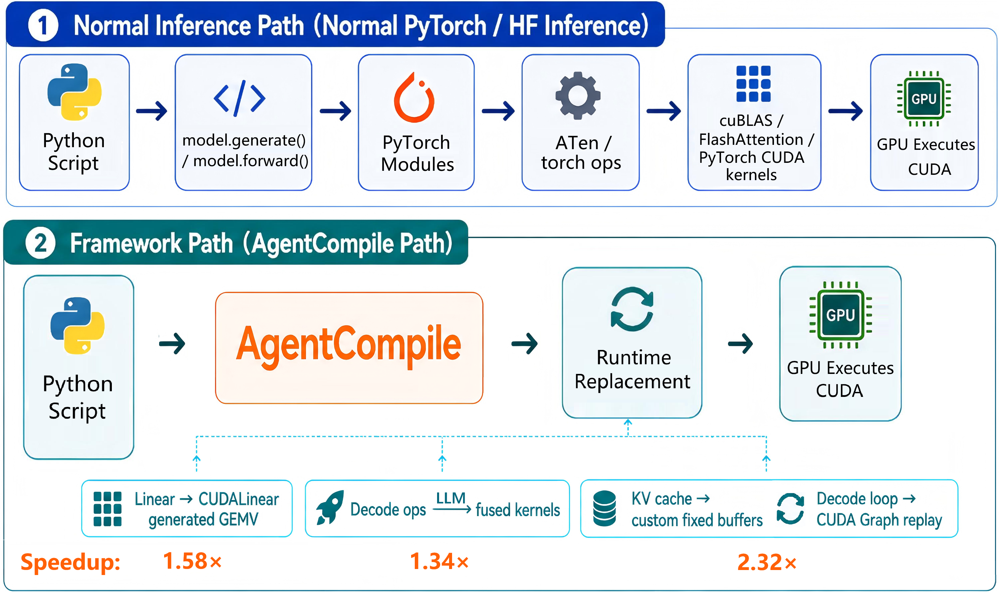
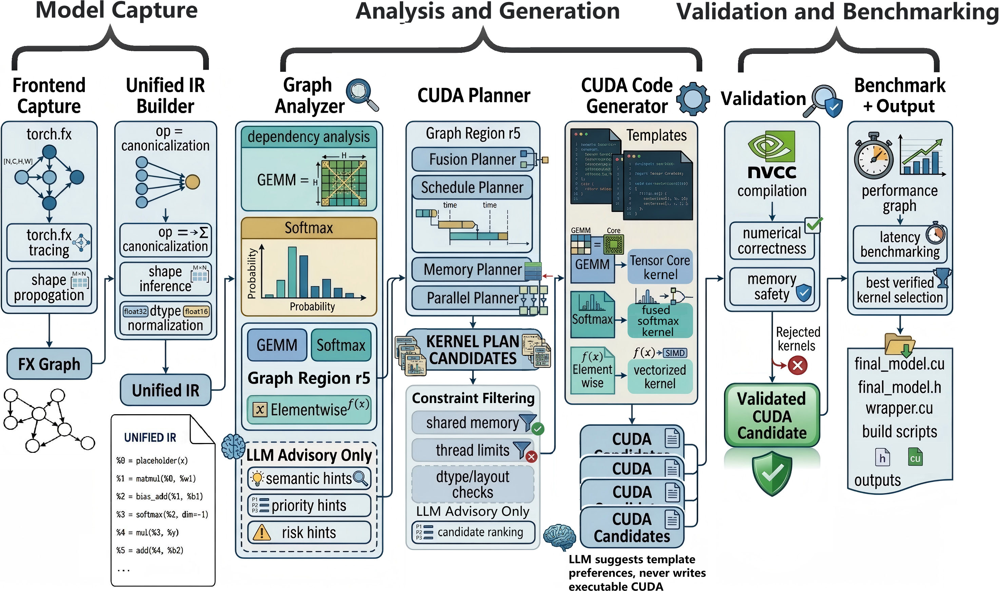
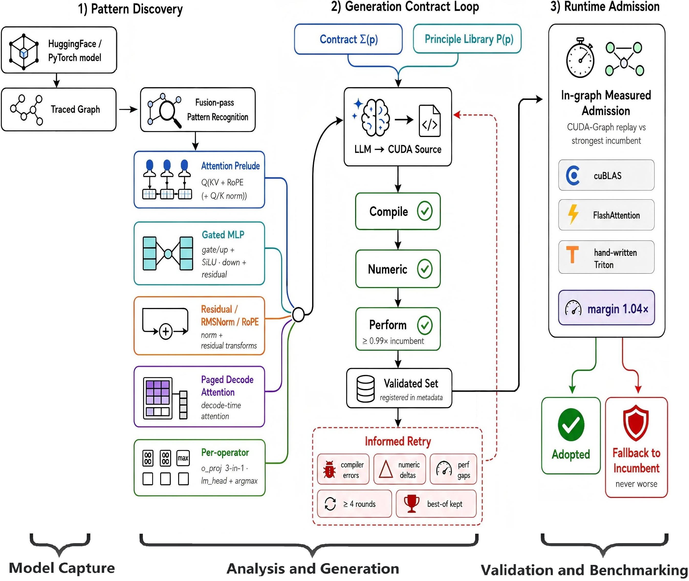
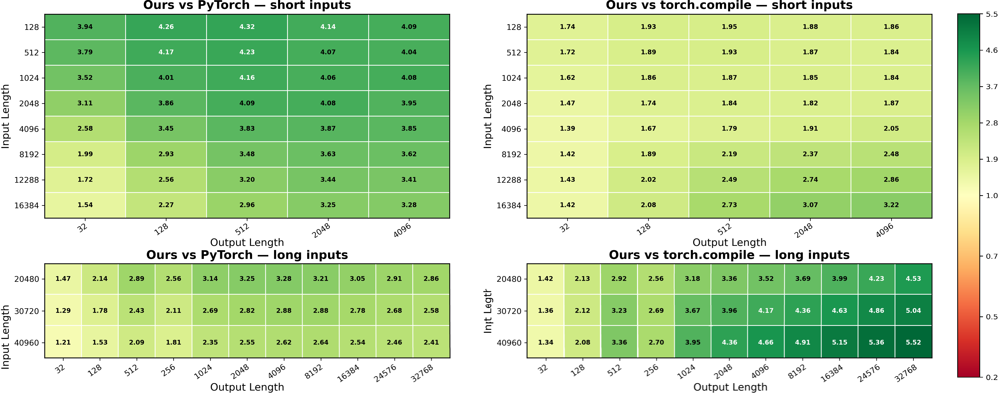

## 目录

1. [论文定位与核心问题](#一论文定位与核心问题)
2. [摘要翻译与贡献概览](#二摘要翻译与贡献概览)
3. [引言：现有推理路径缺了什么](#三引言现有推理路径缺了什么)
4. [相关工作：AgentCompile 位于哪一层](#四相关工作agentcompile-位于哪一层)
5. [问题定义：怎样安全接纳 LLM 输出](#五问题定义怎样安全接纳-llm-输出)
6. [整体方法：编译流水线与服务运行时](#六整体方法编译流水线与服务运行时)
7. [Graph Analyzer：如何构造可优化 Region](#七graph-analyzer如何构造可优化-region)
8. [CUDA Planner：把开放问题变成有界搜索](#八cuda-planner把开放问题变成有界搜索)
9. [Tier 1：LLM 只做编译决策顾问](#九tier-1llm-只做编译决策顾问)
10. [Tier 2：LLM 直接编写五类 CUDA Kernel](#十tier-2llm-直接编写五类-cuda-kernel)
11. [Principle Library 与反馈式重试](#十一principle-library-与反馈式重试)
12. [四重门控与 Never-Worse 准入](#十二四重门控与-never-worse-准入)
13. [推理运行时：从单请求到连续批处理](#十三推理运行时从单请求到连续批处理)
14. [实验设置与对比边界](#十四实验设置与对比边界)
15. [单请求端到端性能](#十五单请求端到端性能)
16. [多请求吞吐与 KV 压力测试](#十六多请求吞吐与-kv-压力测试)
17. [消融实验：4.95 倍来自哪里](#十七消融实验495-倍来自哪里)
18. [附录结果：内核质量、编译统计与视觉模型](#十八附录结果内核质量编译统计与视觉模型)
19. [局限、疑问与工程启发](#十九局限疑问与工程启发)

## 一、论文定位与核心问题

论文题目是 **AgentCompile: An LLM-Guided Compiler for Direct CUDA Inference**，公开版本为 arXiv:2606.07665。它要回答的不是“LLM 能不能写出 CUDA”，而是一个更接近生产系统的问题：

> LLM 生成的 CUDA 代码不天然正确，也不天然更快。怎样把它放进编译器和推理运行时，使错误或低效的候选实现永远不能直接进入执行路径？

> **版本说明**：公开的 arXiv v1 发布于 2026 年 6 月 4 日，主要描述“LLM 提供建议、编译器用模板生成 CUDA”的第一层流程。本文依据扩展后的当前论文源稿讲解；该稿增加了第二层 LLM 直接生成 Kernel、五类 Decode 融合、完整多请求运行时和新版实验。因此，部分结构与数据会不同于 arXiv v1 页面。

传统推理优化通常有三条路线：

| 路线 | 优点 | 主要限制 |
| --- | --- | --- |
| PyTorch eager | 开发灵活，语义清楚 | Python dispatch、动态图与动态 KV Cache 开销大 |
| `torch.compile` | 自动图捕获、融合与代码生成 | 长序列生成中存在 graph break、动态 shape 和 cache 更新 |
| vLLM 等服务框架 | Paged KV Cache、调度器、CUDA Graph 完整 | 核心算子仍依赖预先维护的专家内核库 |

AgentCompile 试图增加第四种路线：

```text
Python / HuggingFace 模型
-> 捕获计算图
-> 编译器构造受约束候选空间
-> LLM 提供决策或生成 CUDA
-> 编译、数值、性能验证
-> 运行时实测准入
-> CUDA 推理
```

它的关键思想可以概括成一句话：

```text
LLM 可以拥有 authorship，但不能拥有 admission authority。

LLM 可以提出方案或编写代码，
真正决定代码能否执行的是编译器、验证器和运行时测量。
```

这里的 `authorship` 是代码创作权，`admission` 是生产路径准入权。论文最有价值的部分，正是把两者明确分离。

## 二、摘要翻译与贡献概览

论文摘要首先指出，Transformer 推理越来越依赖专用编译器和运行时，而大模型已经能够生成有一定复杂度的 CUDA Kernel。但无约束生成既不能保证正确性，也不能保证性能。

AgentCompile 对 LLM 有两种互补用法：

1. **顾问模式**：LLM 读取编译器生成的 Region 摘要，在编译器给定的有限候选集合中提供语义标签、候选优先级、参数提示与风险提示。所有可执行 CUDA 都由确定性模板生成。
2. **作者模式**：对于五类 Decode 关键融合模式，LLM 在编译器定义的契约下直接输出完整 CUDA 源码。

无论哪种模式，候选实现都必须经过：

```text
编译通过
-> 接口与 dtype 契约通过
-> 数值正确性通过
-> 性能门槛通过
-> 图内实测准入
```

论文将生成内核接入了一个完整推理运行时，包括：

- Paged KV Cache。
- Continuous Batching。
- 请求抢占与 KV swap。
- Chunked Prefill。
- 按 Batch Size 分桶的整步 CUDA Graph。

论文报告的主要结果是：

- 单请求生成相对 PyTorch eager 平均加速 `2.23x` 到 `6.98x`。
- 单请求和多请求场景相对 vLLM 平均加速 `1.04x` 到 `1.16x`。
- Qwen3-4B 消融实验中，完整系统相对 PyTorch eager 加速 `4.95x`。

这些数字需要结合基线执行路径理解。相对 PyTorch 的大幅提升不只来自 LLM Kernel，也来自静态 KV Cache、CUDA Graph、Paged KV 与自定义运行时；LLM 阶段在消融实验中贡献的是额外 `1.34x`。

## 三、引言：现有推理路径缺了什么



图 1 把论文的出发点画得很直接。

普通 PyTorch / HuggingFace 路径是：

```text
Python script
-> model.generate() / model.forward()
-> PyTorch Module
-> ATen / torch operators
-> cuBLAS / FlashAttention / PyTorch CUDA kernels
-> GPU
```

AgentCompile 则把模型替换为更直接的 CUDA 执行路径：

```text
Python script
-> AgentCompile
-> 定制推理 Runtime
-> 直接执行已准入 CUDA kernels
```

作者认为 Autoregressive Decode 中存在三类可叠加开销。

### 1. 框架与调度开销

Decode 每一步只生成一个 Token，单步计算粒度较小。Python 循环、算子分发、临时 Tensor 管理和多次 Kernel Launch 的固定开销因此很显著。

例如一个 Transformer 层若分散为多个小算子：

```text
RMSNorm
-> QKV projection
-> RoPE
-> KV append
-> attention
-> output projection
-> residual add
-> RMSNorm
-> MLP
```

每个算子都可能触发一次独立调度和 Kernel Launch。计算量下降后，这些固定成本不会等比例下降。

### 2. 动态 KV Cache

PyTorch `DynamicCache` 会随生成长度增长。动态更新会带来对象管理、Shape 变化、内存操作和图捕获困难。它与需要固定地址、固定控制流的 CUDA Graph 天然冲突。

### 3. 固定专家内核库

vLLM、FlashAttention 和 cuBLAS 已经提供高质量内核，但它们不一定覆盖某个模型中特有的融合机会。例如：

- QKV projection 后紧跟 RoPE 和 Q/K RMSNorm。
- `lm_head` 后只需要 argmax，不需要把完整 Logits 写回显存。
- Decode 的 MLP 是 `M=1` GEMV，不是训练中常见的大 GEMM。

这些模式可能值得为模型结构重新生成专用 Kernel，但手工维护的成本很高。

因此，AgentCompile 的目标不是替代 CUDA 专家，而是把专家经验变成可复用的原则，再让 LLM 针对模型重新推导实现。

## 四、相关工作：AgentCompile 位于哪一层

论文把相关工作分为三类。

### 神经网络编译器

TVM、XLA、MLIR、PyTorch 2 和 Triton 负责从高层模型描述生成加速器代码；AutoTVM、Ansor、ROLLER、Welder 等系统进一步自动搜索 Schedule、Fusion 和内存规划。

AgentCompile 与它们的区别不在“有没有搜索”，而在候选实现的来源：

```text
传统编译器：
  规则 / 模板 / 搜索算法 -> 可执行候选

AgentCompile Tier 1：
  LLM 建议 -> 编译器模板 -> 可执行候选

AgentCompile Tier 2：
  原则库 + 契约 -> LLM 完整生成 CUDA -> 验证后的候选
```

### 推理运行时与专用内核

vLLM、ORCA 重点优化请求调度、批处理和 KV 内存；FlashAttention 优化 Attention 的 I/O 复杂度；CUDA Graph 降低 CPU Launch 开销。

AgentCompile 并没有提出新的 Attention 数学形式或新的调度理论。它实现了类似的服务能力，但尝试用受控 LLM 生成补充固定内核库。

### LLM for Code / Compiler

KernelBench 等工作直接评估 LLM 能否生成更快的 GPU Kernel。AgentCompile 的主要差异有两点：

1. Prompt 不包含参考 Kernel 源码，而是使用提炼后的优化原则和失败经验。
2. LLM 输出不能直接部署，必须经过编译器契约、数值测试、性能门槛和运行时实测。

因此，这篇论文更接近“LLM 如何成为编译系统中的不可信组件”，而不是单纯的 CUDA 代码生成 Benchmark。

## 五、问题定义：怎样安全接纳 LLM 输出

论文把推理程序建模为有向图：

```text
G = (V, E)

V：Tensor operations
E：数据依赖关系
```

一个 Region `r` 是图中的连通子图：

```text
r subset of V
```

Region 不只是若干算子的集合，还必须有清晰的外部接口：

- 输入和输出 Tensor。
- Shape、dtype 与 layout。
- 输入输出依赖。
- Reduction axis。
- Alias 与 in-place 约束。
- Launch signature 和调用约定。

### 什么是 Region

Region 是编译优化的基本边界。例如：

```text
x
-> reduce_max
-> subtract
-> exp
-> reduce_sum
-> divide
-> y
```

这组算子可以被识别为 Softmax Region。只要它没有跨越副作用、未知 Alias 或动态 Shape 边界，编译器就可以尝试把它替换为一个 Fused Softmax Kernel。

CUDA 替换实现只有同时满足以下条件才可接纳：

```text
外部 Tensor 接口不变
数值语义在容差内一致
dtype / layout 假设成立
硬件资源合法
端到端执行可用
```

论文由此把 LLM 的参与拆为两个 Tier。

### Tier 1：受限候选空间中的建议

对 Region `r` 和硬件 `H`，编译器先构造有限候选集：

```text
C(r, H) = 编译器能够真实生成和启动的模板候选
```

LLM 读取 Region 摘要 `S(r)` 后返回：

```text
A_LLM(S(r), C(r,H)) = (l_r, pi_r, eta_r, rho_r)
```

其中：

| 符号 | 含义 |
| --- | --- |
| `l_r` | Region 的语义标签，如 Softmax、Norm、GEMM Epilogue |
| `pi_r` | 候选实现的偏好顺序 |
| `eta_r` | Tile、Vector Width、Thread Count 等参数提示 |
| `rho_r` | 数值、边界、资源或动态 Shape 风险 |

这些输出都只是 Hypothesis。LLM 不能扩展 Region 边界，也不能凭空增加编译器不支持的参数。

### Tier 2：契约约束下直接生成 Kernel

对于已识别的融合模式 `p`，编译器提供：

```text
Sigma(p)：生成契约
P(p)：无源码的优化原则库
```

LLM 输出完整 CUDA：

```text
k = LLM(P(p), Sigma(p))
```

只有通过全部门控的 `k` 才能进入验证集合：

```text
V(p) = {通过编译、接口、数值和性能检查的候选}
```

这两个 Tier 解决的是不同问题。Tier 1 降低搜索成本，但不让 LLM 写可执行代码；Tier 2 提高表达能力，用于模板难以描述的跨 Region 融合。

## 六、整体方法：编译流水线与服务运行时



AgentCompile 的主流程分为三个阶段。

### 阶段一：Model Capture

前端读取 PyTorch 或 HuggingFace 模型，并用示例输入捕获计算图。论文使用类似 `torch.fx` 的图表示，记录：

- Operator。
- 输入输出 Shape。
- dtype。
- layout。
- Use-def 依赖。
- Alias 信息。
- 动态 Shape 标记。

随后 Unified IR Builder 做算子名规范化、Shape 推导和 dtype 归一化。这样不同模型中的等价算子能够进入同一套分析流程。

### 阶段二：Analysis and Generation

这一阶段包含：

```text
Graph Analyzer
-> CUDA Planner
-> CUDA Code Generator
```

Graph Analyzer 决定 Region；Planner 枚举合法 Fusion、Schedule、Memory 和 Parallel 方案；Code Generator 把方案实例化为 CUDA。

Tier 1 中，LLM 只影响候选排序与参数偏好。Tier 2 中，LLM 会绕过模板表达能力限制，直接生成五类完整融合 Kernel。

### 阶段三：Validation and Benchmarking

生成候选依次经过：

```text
nvcc compilation
-> interface validation
-> numerical comparison
-> memory safety check
-> latency benchmark
-> best candidate selection
```

最终输出不只是 `.cu` 文件，还包括：

- CUDA headers。
- C++ / Python wrappers。
- Kernel metadata。
- Launch signatures。
- Build scripts。

### 运行时层

编译器输出之后，AgentCompile 还需要一个完整 Runtime 管理 KV Cache、请求调度、Prefill、Decode 和 CUDA Graph。否则即使单个 Kernel 很快，端到端生成仍可能被 Python 与动态内存开销淹没。

## 七、Graph Analyzer：如何构造可优化 Region

Analyzer 在调用 LLM 前先做确定性分析。它沿 IR 的 Use-def 依赖遍历，并尝试合并：

- Pointwise。
- Activation。
- Softmax。
- Normalization。
- Reduction。

矩阵乘法通常独立成 Region，只在约束允许时附加简单 Epilogue。单纯改变视图或 Layout 的算子不会独立成为 Region，而会被记录成边界 Metadata。

以下情况会形成硬边界：

| 硬边界 | 原因 |
| --- | --- |
| In-place operation | 可能改变其他别名 Tensor 的值 |
| Side effect | 跨边界重排可能改变程序语义 |
| Unresolved alias | 无法判断内存是否重叠 |
| Unsupported dtype | 模板或生成契约不覆盖 |
| Ambiguous dynamic shape | 无法静态证明索引与资源合法 |

### 为什么 Region 边界不能交给 LLM

假设 LLM 建议把两个算子融合，但中间 Tensor 还被第三个分支使用：

```text
         -> op_B
op_A ---|
         -> op_C
```

如果忽略 Use-def 关系直接消除中间结果，可能破坏 `op_C`。类似地，错误处理 Alias、In-place 和副作用会导致静默错误。Region 构造因此属于编译器必须掌握的 Correctness Boundary。

LLM 只在规则难以判断的 Region 上参与，例如：

- Mixed Region。
- 复杂 GEMM Epilogue。
- Reduction + Pointwise。

五类 LLM Kernel 的模式识别也先由结构规则完成。模型不满足前置条件时，系统直接跳过，而不是让 LLM 猜测。

## 八、CUDA Planner：把开放问题变成有界搜索

Planner 不询问“请为这段图写一个最快的 Kernel”，而是构造有限计划：

```text
KernelPlan = {
  fusion_choice,
  template_family,
  tile_size,
  thread_count,
  vector_width,
  reduction_mapping,
  shared_memory_policy,
  grid_block_shape,
  warp_mapping,
  launcher_interface
}
```

模板族包括：

- Tiled GEMM。
- Tensor Core GEMM。
- Softmax。
- Reduction。
- Normalization。
- Elementwise。
- Decode-oriented GEMV。

每个计划必须满足：

```text
存在可用模板
AND launcher signature 兼容
AND dtype / layout 兼容
AND shared memory 不超限
AND thread / register 等硬件参数合法
```

这一步的本质，是把无限代码空间压缩为编译器可证明合法的离散候选空间。

### Decode 为什么特别需要 GEMV

训练和 Prefill 常见矩阵乘法：

```text
[M, K] x [K, N] -> [M, N]，M 较大
```

单请求 Decode 每步只有一个 Token：

```text
[1, K] x [K, N] -> [1, N]
```

此时运算退化为 GEMV。它通常是 Memory-bound：每一步都要读取大块权重，但权重几乎没有批内复用。

AgentCompile 的模板 GEMV 使用：

- `[N, K]` 预转置权重，使每一行连续读取。
- 128-bit Vectorized Load。
- Warp Shuffle Reduction。
- 随输出维度 `N` 调整并行度的双路径策略。

这些实现细节由模板控制，不依赖 LLM 生成。

## 九、Tier 1：LLM 只做编译决策顾问

图 2 中 r5 Region 展示了 Tier 1 的作用。

编译器先生成结构化摘要：

```text
Region r5
operators: reduce_max -> sub -> exp -> reduce_sum -> div
input shape: [B, H, S]
dtype: bf16
reduction axis: S
layout: contiguous
dynamic flags: ...
candidate templates: ...
```

LLM 可以回答：

```text
semantic label: softmax
priority: warp-softmax > block-softmax > generic reduction
parameter hints: vector width = 4
risk: long reduction axis may exceed shared-memory budget
```

但 Planner 会重新检查：

- 语义标签是否受支持。
- 参数是否位于候选空间。
- Reduction axis 是否正确。
- Shared Memory 与线程数是否超硬件限制。
- LLM 是否错误建议跨越 Region 边界。

不合法建议被直接忽略，不会改变图语义。

Tier 1 的工程价值不是“LLM 比编译器更正确”，而是 LLM 能利用语义信息缩小 Benchmark 顺序。例如看到 Softmax 模式后，优先测试 Softmax 专用模板，而不是平均枚举所有 Reduction 模板。

## 十、Tier 2：LLM 直接编写五类 CUDA Kernel



模板生成只能表达模板预先定义的边界。论文因此增加 Tier 2，让 LLM 为五类 Decode 关键模式直接生成完整 CUDA。

### 1. Attention Prelude Fusion

融合：

```text
QKV projection
-> RoPE
-> optional Q/K RMSNorm
```

未融合时，Q、K、V 会被写回显存，再由 RoPE 或 RMSNorm Kernel 读入。融合后，中间值尽可能停留在寄存器或 Shared Memory 中。

### 2. Gated MLP Fusion

典型 SwiGLU MLP：

```text
gate = x W_gate
up   = x W_up
h    = SiLU(gate) * up
y    = h W_down + residual
```

AgentCompile 生成：

- `gate/up projection + SiLU`。
- `down projection + residual add`。
- 面向 `M=1` 的 GEMV 版本。
- 面向小 Batch 的 Thin-GEMM 版本。

运行时根据 Batch Size Dispatch。

### 3. Residual、RMSNorm 与 RoPE Fusion

包括：

```text
residual add + RMSNorm
standalone RoPE
```

这类算子 FLOPs 不高，但会反复读写整个 Hidden State，属于典型 Memory-bound 小 Kernel。融合重点是减少 Global Memory Traffic 和 Launch 次数。

### 4. Paged Decode Attention

这是 Decode Attention 主体：

```text
Q 与分页 KV blocks 做点积
-> online softmax
-> 加权聚合 V
-> 跨 CTA 合并局部结果
```

附录给出的手工参考实现使用：

- `m16n8k16` Tensor Core MMA Fragment。
- `ldmatrix` 加载。
- 经过 Padding 的 Shared Memory Row，降低 Bank Conflict。
- Fragment 内 Softmax。
- 基于 Fence 的融合式跨 CTA Merge，避免单独 Reduction Kernel。

LLM 看不到参考源码，只接收从这些实现中提炼出的原则，再重新推导 CUDA。

### 5. Per-operator Decode Fusion

包括两个关键模式：

```text
o_proj GEMV + residual + post-RMSNorm

lm_head GEMV + argmax -> token_id
```

第二个模式很重要。普通路径会先生成 Vocabulary 大小的 Logits：

```text
hidden [1, H]
-> lm_head
-> logits [1, V]
-> argmax
-> token_id [1]
```

如果使用 Greedy Decoding，最终只需要一个 Token ID。融合 Kernel 可以在计算分块 Logits 时同步维护局部最大值，再做归约，不必把完整 `[1,V]` Logits 写回显存。

## 十一、Principle Library 与反馈式重试

Tier 2 的 Prompt 由两个部分组成：

```text
Contract Sigma(p)
+ Principle Library P(p)
```

### Contract 定义“必须满足什么”

契约包含：

- 输入输出 Tensor Shape。
- dtype 规则。
- Layout 和 Stride 假设。
- 数值容差。
- Launch 接口。
- 性能下限。
- 特定模式的结构前置条件。

论文特别强调 dtype 条款必须完整。一个未声明的 `fp16` / `bf16` 假设，就可能让多轮生成全部失败。

### Principle Library 定义“可以怎样优化”

原则库不包含 Kernel 源码，而是自然语言形式的知识：

- 哪个维度应连续访问。
- 哪类中间结果应保留在寄存器。
- 哪些 Reduction 适合 Warp Shuffle。
- 何时使用 Vectorized Load。
- 怎样避免 Shared Memory Bank Conflict。
- 哪些尝试曾经失败以及失败原因。

最后一项称为 **falsified dead ends**。例如：

```text
尝试 A：
  提高每个 CTA 的工作量

实测结果：
  Register Pressure 过高，Occupancy 下降，端到端更慢

原则库记录：
  在该模式下不要再次选择 A
```

这使原则库不只是“最佳实践列表”，还承担跨模型积累负面经验的作用。

### Hand-write Once, Distill, Generate Everywhere

当原则库不足以描述某类复杂 Kernel 时，作者采用：

```text
手写高质量参考实现
-> 提炼设计原则和失败尝试
-> 删除源码
-> 让 LLM 从原则重新推导
-> 在不同模型上重新验证
```

Paged Decode Attention 就采用了这条路线。手写参考达到 FlashAttention 的 `0.967x` 到 `1.00x`，约使用 A800 峰值显存带宽的 90%；LLM 生成版本达到 `0.966x`，与参考实现相差约 0.1%。

这里的意义不是 LLM 超越 FlashAttention，而是它在看不到参考源码的情况下，从原则中重建了接近专家实现的 Kernel。

### 反馈式重试

每类模式至少生成 4 轮。失败不会只返回“错误”，而是提供结构化诊断：

```text
Compilation error
Numerical mismatch
Performance gap
```

LLM 根据诊断修改下一轮候选，系统始终保留当前最优版本。长期看，失败模式还会回流为原则库中的禁止项。

## 十二、四重门控与 Never-Worse 准入

AgentCompile 对 LLM Kernel 设置四层门槛。

### 第一层：Compile Gate

检查：

- CUDA 是否可编译。
- Symbol 和 Launch Signature 是否正确。
- 模板实例化是否合法。
- 静态资源是否超限。

### 第二层：Numeric Gate

与参考路径比较输出：

```text
abs(candidate - reference) <= atol
OR
relative_error <= rtol
```

容差随 dtype 与算子语义设置。Softmax、Norm 等敏感算子需要更严格地定义累加精度和边界行为。

论文明确承认，这属于经验验证，不是形式化等价证明。测试样本未覆盖的索引错误仍可能漏过。

### 第三层：Generation-time Performance Gate

生成阶段使用：

```text
theta_gen = 0.99
```

即候选至少接近现有实现的 99%。明显无收益的子类型会 Early Stop，避免继续消耗生成和编译成本。

### 第四层：Runtime In-graph Admission

候选通过离线验证后，还要放回真实 CUDA Graph 中与现有实现比较：

```text
T_graph(k) <= mu * T_graph(b)

mu = 1.04
```

`k` 是生成 Kernel，`b` 是 cuBLAS、FlashAttention 或手写 Triton 等当前实现。验证集合中的最终选择为：

```text
c* = argmin T(c), c in V
```

### 为什么必须 In-graph 测量

Microbenchmark 更快，不代表端到端更快。独立测量可能漏掉：

- 额外 Layout Conversion。
- Stream Synchronization。
- 前后 Kernel 的 Cache 影响。
- CUDA Graph Capture 兼容性。
- 临时 Workspace 分配。
- Fusion 后改变的 Launch 拓扑。

所以 AgentCompile 比较的是 Kernel 在真实 Decode Step 中的图内耗时。

### “Never-Worse” 应怎样理解

论文把这称为 Never-Worse Selection，但 `mu=1.04` 意味着系统允许候选在测量上最多慢约 4%，用来吸收噪声。因此它不是数学意义上的“绝不变慢”，更准确的表述是：

```text
在当前验证输入、当前硬件和测量误差范围内，
性能回退被限制在 4% margin 内；
明显更慢的实现回退到 incumbent。
```

这仍然是合理的工程策略，但不能等同于跨输入、跨 GPU、跨软件版本的全局性能保证。

## 十三、推理运行时：从单请求到连续批处理

如果只替换几个 Kernel，PyTorch 控制路径仍会保留大量开销。AgentCompile 因此实现了独立服务运行时。

### CUDALinear

`CUDALinear` 替换 Decode 路径上的 `nn.Linear`：

- 权重预转置为 `[N,K]`。
- `M=1` 时走自定义 GEMV。
- 小 Batch 走 Thin-GEMM。
- Prefill 或不支持的 Shape 回退 cuBLAS。

### FlashKVCacheManager

单请求版本预分配固定 K/V Buffer，并在 GPU 上维护各层 Sequence Length。Prefill 产生的 Cache 被导入固定 Buffer，Decode 使用 FlashAttention KV-cache API 或生成的 Paged Decode Attention。

论文发现 FlashAttention 的 bf16 内核内 KV Append 约为 `0.73 ms/step`，而 fp16 为 `0.18 ms/step`。作者改用一个小型 bf16 Scatter Kernel 先写入新 K/V，再调用 FlashAttention 的 No-append Fast Path。

语义上：

```text
fused attention_with_append(K_new, V_new, seq_len)
```

被拆成：

```text
kv_append(K_new, V_new)
seq_len += 1
attention_without_append(seq_len)
```

两者最终读取相同 KV，但后者避开了慢的 bf16 Append 路径。

### Paged KV Cache

多请求版本按固定大小 Block 分配 KV：

```text
Logical token positions
-> Block table
-> Non-contiguous physical KV blocks
```

请求不需要预留一段最大长度连续显存。Block 可按需分配、回收或交换到 Host，从而降低外部碎片并支持动态请求。

### Continuous Batching 与 Chunked Prefill

Continuous Batching 允许每个 Decode Step 重新组成 Batch：

```text
完成请求退出
-> 新请求立即加入
-> 不等待整个原 Batch 结束
```

长 Prompt 的 Prefill 会切成多个 Chunk，与 Decode 混合调度，避免一次超长 Prefill 长时间阻塞已有请求。

### 抢占与 KV Swap

KV 显存不足时，运行时支持：

- 丢弃部分状态，之后 Recompute。
- 把 KV Blocks Swap 到 Host。

论文采用较激进的 Admission Policy，让更多请求进入系统，并在超额订阅时通过抢占保持 GPU 饱和。

### Bucketed Full-step CUDA Graph

普通 CUDA Graph 可能只捕获几个算子。AgentCompile 捕获整个 Batched Decode Step：

```text
input update
-> all transformer layers
-> attention
-> lm_head
-> token selection
```

由于活跃请求数变化，系统按 Batch Size 建立 Bucket：

```text
batch 1   -> graph bucket 1
batch 2   -> graph bucket 2
batch 4   -> graph bucket 4
batch 8   -> graph bucket 8
...
```

实际 Batch 被映射到可容纳它的 Bucket，并复用固定地址 Buffer。这样每个 Token 只需一次 Graph Replay，显著减少 CPU Dispatch 和 Kernel Launch 开销。

## 十四、实验设置与对比边界

论文实验环境：

| 项目 | 配置 |
| --- | --- |
| GPU | NVIDIA A800 SXM4 80GB |
| CPU | Intel Xeon Platinum 8358 |
| dtype | bfloat16 |
| Decode | Greedy Generation |
| LLM 阶段 | Claude Opus 4.8 |

模型覆盖：

- Qwen3-4B。
- Llama-3.2-3B-Instruct。
- Falcon3-7B-Instruct。
- Mistral-7B-Instruct-v0.3。
- GLM-4-9B-chat。
- Qwen3-VL-2B-Instruct 的文本栈。

附录还测试了 DINOv3-ViT-H+/16 视觉 Encoder。

基线的执行路径并不相同：

| 系统 | Linear / MLP | Attention | KV Cache | Decode Control |
| --- | --- | --- | --- | --- |
| PyTorch eager | cuBLAS | SDPA Flash Backend | DynamicCache | Python Loop |
| `torch.compile` + FA | Inductor / Triton | FlashAttention | DynamicCache | Inductor Graph |
| vLLM | cuBLAS + Fused QKV | PagedAttention | Paged Blocks | CUDA Graph |
| AgentCompile | 生成 GEMV + 融合 Kernel | 生成 Attention，FA 回退 | Fixed / Paged | Full-step Graph |

计时包括 Prefill 和 Decode，但排除一次性准备：

- Cache Allocation。
- Extension Loading。
- Warmup。
- CUDA Graph Capture。
- Attention Patching。

单请求采用 2 次 Warmup 和 10 次正式测量。超过模型最大 Context Length 的工作负载从所有系统中排除。

## 十五、单请求端到端性能

论文报告 AgentCompile 相对 PyTorch eager 的平均加速：

| 模型 | `torch.compile` | AgentCompile |
| --- | ---: | ---: |
| Qwen3-4B | 1.99x | **4.95x** |
| Falcon3-7B | 1.44x | **2.23x** |
| Mistral-7B | 1.44x | **2.43x** |
| GLM-4-9B | 1.75x | **2.83x** |
| Qwen3-VL-2B | 2.43x | **6.98x** |

相对 vLLM 的平均加速较小：

| 模型 | AgentCompile / vLLM |
| --- | ---: |
| Qwen3-4B | 1.07x |
| Llama-3.2-3B | 1.08x |
| Falcon3-7B | 1.08x |
| Mistral-7B | 1.09x |
| Qwen3-VL-2B | 1.16x |

这组结果说明两件事。

第一，PyTorch eager 与专用推理 Runtime 之间存在巨大系统开销差距。把全部提升归因于 LLM Kernel 是错误的，因为 AgentCompile 同时替换了 KV 管理、Decode 控制和 CUDA Graph 路径。

第二，vLLM 已经具备 Paged KV、CUDA Graph 和生产级 Kernel，所以剩余空间只有约 4% 到 16%。这个较小但稳定的提升，才更能体现模型定制 Kernel 与整步 Graph 的增量价值。

### 输入输出长度怎样影响加速



图 4 分成四块：

- 左上：短输入下相对 PyTorch eager。
- 右上：短输入下相对 `torch.compile`。
- 左下：长输入下相对 PyTorch eager。
- 右下：长输入下相对 `torch.compile`。

短输入、长输出时，Decode Step 数量多，固定的 Python、Launch 和 Cache 管理开销被重复成千上万次。AgentCompile 的 Decode-oriented Kernel 和 Graph Replay 因而收益明显。

长输入、短输出时，Prefill 和长 KV Attention 占比更高。此时主要瓶颈逐渐转为大 GEMM、FlashAttention 和 KV 读取，系统控制开销占比下降，所以相对 PyTorch eager 的加速较小。

随着输出极长，KV Cache 持续增大，Decode Attention 每步需要读取更多 K/V：

```text
Decode attention bytes per step
roughly proportional to current sequence length
```

最终 Attention Memory Traffic 成为共同瓶颈，不同系统间的差距会收窄。

`torch.compile` 在长输入、长输出区域反而落后更多，论文将其归因于 Graph Break、动态 Cache 更新、Shape 变化和图复用下降。

## 十六、多请求吞吐与 KV 压力测试

论文使用两组多请求负载。

### Uniform Suite

一个 Tier 内所有请求具有相同输入输出长度。例如：

```text
i2k/o1k n32m32

input length = 2k
output length = 1k
total requests n = 32
max concurrency m = 32
```

AgentCompile 相对 vLLM 的平均吞吐提升：

| 模型 | 平均加速 |
| --- | ---: |
| Qwen3-4B | 1.04x |
| Llama-3.2-3B | 1.09x |
| Mistral-7B | 1.04x |
| Qwen3-VL-2B | 1.12x |

长输出 Tier 的收益更高，因为 Full-step CUDA Graph 的固定节省会在更多 Decode Step 上累计。

### Ragged Swap Suite

这组测试混合不同长度请求，并人为限制 Paged KV Pool。它包含三种压力：

```text
M：
  请求声明很大 max_output，但实际提前结束
  声明 KV 需求约为池容量的 3 倍

H：
  请求长度放大 3 倍
  Prompt 最长约 12k

HH：
  请求长度放大 5 到 6 倍
```

两套系统接收完全相同的 Prompt、长度、请求顺序和 KV Pool。AgentCompile 平均领先 vLLM `1.04x` 到 `1.08x`，极长上下文 Tier 的局部收益可达到 `1.18x`。

作者认为收益来自两点：

- Aggressive Admission 配合 KV Swap，使 GPU 保持更高活跃度。
- Bucketed Full-step Graph 降低多请求每步 Host 开销。

需要注意，调度策略不同会同时改变延迟分布和吞吐。论文主要报告整个请求池的端到端吞吐，没有完整给出 TTFT、TPOT 和 P99 延迟，因此还不能判断它对在线 SLO 的影响。

## 十七、消融实验：4.95 倍来自哪里

Qwen3-4B 的逐步消融如下：

| 阶段 | i128/o128 延迟 | 相对上一步平均收益 |
| --- | ---: | ---: |
| PyTorch eager baseline | 4765 ms | 1.00x |
| + CUDALinear、GEMV、StaticCache | 2986 ms | 1.58x |
| + FAKV、QKV Fusion、CUDA Graph | 1160 ms | 2.32x |
| + LLM 顾问与 LLM Kernel | 824 ms | 1.34x |
| 完整系统相对 baseline | 824 ms | **4.95x** |

### 第一阶段：1.58x

收益来自：

- `nn.Linear` 替换。
- `M=1` GEMV。
- 去除 DynamicCache。
- 固定 Buffer 与更直接的 C++ / CUDA 路径。

### 第二阶段：2.32x

这是最大的一步，来自：

- FlashAttention KV 路径。
- 定制 bf16 KV Append。
- Fused QKV Projection。
- Full-step CUDA Graph。

论文给出对照：在完整系统配置下，SDPA + StaticCache 即使捕获 CUDA Graph，i128/o128 仍需 `1318 ms`；FAKV 路径为 `824 ms`。这说明“用了 CUDA Graph”并不够，图内算子和 KV 更新路径也必须适合 Capture 与 Replay。

### 第三阶段：1.34x

这一步才包含：

- Tier 1 的 LLM 语义与候选建议。
- Tier 2 的五类 LLM 生成 Kernel。

因此，论文标题强调 LLM，但完整 `4.95x` 中最大的单阶段收益其实来自传统推理系统工程。LLM Kernel 是在高质量 Runtime 之上的增量优化。

各阶段平均加速的乘积不严格等于 `4.95x`，因为论文先对每个 Workload 计算阶段收益再求平均，而总收益直接由 Baseline 与最终延迟求比。

## 十八、附录结果：内核质量、编译统计与视觉模型

### LLM Kernel 的单项质量

论文报告每类最佳生成 Kernel 相对被替换实现的速度：

| Kernel | 最佳模型 | 相对速度 |
| --- | --- | ---: |
| QKV + RoPE | Falcon3-7B | 1.03x |
| QKV + RoPE + Q/K Norm | Qwen3-VL-2B | 1.02x |
| Paged Decode Attention | Qwen3-VL-2B | 0.975x |
| `lm_head + argmax` | Llama-3.2-3B | 1.07x |
| MLP `gate/up + SiLU` | Qwen3-4B | 1.12x |
| MLP `down + residual` | GLM-4-9B | 1.01x |
| Standalone RoPE | Qwen3-4B | 4.27x |

这些数字不能横向直接比较，因为 Baseline 强度不同：

- Attention 与手写专家 Kernel 或 FlashAttention 比。
- MLP 与 cuBLAS 比。
- RoPE 与多算子 Framework Path 比。

RoPE 的 `4.27x` 主要说明融合 Framework 小算子很有效，不表示它比同等级手写 Fused RoPE 快 4.27 倍。

Paged Decode Attention 在四个模型上达到 FlashAttention 的 `0.955x` 到 `0.975x`。GLM-4 的 GQA 配置为 32 个 Q Head 对 2 个 KV Head，生成 Kernel 只有 `0.45x`，因此被拒绝并回退。这正好展示了结构门控和运行时回退的必要性。

### 编译流水线统计

七个模型的 IR Node、Region 和模板候选统计如下：

| 模型 | IR Nodes | Regions | Candidates | Selected |
| --- | ---: | ---: | ---: | ---: |
| Qwen3-4B | 236 | 34 | 174 | 34 |
| Llama-3.2-3B | 192 | 34 | 174 | 34 |
| Falcon3-7B | 192 | 34 | 227 | 34 |
| Mistral-7B | 201 | 37 | 249 | 37 |
| GLM-4-9B | 238 | 50 | 347 | 50 |
| Qwen3-VL-2B | 291 | 34 | 227 | 34 |
| DINOv3 | 170 | 49 | 384 | 49 |

每个 Region 最终选择一个实现。表中的候选主要是确定性模板实例，全部通过该批测试并不能推出“LLM 任意生成 CUDA 的正确率为 100%”。Tier 2 生成失败和性能淘汰由另一套 Gate 与回退流程处理。

### 视觉 Encoder

DINOv3 没有 Autoregressive Decode、KV Cache 或 vLLM 路径。论文用同一生成机制构建 Encoder Kernel：

- Batch 1 相对 PyTorch eager 加速 `2.57x`。
- Batch 96 为 `1.02x`。
- 八个 Batch Size 平均 `1.35x`。
- 输出特征与 eager 的 Cosine Similarity 为 `0.9998`。

Batch 增大后，大 GEMM 成为主导，Framework Dispatch 和小 Kernel Launch 的占比下降，所以收益逐渐接近 1。

## 十九、局限、疑问与工程启发

### 论文明确承认的局限

AgentCompile 仍是原型系统：

- 主要覆盖 Transformer 风格 Region。
- 不支持的 Region 回退原 Framework 或 Library。
- 数值验证是经验测试，不是形式化等价证明。
- 复杂模型仍需要前端和 Generator 适配。

### 评估中仍需补充的内容

从系统论文视角，还有几项信息值得进一步验证。

第一，实验集中在单张 A800。Kernel 的最优 Tile、Occupancy、Tensor Core 路径和显存带宽比例会随 GPU 架构变化，跨 A100、H100、H200、B200 的可迁移性尚未展示。

第二，论文排除了一次性编译、LLM 调用、候选 Benchmark 和 CUDA Graph Capture 成本。这对长期部署合理，但决定了它更适合模型固定、请求长期运行的场景，而不是频繁变化的短生命周期模型。

第三，多请求实验主要报告整体吞吐。服务系统还应同时比较 TTFT、TPOT、P50/P99、Preemption 次数、Swap Bytes 和 Fairness。

第四，`mu=1.04` 是有噪声容忍的经验准入，不是严格的 Never-Worse 定理；输入分布变化后仍可能需要重新 Benchmark。

第五，LLM 生成阶段使用单一闭源模型。不同 LLM 的成功率、生成轮数、成本和 Kernel 质量缺少横向比较。

### 这篇论文真正值得借鉴的三点

第一，**把 LLM 当作不可信优化器，而不是编译器真值来源**。

```text
LLM output = hypothesis
compiler contract = legality
numeric test = empirical correctness
benchmark = profitability
runtime admission = deployment decision
```

第二，**把优化知识从源码提炼为 Principle + Falsified Dead End**。源码与特定 Shape、架构和实现强绑定，而原则更容易迁移；记录失败经验还能避免重复探索。

第三，**Kernel 生成必须与 Runtime 共同设计**。Paged KV、Static Buffer、Continuous Batching 和 Full-step CUDA Graph 不是外围组件，它们决定生成 Kernel 能否形成端到端收益。

AgentCompile 最终给出的不是“LLM 将取代 CUDA 工程师”，而是一种更务实的协作边界：

```text
专家定义：
  语义契约、硬件约束、验证方法、性能基线和优化原则

LLM 负责：
  在受控边界内提出候选、生成实现、根据失败反馈迭代

编译器与运行时负责：
  拒绝错误、拒绝低效、选择实测最优并随时回退
```

这套边界比单次生成出一个看似正确的 CUDA Kernel 更接近 LLM 在真实 AI Infra 中可落地的形态。

论文与代码：

- [arXiv: AgentCompile: An LLM-Guided Compiler for Direct CUDA Inference](https://arxiv.org/abs/2606.07665)
- [AgentCompile GitHub Repository](https://github.com/veneno1213822/AgentCompile)
