## 目录

1. [论文定位](#一论文定位)
2. [SpMM 与 Tensor Core 背景](#二spmm-与-tensor-core-背景)
3. [相关工作放在什么位置](#三相关工作放在什么位置)
4. [TC-GNN 的基本方案](#四tc-gnn-的基本方案)
5. [论文发现的四个 gap](#五论文发现的四个-gap)
6. [DTC-SpMM 总体设计](#六dtc-spmm-总体设计)
7. [ME-TCF：面向 Tensor Core 的省内存格式](#七me-tcf面向-tensor-core-的省内存格式)
8. [TCA reordering：同时照顾 TC 块密度和 L2 cache](#八tca-reordering同时照顾-tc-块密度和-l2-cache)
9. [运行时 kernel：从 WMMA 到 PTX mma](#九运行时-kernel从-wmma-到-ptx-mma)
10. [Sparse double buffering](#十sparse-double-buffering)
11. [Index precomputing](#十一index-precomputing)
12. [负载均衡与 Selector](#十二负载均衡与-selector)
13. [实验设置与整体性能](#十三实验设置与整体性能)
14. [消融实验](#十四消融实验)
15. [端到端 GCN 训练](#十五端到端-gcn-训练)
16. [开销、局限与适用场景](#十六开销局限与适用场景)
17. [官方源码对应关系](#十七官方源码对应关系)
18. [这篇论文的核心启发](#十八这篇论文的核心启发)

## 一、论文定位

论文题目是 **DTC-SpMM: Bridging the Gap in Accelerating General Sparse Matrix Multiplication with Tensor Cores**，发表在 ASPLOS 2024。

作者是：

- Ruibo Fan，HKUST(GZ)
- Wei Wang，HKUST
- Xiaowen Chu，HKUST(GZ)，通讯作者

论文研究的问题是：

```text
C = A x B

A: sparse matrix
B: dense matrix
C: dense matrix
```

这就是 SpMM，Sparse Matrix-Matrix Multiplication。它是 Level-3 Sparse BLAS 的核心算子，也是科学计算、图神经网络、稀疏深度学习里的常见瓶颈。

这篇论文的关键点不是“发明 SpMM”，而是解决一个更具体的问题：

```text
Tensor Core 很快，但 Tensor Core 原生喜欢 dense tile。
通用稀疏矩阵是高度 irregular 的。
如何让 Tensor Core 真正在 general SpMM 上跑快？
```

论文把目标限定为 **general SpMM**，也就是来自 GNN 和 scientific computing 的真实大规模稀疏矩阵，而不是剪枝后带规则约束的结构化稀疏权重矩阵。

这一区分很重要。很多 Tensor Core 稀疏工作依赖 2:4 sparsity、block sparsity、vector sparsity 或小规模模型权重矩阵；DTC-SpMM 关注的是几百万行、上千万甚至上亿非零、稀疏率超过 95% 的真实图/科学计算矩阵。

官方仓库 README 对工作定位也很直接：

```text
DTC-SpMM aims to enhance general-purpose SpMM on GPUs equipped with Tensor Cores.
The work is accepted by ASPLOS'24.
```

实现中最核心的文件是：

```text
DTCSpMM.cpp
DTCSpMM_kernel.cu
config.h
setup.py
TCA_reorder.py
bench_mma.cu
bench_shfl.cu
bench_offset.cu
```

从源码看，论文的三条主线都能对应到实现：

- `ME-TCF` 格式转换：`DTCSpMM.cpp` 和 `DTCSpMM_kernel.cu` 中的 `preprocess_gpu`、`seg_sort_dequ`、`generate_tcoffset_id_atob`。
- `TCA reordering`：`TCA_reorder.py`。
- DTC 运行时 kernel：`DTCSpMM_kernel.cu` 中大量 `spmm_forward_cuda_kernel_improved_ptx_*` kernel。

## 二、SpMM 与 Tensor Core 背景

论文使用的 SpMM 公式是：

```text
C_{M x N} = A_{M x K} x B_{K x N}
```

其中：

- `A` 是 sparse matrix。
- `B` 是 dense matrix。
- `C` 是 dense output。
- `NNZ` 是 `A` 的非零元素数量。
- 总浮点运算量通常按 `2 x N x NNZ` 估算。

在 GNN 中，`A` 常常是图邻接矩阵，`B` 是节点特征矩阵。例如 GCN 的一层可以写成：

```text
H^{l+1} = sigma[(A x H^l) x W^l + b^l]
```

其中 `A x H^l` 就是典型 SpMM。

### Tensor Core 做什么

NVIDIA Tensor Core 从 Volta 开始出现，面向矩阵乘加。论文中的抽象是：

```text
D_frag = A_frag x B_frag + C_frag
```

其中 `A_frag`、`B_frag` 是输入 fragment，`C_frag` 是累加器，`D_frag` 是输出 fragment。

论文目标精度是 `TF32`。原因是 TF32 相比 FP32 在 Tensor Core 上有更高吞吐，同时在 GNN 和科学计算中有较好的数值行为。

论文用 `m x k x n` 表示 Tensor Core 支持的 MMA tile 形状。在 DTC-SpMM 的实现里，核心 PTX 指令包括：

```text
mma.sync.aligned.m16n8k4.row.col.f32.tf32.tf32.f32
mma.sync.aligned.m16n8k8.row.col.f32.tf32.tf32.f32
```

官方源码的 microbenchmark `bench_mma.cu` 正是用来测这些指令的延迟/吞吐。代码里反复执行：

```cpp
asm volatile(
    "mma.sync.aligned.m16n8k4.row.col.f32.tf32.tf32.f32 "
    "{%0,%1,%2,%3}, {%4,%5}, {%6}, {%7,%8,%9,%10};\n"
    : "=f"(D[0]), "=f"(D[1]), "=f"(D[2]), "=f"(D[3])
    : "r"(A[0]), "r"(A[1]),
      "r"(B[0]),
      "f"(C[0]), "f"(C[1]), "f"(C[2]), "f"(C[3])
);
```

论文第 4.4 节提到的 microbenchmark 结论是：

- RTX4090 上 HMMA 指令延迟约 16.0 cycles。
- `__shfl_sync` 延迟约 10.7 cycles。
- 因此如果为了重排寄存器而额外插入 warp transpose，开销很明显。

这直接影响 DTC-SpMM 选择 strided-access 和 register remapping 的设计。

## 三、相关工作放在什么位置

论文把已有 SpMM 工作分成两类。

第一类是 CUDA-core SpMM：

- cuSPARSE：NVIDIA 官方库，支持 CSR/COO。
- row-split、merge-path 类方法：通过并行划分隐藏访存延迟。
- RS-SpMM、ASpT：使用 adaptive tiling，把稀疏矩阵划分为 dense/sparse 部分，利用 shared memory。
- Sputnik：面向深度学习稀疏性的高性能稀疏库，引入 1-D tiling 和 reverse offset alignment。
- SparseTIR：TVM 体系下的 sparse tensor compiler。
- GE-SpMM、HP-SpMM：面向 GNN SpMM 的访存复用和负载均衡优化。

DTC-SpMM 和这些工作是 orthogonal 的，因为它关注的是如何系统利用 Tensor Core，而不是继续只在 CUDA core 上调优。

第二类是 TC-based sparse 工作：

- Block-SpMM：基于 block-sparse routine，cuSPARSE 中有 Blocked-Ellpack/BELL 实现。
- VectorSparse、CLASP：利用细粒度 vector sparsity。
- Magicube：量化稀疏矩阵操作，提出 SR-BCRS 等压缩和优化。
- SparTA：把非结构化权重稀疏拆成 2:4 结构化稀疏和非结构化部分，结合 sparse TC 和 CUDA core。
- Flash-LLM：针对大模型推理中的稀疏权重矩阵，提出 Load-as-Sparse-Compute-as-Dense。
- TC-GNN：第一篇把 Tensor Core 用到 irregular GNN aggregation 的 general SpMM 工作。

论文强调：很多 TC-based 方法依赖 pruning 后的规则稀疏，目标矩阵往往是小到中等规模的 DNN weight matrix，稀疏率 60%-90%。而 GNN/SC 矩阵常常是百万行、极稀疏、分布高度不规则。这正是 DTC-SpMM 的目标场景。

## 四、TC-GNN 的基本方案

DTC-SpMM 的设计从分析 TC-GNN 开始。TC-GNN 的关键思想是 Sparse Graph Translation，也就是 `SGT`。

SGT 做的事情是：

```text
在一个 row window 内，把原始稀疏列号压缩成连续局部列号。
```

Tensor Core 需要 dense tile，例如 `16 x 8` 的稀疏 A tile 和 dense B tile。原始稀疏矩阵列号可能非常分散，不能直接形成小 tile。SGT 把每个 row window 内出现过的邻居列去重、排序、重新编号，使这些列可以放进一个或多个 `16 x 8` TC block。

论文 Figure 1 展示了 Sparse Graph Translation 和 TCF format。TC-GNN 的 TCF 需要五个数组：

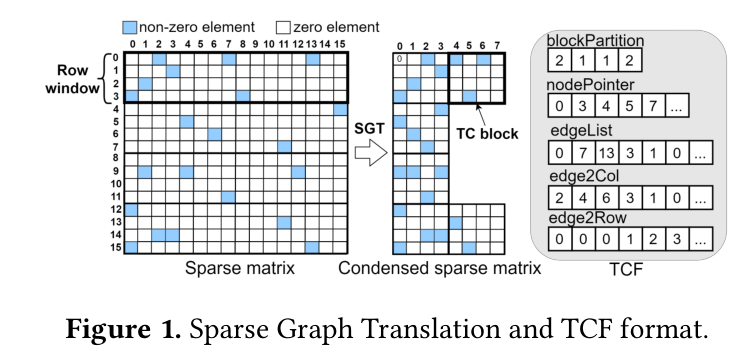

- `blockpartition`：每个 row window 有多少 TC block。
- `nodePointer`：类似 CSR 的 row offset。
- `edgeList`：非零元素的原始列号。
- `edgeToColumn`：非零元素在压缩后 tile 中的列号。
- `edgeToRow`：非零元素的行号。

论文 Figure 2 展示 TC-GNN SpMM 的流程：

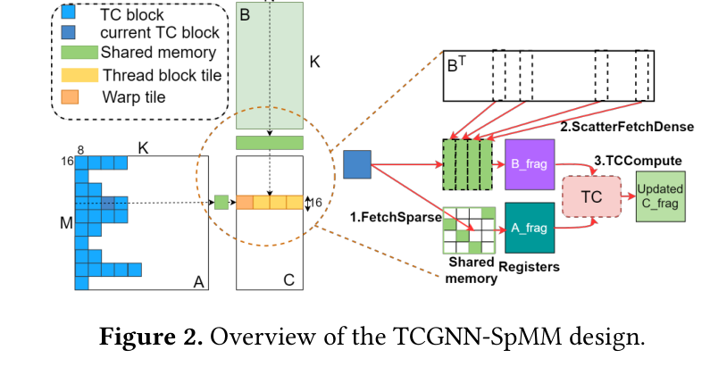

1. 一个 thread block 负责一个 output row window。
2. 每次迭代处理该 row window 中的一个 TC block。
3. 每轮包含 `FetchSparse`、`ScatterFetchDense`、`TCCompute`。
4. 稀疏 A tile 和 dense B tile 都先放进 shared memory。
5. 再通过 WMMA API 让 warp 调 Tensor Core。

官方代码中，TC-GNN baseline 对应：

```cpp
m.def("run_TCGNNSpMM", &spmm_forward, "TC-GNN SPMM forward (CUDA)");
```

底层 kernel 是 `spmm_forward_cuda_kernel`。它的结构与论文描述一致：

```cpp
__shared__ float sparse_A[BLK_H * BLK_W];
__shared__ int sparse_AToX_index[BLK_W];
extern __shared__ float dense_X[];

wmma::fragment<wmma::matrix_a, ...> a_frag;
wmma::fragment<wmma::matrix_b, ...> b_frag;
wmma::fragment<wmma::accumulator, ...> acc_frag;
```

每个 TC block 中，代码先扫描当前 row window 的边：

```cpp
if (i * BLK_W <= col && col < (i + 1) * BLK_W) {
    unsigned row_local = edgeToRow[eIdx] % BLK_H;
    unsigned col_local = col % BLK_W;
    sparse_A[row_local * BLK_W + col_local] = 1;
    sparse_AToX_index[col_local] = edgeList[eIdx];
}
```

然后把 `B` 对应行搬进 `dense_X` shared memory：

```cpp
unsigned dense_rowIdx = sparse_AToX_index[idx % BLK_W];
unsigned source_idx = dense_rowIdx * embedding_dim + wid * BLK_H + dense_dimIdx;
dense_X[target_idx] = input[source_idx];
```

最后用 WMMA：

```cpp
wmma::load_matrix_sync(a_frag, sparse_A, BLK_W);
wmma::load_matrix_sync(b_frag, dense_X + wid * BLK_W * BLK_H, BLK_W);
wmma::mma_sync(acc_frag, a_frag, b_frag, acc_frag);
```

这段代码很适合理解论文后续批判：TC-GNN 让 Tensor Core 能算 general SpMM，但 shared memory 使用、索引计算和负载均衡都留下了性能空间。

## 五、论文发现的四个 gap

论文第 3 节扩展了 TC-GNN 使用的数据集。原始 TC-GNN 矩阵行数跨度大，但非零元素只有百万级，平均行长较小，约 2 到 12。作者认为平均行长 `AvgRowL` 会显著影响 SpMM 效率，因此额外加入更大、更长行的矩阵，把非零元素扩展到上亿级，把 `AvgRowL` 扩到接近 600。

Table 1 给出 8 个代表矩阵，分成 Type I 和 Type II：

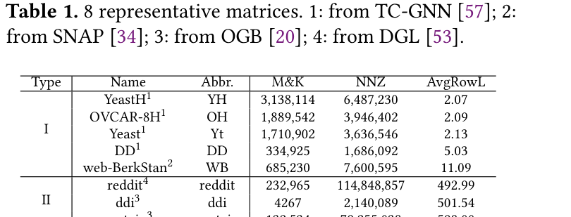

| Type | Name | Abbr. | M & K | NNZ | AvgRowL |
| --- | --- | --- | --- | --- | --- |
| I | YeastH | YH | 3,138,114 | 6,487,230 | 2.07 |
| I | OVCAR-8H | OH | 1,889,542 | 3,946,402 | 2.09 |
| I | Yeast | Yt | 1,710,902 | 3,636,546 | 2.13 |
| I | DD | DD | 334,925 | 1,686,092 | 5.03 |
| I | web-BerkStan | WB | 685,230 | 7,600,595 | 11.09 |
| II | reddit | reddit | 232,965 | 114,848,857 | 492.99 |
| II | ddi | ddi | 4,267 | 2,140,089 | 501.54 |
| II | protein | protein | 132,534 | 79,255,038 | 598.00 |

Type I 行短，Type II 行长。论文后面的分析经常按这个分类比较。

### Gap 1：TCF 格式内存开销高

TC-GNN 的 TCF 需要：

```text
ceil(M / 16) + M + 1 + NNZ x 3
```

其中：

- `ceil(M/16)` 存 `blockpartition`。
- `M+1` 存 `nodePointer`。
- 三个 `NNZ` 数组分别是 `edgeList`、`edgeToColumn`、`edgeToRow`。

CSR 只需要：

```text
M + 1 + NNZ
```

论文测得，8 个矩阵上 TCF 平均比 CSR 多消耗 `168.41%` 内存。SpMM 常常 memory-bound；在总 FLOPs 固定时，格式越臃肿，有效计算密度越低，roofline 上界也越差。

### Gap 2：TC block 密度低

TC block 密度用 `MeanNnzTC` 衡量：

```text
MeanNnzTC = 平均每个 TC block 中有多少个非零元素
```

Tensor Core 实际执行的是 dense tile 乘法。一个 `16 x 8` TC block 理论容量是 128 个元素，如果里面非零太少，就会浪费 TC 计算。

论文解释 `MeanNnzTC` 影响两个方面：

- 影响总工作量：TC 上的工作量取决于 `NumTCBlocks` 而不是 `NNZ`。固定 `NNZ` 下，`MeanNnzTC` 越高，TC block 越少。
- 影响 B 的数据复用：一个 TC block 加载 8 行 B；同一列内多个非零能复用同一 global memory transaction。

Table 2 显示 TC-GNN 使用 SGT 后多数矩阵 `MeanNnzTC < 16`。这意味着平均每个 TC block 的每列不足 2 个非零，压缩程度不够。

Table 2 中的关键指标：

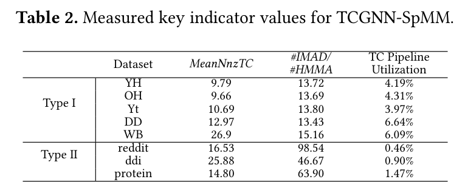

| Dataset | MeanNnzTC | #IMAD/#HMMA | TC Pipeline Utilization |
| --- | ---: | ---: | ---: |
| YH | 9.79 | 13.72 | 4.19% |
| OH | 9.66 | 13.69 | 4.31% |
| Yt | 10.69 | 13.80 | 3.97% |
| DD | 12.97 | 13.43 | 6.64% |
| WB | 26.90 | 15.16 | 6.09% |
| reddit | 16.53 | 98.54 | 0.46% |
| ddi | 25.88 | 46.67 | 0.90% |
| protein | 14.80 | 63.90 | 1.47% |

### Gap 3：Tensor Core pipeline utilization 低

论文用 Nsight Compute 统计 TC pipeline utilization。TC-GNN 在 RTX4090 上一直低于 8%，Type II 矩阵甚至低到 0.46%、0.90%、1.47%。

论文认为主要原因有两个。

第一，shared memory 使用冗余。TC-GNN 把 A tile 和 B tile 都放进 shared memory。对 dense GEMM 来说，shared memory 可以复用 A/B tile；但在 SpMM 中，A 是 irregular 且压缩的，B 的访问位置由稀疏结构决定，无法像 GEMM 那样做规则列向复用。因此把 B 放进 shared memory 会增加搬运而不带来足够复用。

第二，坐标计算太多。FetchSparse 和 ScatterFetchDense 里大量计算索引，导致 IMAD 指令远多于 HMMA 指令。Table 2 里 Type II 的 `#IMAD/#HMMA` 高达 98.54、46.67、63.90，说明 Tensor Core 算法在执行大量整数地址计算。

### Gap 4：输入相关的负载不均衡

CUDA-core SpMM 中，任务常按行或非零元素划分。Tensor Core SpMM 中，任务变成 row window 和 TC block。一个 row window 内 TC block 数量可能差异很大，于是 thread block 的执行时间不均。

论文 Figure 3 对 RTX4090 的 128 个 SM 统计执行/空闲时间：

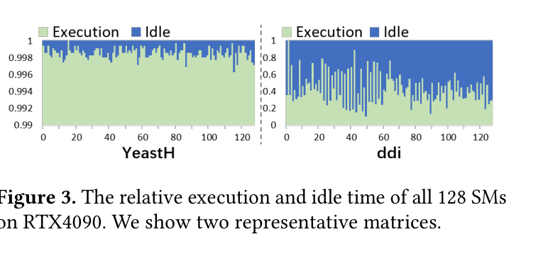

- YeastH 的负载不均衡较轻。
- ddi 的负载不均衡明显，很多 SM 空闲。

根本原因是：不同输入矩阵的 row window 内 TC block 数差异不同，因此负载均衡问题是 input-adaptive 的。

## 六、DTC-SpMM 总体设计

论文 Figure 4 给出 DTC-SpMM 的整体流程。它不是单个 kernel，而是一套从预处理到运行时的系统优化：

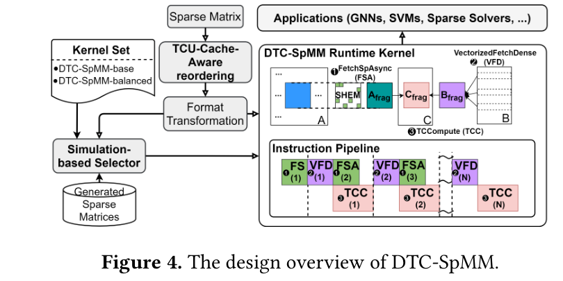

1. `TCU-Cache-Aware reordering`：离线重排序，提高 TC block 密度和 L2 cache locality。
2. `Format conversion`：把矩阵转成更省内存的 ME-TCF。
3. `Simulation-based Selector`：根据输入矩阵选择普通 DTC-SpMM kernel 或 balanced kernel。
4. `Runtime SpMM kernel`：用 shared-memory bypassing、sparse double buffering、index precomputing、vectorized fetch 等优化提高 TC 利用率。

论文强调模块 1、2、3 都用 CUDA kernel 加速以降低开销；TCA 重排序也可以离线做。

这套设计对应四个 gap：

| Gap | DTC-SpMM 对应设计 |
| --- | --- |
| TCF 内存开销高 | ME-TCF |
| TC block 密度低 | TCA reordering |
| TC pipeline utilization 低 | PTX kernel、SMB、SDB、IP、VFD |
| 负载不均衡 | strict-balance + simulation-based Selector |

## 七、ME-TCF：面向 Tensor Core 的省内存格式

论文第 4.2 节提出 `ME-TCF`，Memory-efficient TCF。它仍然基于 SGT 压缩后的 sparse matrix，但减少了数组数量和索引位宽。

ME-TCF 用四个数组：

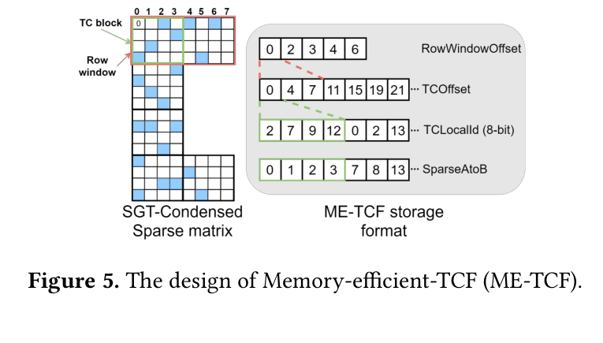

### RowWindowOffset

```text
RowWindowOffset: length = ceil(M / 16) + 1
```

它记录每个 row window 在 `TCOffset` 中的起始位置。

如果一个矩阵按 16 行一组切成 row window，第 `w` 个 row window 对应的 TC block 范围是：

```text
TC block id in [RowWindowOffset[w], RowWindowOffset[w+1])
```

源码中对应 `row_window_offset_tensor`：

```cpp
auto row_window_offset_tensor =
    torch::zeros({blockPartition_tensor.size(0) + 1}, options_gpu);
```

并通过 `blockpartition` 的 inclusive scan 得到：

```cpp
thrust::inclusive_scan(blockpartition_vector.begin(),
                       blockpartition_vector.end(), rowwindow_offset_ptr);
```

### TCOffset

```text
TCOffset: length = NumTCBlock + 1
```

它记录每个 TC block 在 `TCLocalId` 中的起止位置：

```text
nonzeros in TC block t:
TCLocalId[TCOffset[t] ... TCOffset[t+1]-1]
```

源码中是：

```cpp
auto tcblock_offset_tensor = torch::zeros({block_counter + 1}, options_gpu);
```

### TCLocalId

```text
TCLocalId: length = NNZ, dtype = uint8
```

每个非零元素只记录它在当前 `16 x 8` TC block 内的 local index：

```text
local_id = row_local x 8 + col_local
```

因为 `16 x 8 = 128`，最大 local id 是 127，`uint8` 足够表示。论文说该数组按 8-bit 存，相比 32-bit index，空间折算为 `NNZ / 4` 个 32-bit element。

源码中对应：

```cpp
auto tcblocktile_id_tensor = torch::zeros({num_edges}, options_gpu_unit8);
```

生成逻辑在 `generate_tcoffset_id_atob`：

```cpp
unsigned row_local = edgeToRow[e_index] % blockSize_h;
unsigned col_local = col % blockSize_w;
tileid[...] = (uint8_t)(row_local * blockSize_w + col_local);
```

### SparseAtoB

```text
SparseAtoB: length = NumTCBlock x 8
```

它记录 TC block 的每个局部列对应 B 的原始行号。因为 SpMM 中 `A[i,k]` 要乘 `B[k,:]`，压缩后的局部列必须能映射回原始 `k`。

源码中对应：

```cpp
auto sparse_AToX_index_tensor =
    torch::zeros({block_counter * blockSize_w}, options_gpu);
```

生成逻辑：

```cpp
sparse_AToB[tcblock_id * blockSize_w + col_local] = edgeList[e_index];
```

### ME-TCF 空间复杂度

论文给出 ME-TCF 总空间：

```text
ceil(M / 16) + NumTCBlock x 9 + NNZ / 4 + 2
```

解释如下：

- `ceil(M/16) + 1`：RowWindowOffset。
- `NumTCBlock + 1`：TCOffset。
- `NNZ / 4`：8-bit TCLocalId 折算成 32-bit element。
- `NumTCBlock x 8`：SparseAtoB。

合并后就是：

```text
ceil(M / 16) + NumTCBlock x 9 + NNZ / 4 + 2
```

论文实验结论：

- 原始 8 个矩阵上，ME-TCF 比 CSR 平均少 `6.42%` 空间。
- 经过 TCU-Cache-Aware reordering 后，TC block 数减少，SparseAtoB 空间也下降，ME-TCF 比 CSR 平均少 `30.10%`。

这说明 ME-TCF 的收益不仅来自 `uint8 TCLocalId`，也来自重排序提高 TC block 密度后减少 `NumTCBlock`。

## 八、TCA reordering：同时照顾 TC 块密度和 L2 cache

论文第 4.3 节提出两级 `TCU-Cache-Aware reordering`，简称 TCA。

普通图重排序如 METIS、Louvain、LSH64 多数面向 cache locality，而不是 Tensor Core tile density。因此它们不能直接最大化 TC block 的非零密度。

TCA 有两级：

```text
Hierarchy I: TCU-Aware
Hierarchy II: Cache-Aware
```

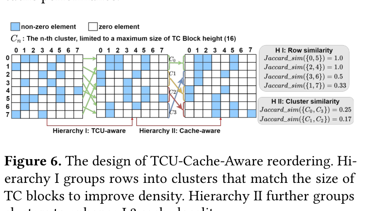

### Hierarchy I：TCU-Aware

目标：把非零列集合相似的行聚成不超过 16 行的 row cluster。

为什么是 16？

```text
DTC-SpMM 的 TC block 高度是 16。
一个 row window 正好对应 16 行。
```

如果把相似行放在同一个 row window，它们更可能共享 B 的列，压缩后 TC block 更密，`MeanNnzTC` 更高。

论文 Algorithm 1 的步骤是：

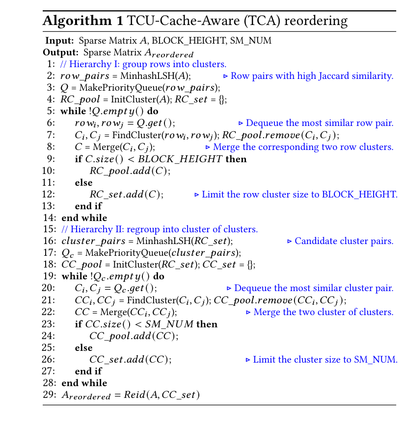

1. 用 Minhash LSH 找 Jaccard 相似度较高的行对。
2. 把候选行对放进 priority queue。
3. 初始化每行一个 cluster。
4. 每次取相似度最高的行对。
5. 找到它们所属 cluster，合并。
6. 如果合并后 cluster size 小于 `BLOCK_HEIGHT`，继续放回 pool。
7. 如果达到限制，就放进最终 row cluster set。

源码 `TCA_reorder.py` 中有直接对应：

```python
lsh = MinHashLSH(threshold=lsh_thres, num_perm=per)
...
res = lsh.query(allver[i])
...
que.put(Pair(source, item, df1[j][0]))
```

这里 `df1[j][0]` 是 Jaccard 相似度。源码用 `cugraph.jaccard` 在 GPU 上算候选行对的 Jaccard：

```python
df1 = cugraph.jaccard(G, df_pairs).to_pandas().values
```

合并时使用 union-find 风格的 `cluster_id`：

```python
if cluster_sz[p1] < cluster_sz[p2]:
    cluster_id[p1] = p2
    cluster_sz[p2] = cluster_sz[p1] + cluster_sz[p2]
    if cluster_sz[p2] >= thres:
        deleted[p2] = 1
else:
    cluster_id[p2] = p1
    cluster_sz[p1] = cluster_sz[p1] + cluster_sz[p2]
    if cluster_sz[p1] >= thres:
        deleted[p1] = 1
```

命令行参数 `--thres 16` 就是论文中的 `BLOCK_HEIGHT`。

### Hierarchy II：Cache-Aware

Hierarchy I 的 cluster size 很小，有利于 TC block density，但可能伤害 L2 cache locality。

原因是：GPU 上多个 SM 同时跑一批 thread block。如果相邻 row cluster 访问的 B 列完全不同，L2 cache hit rate 会低。

Hierarchy II 的做法是：

1. 把一个 row cluster 内所有非零列去重，形成 cluster 的列集合。
2. 对 row cluster 之间继续用 Jaccard similarity。
3. 把相似 row cluster 合并成 cluster of clusters。
4. cluster of clusters 的大小限制为 `SM_NUM`。

论文说这样可以让同一 wave 中并发执行的 row windows 更可能访问相似的 B 行，提高 L2 cache hit rate。

源码中对应：

```python
lists_c = [[] for i in range(cluster_num)]
...
list_cluster_i = []
for node in clusters[i]:
    list_cluster_i = list_cluster_i + lists[node]
list_cluster_i = list(set(list_cluster_i))
```

然后继续 LSH：

```python
lsh_c = MinHashLSH(threshold=cluster_thres, num_perm=per_c)
...
res = lsh_c.query(allver_c[i])
...
que_c.put(Pair(i, int(item), jd(lists_c[i], lists_c[int(item)])))
```

源码里第二级合并的阈值是：

```python
c_thres = 128
```

这和 RTX4090 的 128 SM 对应。

最终输出：

```python
np.savez(... dataset + ".reorder_id.npz", reorder_id=reorder)
np.savez(... dataset + ".reorder.npz", src_li=new_row_ind, dst_li=new_col_ind, num_nodes=num_row)
```

即保存重排序 id 和重排后的边列表。

### TCA 的实验结论

论文 Figure 13 给出三类结果：

- Figure 13(a)：TCA 提升 `MeanNnzTC`，相比 TC-GNN 的 SGT，Type I 提升 `1.13x`，Type II 提升 `1.72x`，超过 METIS、Louvain、LSH64。
- Figure 13(b)：重排序后 DTC-SpMM 平均性能提升 `23.23%`，平均行长越大收益越明显。
- Figure 13(c)：仅做 TCU-Aware 时，L2 hit rate 比 LSH64 平均低 `1.36%`；加上 Cache-Aware 后，L2 hit rate 进一步提高，并平均比 LSH64 高 `0.01%`。

这说明 TCA 不是单纯为了 cache，也不是单纯为了 TC block density，而是两者兼顾。

## 九、运行时 kernel：从 WMMA 到 PTX mma

论文第 4.4 节是性能优化核心。DTC-SpMM 运行时 kernel 每轮处理一个 TC block，主要有三个阶段：

1. `FetchSpAsync`：异步加载下一轮 sparse A tile。
2. `VFetchDense`：把 B 中对应 dense row 向量化加载进寄存器。
3. `TCCompute`：用 PTX-level `mma` 指令调用 Tensor Core。

论文 Algorithm 2 的伪代码可概括为：

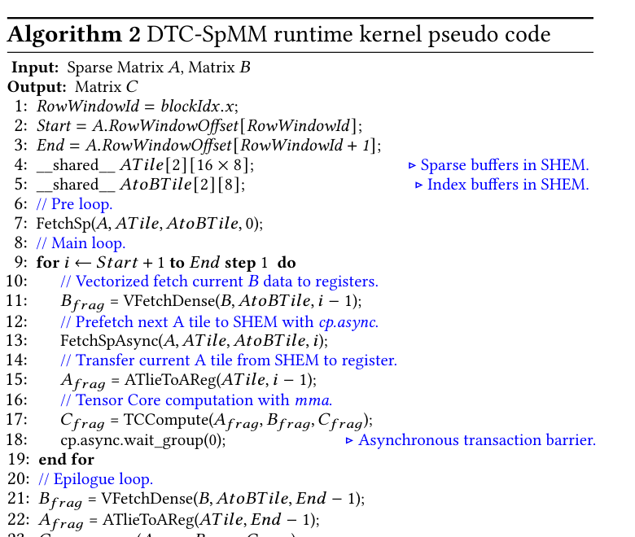

```cpp
RowWindowId = blockIdx.x;
Start = A.RowWindowOffset[RowWindowId];
End = A.RowWindowOffset[RowWindowId + 1];

__shared__ ATile[2][16 x 8];
__shared__ AtoBTile[2][8];

FetchSp(A, ATile, AtoBTile, 0);

for i = Start + 1 to End:
    Bfrag = VFetchDense(B, AtoBTile, i - 1);
    FetchSpAsync(A, ATile, AtoBTile, i);
    Afrag = ATileToAReg(ATile, i - 1);
    Cfrag = TCCompute(Afrag, Bfrag, Cfrag);
    cp.async.wait_group(0);

Bfrag = VFetchDense(B, AtoBTile, End - 1);
Afrag = ATileToAReg(ATile, End - 1);
Cfrag = mma(Afrag, Bfrag, Cfrag);
StoreCRemapping(C, Cfrag);
```

### Shared-memory bypassing

TC-GNN 的流程是：

```text
global memory -> shared memory -> register fragment -> Tensor Core
```

DTC-SpMM 对 B 做 shared-memory bypassing：

```text
global memory -> register fragment -> Tensor Core
```

原因是 B tile 在通用 SpMM 中复用有限，放 shared memory 会增加 `STS/LDS` 指令和同步开销。

论文 Figure 7 对比了 TC-GNN 和 DTC-SpMM 的 instruction pipeline 和 data movement：

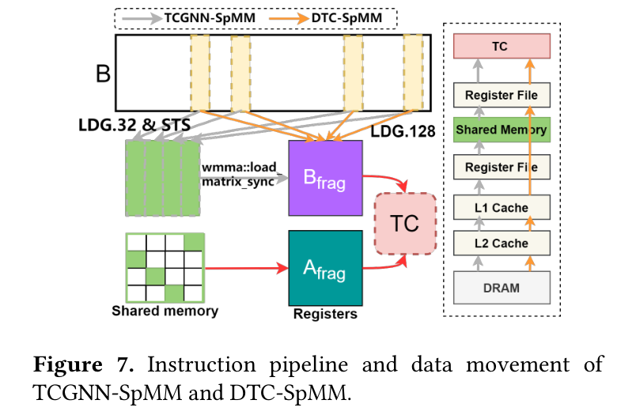

- TC-GNN 使用 C-level WMMA，B 先写 shared memory。
- DTC-SpMM 使用 PTX-level `mma`，B 直接进入寄存器。

官方代码中，优化版不再用 `wmma::fragment<...>`，而是直接维护寄存器数组：

```cpp
uint32_t frag_A[4];
uint32_t frag_B[4];
float frag_D[8] = {0.0};
```

并把 FP32 转 TF32：

```cpp
asm("cvt.rna.tf32.f32  %0, %1;\n" : "=r"(frag_B[0]) : "f"(input[source_idx]));
```

再直接调用 PTX：

```cpp
asm volatile(
    "mma.sync.aligned.m16n8k4.row.col.f32.tf32.tf32.f32 "
    "{%0,%1,%2,%3}, {%4,%5}, {%6}, {%7,%8,%9,%10};\n"
    : "=f"(frag_D[0]), "=f"(frag_D[1]), "=f"(frag_D[2]), "=f"(frag_D[3])
    : "r"(frag_A[0]), "r"(frag_A[1]),
      "r"(frag_B[0]),
      "f"(frag_D[0]), "f"(frag_D[1]), "f"(frag_D[2]), "f"(frag_D[3])
);
```

这就是论文说的 low-level PTX programming 的必要性：C-level WMMA API 难以表达“B 不经过 shared memory，直接按寄存器分布喂给 mma”。

### VFetchDense：strided access vs sequential access

论文 Figure 8 讨论 B 的寄存器分布问题。

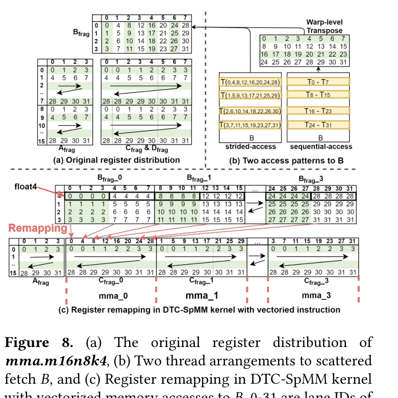

背景是：

- GNN 等 workload 中，B 通常按 row-major 存。
- `mma` 需要的 `B_frag` 是 column-major 分布。

有两种选择：

1. `strided-access`：线程按 column-major 需求直接取 B，对线程来说地址比较分散。
2. `sequential-access`：相邻线程先读相邻地址，再用 `__shfl_sync` 做 warp transpose。

论文 microbenchmark 显示，在 RTX4090 上两者都能形成 coalesced memory access，因为 global memory access granularity 是 32 bytes，也就是 8 个 float；两种方式都需要 4 个 sector。

但 sequential-access 需要额外 `__shfl_sync`，而 `__shfl_sync` 延迟约 10.7 cycles，HMMA 也才约 16 cycles。因此 DTC-SpMM 选择 strided-access。

### vectorized memory access 与 register remapping

为了提高 B 加载带宽，DTC-SpMM 使用 `float2`、`float4` 向量化读取。

源码里有多个版本：

```cpp
spmm_forward_cuda_kernel_improved_ptx_1684_uint8_v1_with_value_double_buffer_float2
spmm_forward_cuda_kernel_improved_ptx_1684_uint8_v1_with_value_double_buffer_float4
spmm_forward_cuda_kernel_improved_ptx_1684_uint8_v1_with_value_double_buffer_float4_split
```

`float4` 版本中直接读取：

```cpp
float4 t = FLOAT4(input[source_idx]);
asm("cvt.rna.tf32.f32 %0, %1;\n" : "=r"(frag_B[0]) : "f"(t.x));
asm("cvt.rna.tf32.f32 %0, %1;\n" : "=r"(frag_B[1]) : "f"(t.y));
asm("cvt.rna.tf32.f32 %0, %1;\n" : "=r"(frag_B[2]) : "f"(t.z));
asm("cvt.rna.tf32.f32 %0, %1;\n" : "=r"(frag_B[3]) : "f"(t.w));
```

问题是，`float4` 读取后线程内持有连续元素，而 MMA 原始寄存器分布可能要求这些连续元素分散在 thread 0、4、8、12。论文不在在线路径做 shuffle，而是保留 B_frag 的这种分布，并在最后写 C 时做一次 register remapping。

源码的 `StoreCRemapping` 对应输出写回逻辑，例如：

```cpp
uint32_t row_d = (i < 2) ? group_id : group_id + 8;
uint32_t col_d = (tid_in_group * 2) + (i & 0x1);
uint32_t off = row_d * embedding_dim + col_d;
output[o_off1 + off] = frag_D[i];
output[o_off2 + off] = frag_D[i + 4];
```

`float4` 版本中则一次写更多连续列：

```cpp
uint32_t col_d = (tid_in_group << 3) + ((i & 0x1) << 2);
output[off_set]     = frag_D[i];
output[off_set + 1] = frag_D[i + 4];
output[off_set + 2] = frag_D[i + 8];
output[off_set + 3] = frag_D[i + 12];
```

这就是论文 Figure 8(c) 的 register remapping。

## 十、Sparse double buffering

论文第 4.4.2 节指出，直到 Ada Lovelace，GPU 不支持从 global memory 异步拷贝到 register。因此 B 的 `VFetchDense` 不能像 shared memory tile 那样预取。

DTC-SpMM 转而预取 sparse A tile：

```text
当前轮做 Tensor Core compute。
同时把下一轮 A tile 异步搬进 shared memory。
```

这就是 `sparse double buffering`。

论文 Figure 9 画的是两个 shared memory buffer：

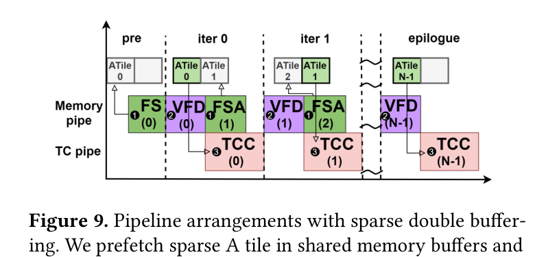

```text
ATile[0], AtoBTile[0]
ATile[1], AtoBTile[1]
```

当前 buffer 用于计算，另一个 buffer 用 `cp.async` 预取下一块。

源码中对应：

```cpp
__shared__ float sparse_A[2 * BLK_H * BLK_W];
__shared__ int sparse_AToX_index[2 * BLK_W];
```

选择当前/下一 buffer：

```cpp
int smem_sel = ((j - lb) & 1) ^ 1;
int smem_sel_next = ((j - lb - 1) & 1) ^ 1;
```

异步拷贝：

```cpp
asm ("cp.async.ca.shared.global [%0], [%1], 4;\n"
     :: "r"(sa_ptr + id_local + (smem_sel_next << 9)), "l"(valuesA + eIdx));

asm ("cp.async.ca.shared.global [%0], [%1], 4;\n"
     :: "r"(si_ptr + (tid << 2) + (smem_sel_next << 5)),
        "l"(sparse_AToX_idx + sparse_AToX_idx_start + tid));
```

提交和等待：

```cpp
asm ("cp.async.commit_group;\n"::);
asm ("cp.async.wait_group 0;\n" ::);
```

这与论文 Algorithm 2 的 `FetchSpAsync`、`cp.async.wait_group(0)` 完全对应。

## 十一、Index precomputing

论文第 4.4.3 节的目标是减少 FetchSparse 和 VFetchDense 中的 IMAD 指令。

TC-GNN 在运行时需要反复做：

```text
edge -> compressed column
compressed column -> TC block id
compressed column -> local col
row -> local row
TC block local col -> B original row
source index = B row x embedding_dim + feature offset
```

DTC-SpMM 把能预计算的索引提前放进 ME-TCF：

- `TCLocalId` 已经把 `(row_local, col_local)` 压成一个 local id。
- `SparseAtoB` 已经记录 TC block 局部列到 B 原始行的映射。
- kernel 中只要读 `TCblocktile_id` 和 `sparse_AToX_idx`。

源码里优化版的运行时逻辑明显比 TC-GNN 少：

```cpp
int id_local = (int)TCblocktile_id[eIdx];
sparse_A[id_local] = valuesA[eIdx];
```

以及：

```cpp
sparse_AToX_index[tid] = sparse_AToX_idx[eIdx] * embedding_dim;
```

相比 TC-GNN 原始版本里先判断 `edgeToColumn` 是否落在当前 TC block、再求 `row_local` 和 `col_local`，DTC 的在线索引计算更少。

论文 Figure 14 的结果也验证了这一点：DTC-SpMM 的 `#IMAD/#HMMA` 比 TCGNN-SpMM 明显降低，Type I 降低 `38.39%`，Type II 降低 `89.37%`。

## 十二、负载均衡与 Selector

论文第 4.5 节处理 Observation 4。

### balanced runtime kernel

普通 DTC-SpMM 的分配方式是：

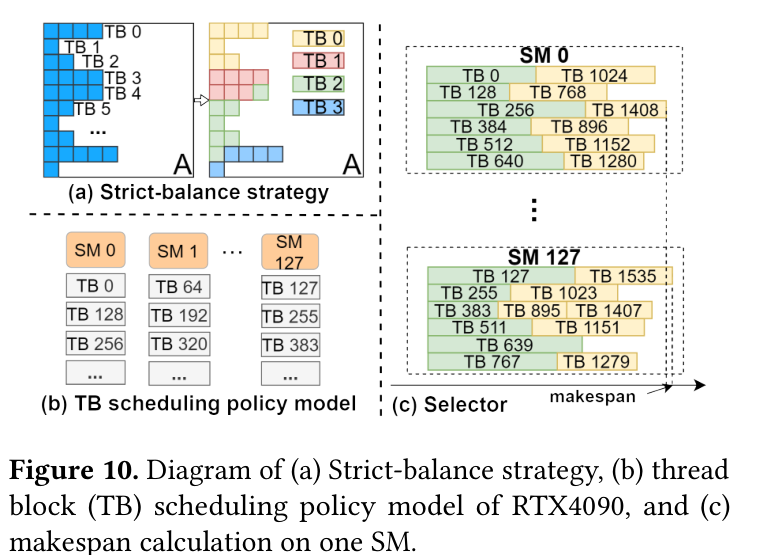

```text
一个 thread block 负责一个 row window。
```

优点是同一 row window 的结果可以在本 block 内完成累加，最后写一次 global memory。

缺点是 row window 的 TC block 数不均时，负载不均。

balanced DTC-SpMM 改成：

```text
每个 thread block 处理固定数量 TC blocks。
这些 TC blocks 可以来自不同 row windows。
```

论文说实现中每个 thread block 分配 32 个 TC blocks。这样计算任务更均匀地分散到 SM 上。

代价是：

- 不同 thread block 可能写同一个 row window 的输出。
- 需要 atomic operation。
- 额外 global memory write 增多。

源码中 `config.h` 设置：

```cpp
#define BLK_H 16
#define BLK_W 8
#define WARP_SIZE 32
#define TCBLOCK_PER_WARP 64
```

仓库当前配置里 `TCBLOCK_PER_WARP` 是 64，说明代码版本允许调参；论文正文中描述的是 32 in our implementation。文章理解时应以论文叙述为主，同时注意官方仓库配置可能有后续实验调整。

balanced kernel 入口：

```cpp
m.def("run_DTCSpMM_balance", &spmm_balance_forward_ptx_uint8_prefetch,
      "DTC-SpMM balance version forward (CUDA)");
```

底层 launch：

```cpp
dim3 grid((tc_count + TCBLOCK_PER_WARP - 1) / TCBLOCK_PER_WARP, 1, 1);
```

这表示 grid 不再按 `num_row_windows`，而是按 `tc_count / TCBLOCK_PER_WARP` 划分。

### Simulation-based Selector

balanced kernel 不是总是更快。对本来就均衡的矩阵，它会引入 atomic 和额外写回，可能变慢。

因此论文设计 Selector。它不实际运行 kernel，而是模拟 RTX4090 thread block scheduler，估计普通 kernel 的 makespan。

论文给出的 SM 分配模型是：

```text
sm_idx = 2 * (block_idx mod 64) + (block_idx / 64 mod 2)
```

这对应 RTX4090 的 128 个 SM。论文说 NVIDIA 的 TB scheduler 是 proprietary 的，所以这是通过观察/建模得到的近似。

普通 kernel 的 makespan：

```text
每个 thread block 的工作量约等于其 row window 中 TC block 数。
按照调度模型把 thread block 分配到 SM。
每个 SM 同时可驻留 occupancy 个 thread block。
最终 makespan = 128 个 SM 中最大的累计完成时间。
```

论文给出 RTX4090 上 DTC-SpMM kernel occupancy 是 6。

balanced kernel 的 makespan 近似：

```text
NumTCBlocks / (128 x 6)
```

Selector 用 approximation ratio：

```text
AR = makespan_without_balance / makespan_with_balance
```

如果：

```text
AR > 1.2
```

就启动 balanced-DTC-SpMM；否则用普通 DTC-SpMM。

阈值 `1.2` 来自离线实验：作者生成了 1000 个非零均匀分布、天然负载均衡的稀疏矩阵，发现使用 strict-balance 会造成 `22.4%` 性能下降。因此阈值设成 1.2，避免在收益不足时启用 balance。

论文也承认这个阈值不一定 universal optimal，但在他们的数据集上有效。

## 十三、实验设置与整体性能

### Baselines

论文比较了这些 baseline：

1. `cuSPARSE SpMM`：CUDA 12.1，CSR，`CUSPARSE_SPMM_ALG_DEFAULT`。
2. `TCGNN-SpMM`：之前使用 TF32 Tensor Core 做 general SpMM 的 SOTA。
3. `Sputnik`：深度学习稀疏库。
4. `SparseTIR`：TVM 体系 sparse tensor compiler。
5. `Block-SpMM`：cuSPARSE Blocked-ELL，使用 TF32 TC，目标 structured SpMM。
6. `VectorSparse`：细粒度 1-D vector sparsity。
7. `Flash-LLM`：面向 LLM 推理中的 unstructured sparse weight。
8. `SparTA`：面向 DNN unstructured sparse weight。

官方代码也封装了 cuSPARSE、Sputnik、Blocked-ELL：

```cpp
m.def("run_cuSPARSE", &spmm_forward_cusparse_impl, ...);
m.def("run_Sputnik", &spmm_forward_sputnik_impl, ...);
m.def("forward_cusparse_bell", &spmm_forward_cusparse_blocked_ellpack_impl, ...);
```

### Datasets

除了 Table 1 的 8 个代表矩阵，论文还从 SuiteSparse 选取至少 100 万非零元素的矩阵。

排除条件：

- Sputnik 的 index 计算依赖 int32，某些矩阵超过限制会 segfault。
- TCGNN-SpMM 不能处理非方阵。

最终保留 414 个 SuiteSparse 矩阵。

### Environments

硬件：

- RTX4090，Ada Lovelace，Compute Capability 8.9，24GB。
- RTX3090，Ampere，Compute Capability 8.6，24GB。

软件：

- CUDA 12.1 NVCC。
- 每个实验运行 1000 次，报告平均值。

### Overall performance

论文测试 `N = 128, 256, 512`，其中 `N` 是 dense matrix B 的列数。

Figure 11(a) 显示 RTX4090 上 8 个代表矩阵的 speedup，归一化到 cuSPARSE-SpMM。DTC-SpMM 在所有 8 个矩阵上最高，Type II 矩阵上相对加速更明显，最高到 `3.29x`。

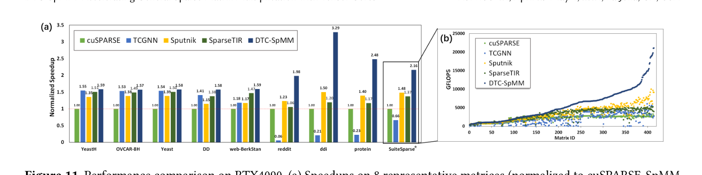

论文解释：TCGNN-SpMM 对 Type I 短行矩阵优化较好，但在 Type II 长行矩阵上不能取得加速。

Table 3 总结 414 个 SuiteSparse 矩阵上的分布。

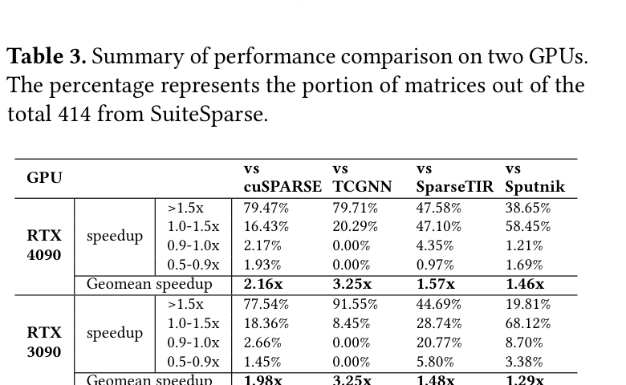

RTX4090：

| Baseline | >1.5x | 1.0-1.5x | 0.9-1.0x | 0.5-0.9x | Geomean |
| --- | ---: | ---: | ---: | ---: | ---: |
| cuSPARSE | 79.47% | 16.43% | 2.17% | 1.93% | 2.16x |
| TCGNN | 79.71% | 20.29% | 0.00% | 0.00% | 3.25x |
| SparseTIR | 47.58% | 47.10% | 4.35% | 0.97% | 1.57x |
| Sputnik | 38.65% | 58.45% | 1.21% | 1.69% | 1.46x |

RTX3090：

| Baseline | >1.5x | 1.0-1.5x | 0.9-1.0x | 0.5-0.9x | Geomean |
| --- | ---: | ---: | ---: | ---: | ---: |
| cuSPARSE | 77.54% | 18.36% | 2.66% | 1.45% | 1.98x |
| TCGNN | 91.55% | 8.45% | 0.00% | 0.00% | 3.25x |
| SparseTIR | 44.69% | 28.74% | 20.77% | 5.80% | 1.48x |
| Sputnik | 19.81% | 68.12% | 8.70% | 3.38% | 1.29x |

结论是：DTC-SpMM 不只超过 TC-GNN，也超过了高度优化的 CUDA-core baseline cuSPARSE、SparseTIR、Sputnik 的几何平均性能。

### 与 structured TC SpMM 比较

Figure 12 比较 Block-SpMM 和 VectorSparse。

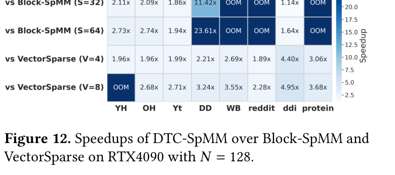

论文把矩阵转换成：

- BELL format，block size 为 32 和 64。
- CVSE format，vector length 为 4 和 8。

DTC-SpMM 对 Block-SpMM 有 `1.14x-23.51x` 加速，对 VectorSparse 有 `1.89x-4.95x` 加速。

Block-SpMM 的问题是 BELL 需要 padding/fill 所有 block rows，大规模非结构化稀疏矩阵可能 OOM。

### 与 Flash-LLM 和 SparTA 比较

Table 4 给出 `N=128` 时的执行时间：

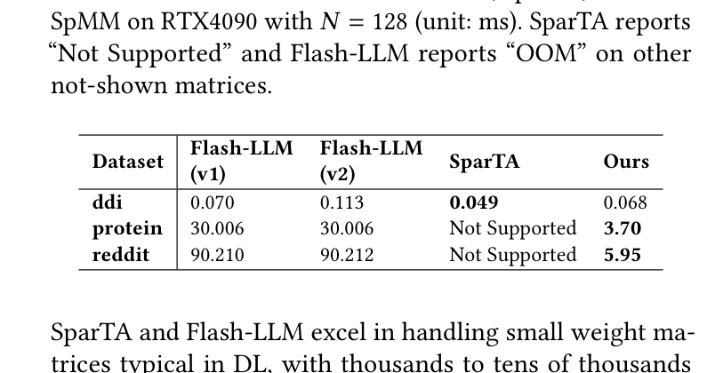

| Dataset | Flash-LLM v1 | Flash-LLM v2 | SparTA | DTC-SpMM |
| --- | ---: | ---: | ---: | ---: |
| ddi | 0.070 ms | 0.113 ms | 0.049 ms | 0.068 ms |
| protein | 30.006 ms | 30.006 ms | Not Supported | 3.70 ms |
| reddit | 90.210 ms | 90.212 ms | Not Supported | 5.95 ms |

ddi 很小，SparTA/Flash-LLM 有竞争力。但在 protein/reddit 这种大规模 GNN/SC 矩阵上，DTC-SpMM 明显更强。

论文解释：SparTA 和 Flash-LLM 擅长小型 DNN 权重矩阵，行数几千到几万，稀疏率 60%-90%；但 GNN/SC 场景是百万级行、超过 95% 稀疏，若没有 condensing 设计，TC block density 低，性能会受限。

## 十四、消融实验

### ME-TCF 格式有效性

论文第 5.3 节先比较存储开销：

- TCF 比 CSR 平均多 `168.41%`。
- ME-TCF 在原始 8 个矩阵上比 CSR 平均少 `6.42%`。
- TCA 重排序后，ME-TCF 比 CSR 平均少 `30.10%`。

解释是：TCA 减少 TC block 数，SparseAtoB 也随之减少。

### TCA reordering 有效性

TCA 后 DTC-SpMM 平均性能提升 `23.23%`。

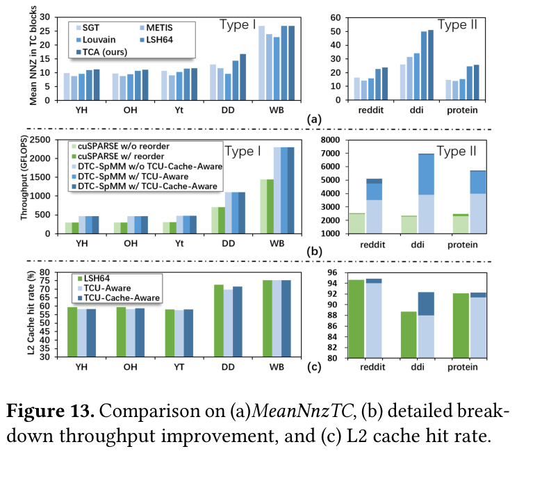

相比 SGT：

- Type I 的 `MeanNnzTC` 提升 `1.13x`。
- Type II 的 `MeanNnzTC` 提升 `1.72x`。

对 L2 cache：

- 只做 TCU-Aware 时，L2 hit rate 比 LSH64 平均低 `1.36%`。
- 加 Cache-Aware 后，L2 hit rate 超过 LSH64，平均高 `0.01%`。

这个结果说明第二级 Cache-Aware 不是装饰项，它确实修补了第一级小 cluster 对 cache locality 的伤害。

### runtime kernel optimizations 有效性

Figure 14 分析 TC pipeline utilization 和 `#IMAD/#HMMA`。

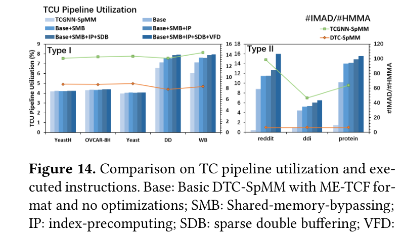

相比 TCGNN-SpMM：

- Type I：DTC-SpMM 的 TC pipeline utilization 高 `11.35%`。
- Type II：DTC-SpMM 的 TC pipeline utilization 高 `1760.25%`。
- Type I：`#IMAD/#HMMA` 低 `38.39%`。
- Type II：`#IMAD/#HMMA` 低 `89.37%`。

消融结论：

- `Base`：只用 ME-TCF、不加 runtime 优化，相比 TCGNN 已让 TC pipeline utilization 在 Type I/II 上高 `6.10%` / `921.24%`。
- `SMB`：shared-memory bypassing 让 pipeline utilization 增加 `12.16%`。
- `IP`：index-precomputing 对平均行长大的矩阵尤其有效。
- `SDB`：sparse double buffering 增加 `4.83%`。
- `VFD`：VectorizedFetchDense 再增加 `4.99%`。

### workload balance 有效性

Figure 15 比较 reddit 和 ddi。

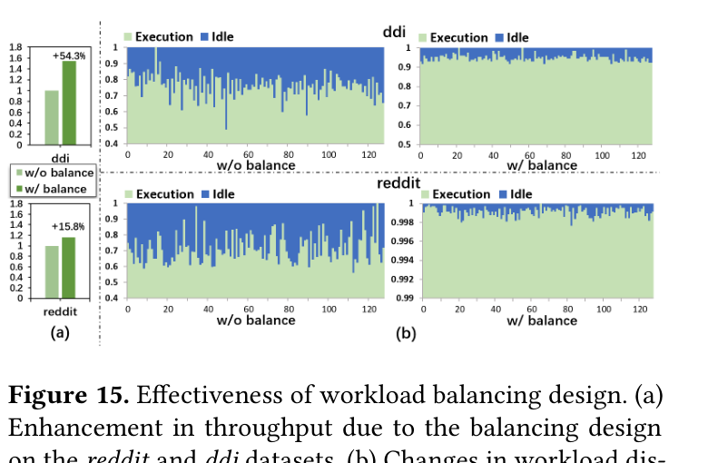

启用 strict-balance 后：

- reddit 性能提升 `15.82%`。
- ddi 性能提升 `54.31%`。

Figure 15(b) 显示 128 个 SM 的执行/空闲时间明显更均匀。

对 YeastH 这类 Type I 短行矩阵，负载不均衡不严重，strict-balance 收益不明显。Selector 的作用就是区分这些场景。

## 十五、端到端 GCN 训练

论文第 5.4 节做 case study：把 DTC-SpMM 用到两层 GCN 模型中，称为 DTC-GCN。

GCN 公式：

```text
H^{l+1} = sigma[(A x H^l) x W^l + b^l]
```

其中 `A x H^l` 是 SpMM。

实验数据集：

- YeastH
- protein
- IGB-tiny
- IGB-small

对比框架：

- DGL
- PyG
- TC-GNN

PyG 1.6.0 之后有两种模式：

- Gather-Scatter
- SparseTensor

SparseTensor 会调用 `torch-sparse` 中的 SpMM kernel，通常内存更省、速度更快。

隐藏层维度：

```text
128 and 256
```

训练：

```text
200 epochs
```

Figure 16 结果：

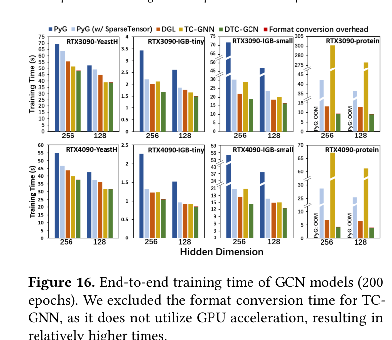

RTX4090 上，DTC-GCN 几何平均加速：

- 相比 DGL：`1.26x`
- 相比 PyG SparseTensor：`1.91x`
- 相比 TC-GNN：`2.21x`

RTX3090 上：

- 相比 DGL：`1.22x`
- 相比 PyG SparseTensor：`1.81x`
- 相比 TC-GNN：`2.69x`

如果排除 protein，因为 TC-GNN 的 SpMM kernel 在 protein 上表现较弱，则 DTC-GCN 相比 TC-GNN：

- RTX4090：`1.16x`
- RTX3090：`1.19x`

论文还说明：Figure 16 中 TC-GNN 排除了格式转换时间，因为 TC-GNN 的格式转换没有 GPU 加速，时间较高。

## 十六、开销、局限与适用场景

论文第 6 节非常重要，因为它说明 DTC-SpMM 不是所有场景都适合。

### Format conversion overhead

从 CSR 转 ME-TCF 有开销。论文用 YeastH 和 protein 做例子：

- YeastH：转换开销是单次 SpMM 执行时间的 `1.48x`。
- protein：转换开销是单次 SpMM 执行时间的 `14.50x`。

但 DTC-SpMM 使用 GPU kernel 加速转换，相比 TC-GNN 的 CPU/非 GPU 加速转换：

- YeastH 快 `101.00x`。
- protein 快 `72.21x`。

源码中 `preprocess_gpu` 就是这个目的：

```cpp
fill_edgeToRow_cuda(...);
fill_segment_cuda(...);
seg_sort_dequ(...);
```

### Reordering overhead

TCA reordering 是 optional，但计算代价高，因为涉及 Minhash 和 Jaccard。

论文说：

- 使用 MinHashCuda 和 cuGraph GPU kernel。
- 使用 batching 提高 GPU 利用率。
- 把 [23] 中小时级重排序降到分钟级。

源码 `TCA_reorder.py` 中能看到：

```python
import cugraph
import cudf
import libMHCUDA
```

以及批量 query 后再调用 `cugraph.jaccard`。

论文强调重排序可以离线预处理；即使没有重排序，DTC-SpMM 在 Figure 11 中也有显著加速。

### Selector overhead

Selector 开销：

- YeastH：占单次 SpMM 执行时间的 `42.0%`。
- protein：占 `24.8%`。

听起来不小，但如果 sparse matrix A 不变、重复执行上千次 SpMM，格式转换和 Selector 开销就会被摊薄。

### 适用场景

适合：

- GNN 训练/推理中固定图结构，多次 SpMM。
- scientific computing 中固定稀疏结构的迭代求解。
- 稀疏矩阵集合/图数据集可以预处理的场景。
- DGL、PyG、IGB、OGB、SNAP、SuiteSparse 这类矩阵可缓存格式转换和重排序结果的场景。

不适合：

- 每次 SpMM 的稀疏矩阵都变的场景。
- 图采样训练中每个 mini-batch 都生成不同稀疏子图的场景。
- 转换/重排序不能被复用的低迭代次数场景。

论文明确说，对 graph sampling in GNN 这类输入稀疏矩阵频繁变化的场景，cuSPARSE 或 HP-SpMM 这类轻量开销方法可能更合适。

## 十七、官方源码对应关系

这一节把论文设计和代码文件对应起来。

### Python 扩展入口

`DTCSpMM.cpp` 用 PyTorch extension 暴露接口：

```cpp
PYBIND11_MODULE(TORCH_EXTENSION_NAME, m) {
  m.def("preprocess", &preprocess, "Preprocess Step on (CPU)");
  m.def("preprocess_gpu", &preprocess_gpu, "Preprocess Step on (CUDA)");

  m.def("run_TCGNNSpMM", &spmm_forward, "TC-GNN SPMM forward (CUDA)");
  m.def("run_DTCSpMM", &spmm_forward_ptx_uint8_improved,
        "DTC-SPMM forward (CUDA)");
  m.def("run_DTCSpMM_balance", &spmm_balance_forward_ptx_uint8_prefetch,
        "DTC-SpMM balance version forward (CUDA)");

  m.def("run_cuSPARSE", &spmm_forward_cusparse_impl, ...);
  m.def("run_Sputnik", &spmm_forward_sputnik_impl, ...);
  m.def("forward_cusparse_bell", &spmm_forward_cusparse_blocked_ellpack_impl, ...);
}
```

这说明官方实现同时包含：

- DTC-SpMM。
- balanced DTC-SpMM。
- TC-GNN baseline。
- cuSPARSE CSR baseline。
- Sputnik baseline。
- cuSPARSE Blocked-ELL baseline。

### 参数配置

`config.h`：

```cpp
#define BLK_H 16
#define BLK_W 8
#define WARP_SIZE 32
#define TCBLOCK_PER_WARP 64
```

`BLK_H=16`、`BLK_W=8` 对应论文中 `16 x 8` TC block 的设计。

### ME-TCF 构建

`preprocess_gpu` 负责 GPU 格式转换：

```cpp
fill_edgeToRow_cuda(edgeToRow, nodePointer, num_nodes);
fill_segment_cuda(nodePointer, seg_out, blockSize_h, blockSize_w, num_nodes);
seg_sort_dequ(...);
```

`seg_sort_dequ` 中：

1. 用 Thrust 对 `(segment, edgeList)` zip sort。
2. `generate_edgetocolumn_cuda` 生成压缩列号和 blockpartition。
3. inclusive scan 生成 rowwindow_offset。
4. `generate_tcblock_rowid_cuda` 生成每个 TC block 对应的 row window。
5. `generate_tcoffset_id_atob_cuda` 生成 `TCOffset`、`TCLocalId`、`SparseAtoB`。

### TCGNN baseline kernel

`spmm_forward_cuda_kernel` 对应论文 Figure 2。

关键特征：

- A tile 和 B tile 都走 shared memory。
- 使用 `wmma::fragment`。
- 使用 `wmma::mma_sync`。
- 在线扫描 `edgeToColumn` 判断某条边是否属于当前 TC block。

### DTC basic/improved kernel

`spmm_forward_improved_ptx_uint8_cuda` 根据 `exeplan` 选择 kernel：

```cpp
if (exeplan == "float_nonsplit") {
    spmm_forward_cuda_kernel_improved_ptx_1684_uint8_v1_with_value_double_buffer<<<...>>>(...);
} else if (exeplan == "float2_nonsplit") {
    spmm_forward_cuda_kernel_improved_ptx_1684_uint8_v1_with_value_double_buffer_float2<<<...>>>(...);
} else if (exeplan == "float2_split") {
    spmm_forward_cuda_kernel_improved_ptx_1684_uint8_v1_with_value_double_buffer_float2_split<<<...>>>(...);
} else if (exeplan == "float4_nonsplit") {
    spmm_forward_cuda_kernel_improved_ptx_1684_uint8_v1_with_value_double_buffer_float4<<<...>>>(...);
} else if (exeplan == "float4_split") {
    spmm_forward_cuda_kernel_improved_ptx_1684_uint8_v1_with_value_double_buffer_float4_split<<<...>>>(...);
}
```

这对应论文中的 VectorizedFetchDense 和 split/nonsplit execution plan。

### GCN 专用选择逻辑

`spmm_forward_improved_ptx_uint8_cuda_dtc_for_gcn` 会根据 embedding dimension 自动选 float4/float2/single 版本：

```cpp
if (embedding_dim >= 128 && embedding_dim % 4 == 0) {
    ... float4_split ...
} else if (embedding_dim >= 64 && embedding_dim % 2 == 0) {
    ... float2_split ...
} else if (embedding_dim % 2 == 0) {
    ... float2 ...
} else {
    ... base ...
}
```

这说明论文里的运行时 kernel 并不是一个单一路径，而是按特征维度选择不同向量化和切分版本。

### balanced kernel

`spmm_balance_forward_cuda_ptx_unit8_prefetch` 用：

```cpp
dim3 grid((tc_count + TCBLOCK_PER_WARP - 1) / TCBLOCK_PER_WARP, 1, 1);
```

这说明 balanced 版本按 TC block 总数划分任务，而不是按 row window 数划分任务。

### 计时与 SM 负载统计

源码中多处使用：

```cpp
int smid = getSMId();
clocktype tt = GlobalTimer64();
```

然后把每个 block 的开始、结束和 SM id 写入数组，最后输出：

```cpp
block_time.csv
block_time_ours_before_balance.csv
block_time_ours_after_balance.csv
```

这对应论文 Figure 3 和 Figure 15 的 SM execution/idle time 分析。

## 十八、这篇论文的核心启发

DTC-SpMM 的主要贡献可以压缩成一句话：

```text
让 Tensor Core 加速 general SpMM，关键不是简单把稀疏矩阵补成 dense tile，而是同时解决格式、重排序、运行时数据路径和负载均衡。
```

具体启发有四点。

第一，Tensor Core 的高 FLOPS 不会自动转化为 SpMM 性能。TC-GNN 已经能用 TC 算 general SpMM，但 TC pipeline utilization 低于 8%，说明“能用 TC”和“有效用 TC”之间差距很大。

第二，稀疏格式必须为硬件执行路径服务。ME-TCF 不是一般意义上的压缩格式，而是围绕 `16 x 8` TC block 设计的格式：`uint8 local id`、`RowWindowOffset`、`TCOffset`、`SparseAtoB` 都直接服务于 PTX kernel。

第三，重排序不能只看 cache，也要看 Tensor Core tile density。TCA 的两级设计很典型：第一级提高 `MeanNnzTC`，第二级补 L2 cache locality。

第四，低层 kernel 优化要落到指令级。DTC-SpMM 的关键优化包括：

- 避免 B tile 经 shared memory。
- 使用 PTX `mma.sync` 直接控制寄存器。
- 使用 `cp.async` 只预取 sparse A tile。
- 用 `float2/float4` 提高 B 的读取效率。
- 用 register remapping 避免在线 `__shfl_sync`。
- 用 Selector 避免 balance kernel 的无谓 overhead。

这篇论文最值得记住的面试表达是：

```text
DTC-SpMM 解决的是 Tensor Core 在通用不规则 SpMM 上利用率低的问题。
它先分析 TC-GNN 的四个瓶颈：TCF 内存开销高、TC block 密度低、TC pipeline utilization 低、输入相关负载不均。
然后分别用 ME-TCF、TCA reordering、PTX-level runtime kernel 和 simulation-based Selector 解决。
它的重点不是单个技巧，而是从数据布局到指令 pipeline 的端到端协同设计。
```
