## 目录

1. [论文解决的问题](#一论文解决的问题)
2. [核心贡献](#二核心贡献)
3. [整体架构](#三整体架构)
4. [背景：异构程序追踪与异常检测](#四背景异构程序追踪与异常检测)
5. [HLibrary：异构事件采集层](#五hlibrary异构事件采集层)
6. [HCCG：异构计算通信图](#六hccg异构计算通信图)
7. [HADEN：异构异常检测演化网络](#七haden异构异常检测演化网络)
8. [结合源码理解模型实现](#八结合源码理解模型实现)
9. [异常分数与源码归因](#九异常分数与源码归因)
10. [层次化性能分析](#十层次化性能分析)
11. [实验设置](#十一实验设置)
12. [四类层次化分析案例](#十二四类层次化分析案例)
13. [MISA-MD 大规模综合案例](#十三misa-md-大规模综合案例)
14. [开销评估](#十四开销评估)
15. [相关工作定位](#十五相关工作定位)
16. [结论与理解](#十六结论与理解)

## 一、论文解决的问题

论文题目是 **Spatio-Temporal Evolving Anomaly Detection Tool for Large-Scale Heterogeneous Programs Analysis**。核心目标是：在大规模异构 HPC 程序中，用一次程序执行得到的 trace，自动识别性能异常操作，并进一步定位硬件、通信、host-device 传输和 kernel 执行层面的性能问题。

异构 HPC 程序的性能分析难点主要来自四点。

第一，异构系统复杂。现代超级计算机中，GPU 等加速器贡献了主要峰值算力，但 CPU、GPU、MPI 通信、host-device 数据传输、kernel 执行共同构成复杂执行链路。性能问题可能出现在任一层。

第二，真实应用离峰值性能很远。论文提到，近年来 Gordon Bell Prize 相关工作显示，真实应用通常只达到超级计算机峰值性能的 3% 到 10%，说明仍有大量优化空间。

第三，传统工具依赖专家经验。启发式工具需要专家为每类性能问题总结模式和规则；机器学习工具常需要大量带标签数据，并且往往依赖特定硬件平台、应用或问题类型。

第四，已有分析范围窄。很多工具只检测特定问题，例如通信负载不均、性能方差、kernel hotspot 等。用户在不知道问题类型时，只能反复尝试多个工具，成本高，且很难覆盖 CPU-GPU 交互问题。

HeSTEAD 的基本观察是：虽然性能问题类型很多，但异构程序中的关键操作可以抽象成三类：

- inter-node communication：节点间通信，主要是 MPI 操作。
- host-device data transfer：主机和设备之间的数据传输，主要是 HIP/CUDA runtime API 和 memcpy 活动。
- kernel computation：设备端 kernel 执行。

性能问题会让这些操作在某段时间内表现出不同于主导执行模式的异常特征。因此，论文把性能分析拆成两阶段：

```text
异常操作检测 -> 层次化性能分析
```

第一阶段用无监督模型识别异常操作；第二阶段把异常映射到硬件、通信、传输和 kernel 执行层，生成 heatmap 和 anomaly tree，让开发者能定位可优化位置。

## 二、核心贡献

论文的贡献可以整理为四个层次。

### 1. HCCG 表示

论文提出 HCCG，Heterogeneous Computation and Communication Graph，用来表达异构程序在一个时间片内的执行行为。

HCCG 同时包含：

- host nodes。
- device nodes。
- inter-node communication edges。
- host-device transfer edges。
- 节点事件序列、硬件计数器、kernel duration。
- 以时间片为单位形成的 HCCG sequence。

这让模型能同时看到空间关系和时间演化。

### 2. HADEN 模型

论文提出 HADEN，Heterogeneous Anomaly Detection Evolving Network。它是面向 HCCG 序列的无监督异常检测模型，使用 HeLSTM 和 VAE 风格的 encoder-decoder 结构，按 reconstruction error 计算每个节点在每个时间片的异常分数。

### 3. HeSTEAD 工具链

HeSTEAD 是完整工具，不只是模型。工具链包括：

```text
trace collection
-> HCCG construction
-> HADEN training / inference
-> hierarchical performance analysis
```

HLibrary 负责异构事件采集；HCCG 负责结构化表示；HADEN 负责异常检测；层次化分析负责将异常转为可理解的 root cause。

### 4. 大规模实验验证

论文在真实 16,000 GPU 集群上验证 HeSTEAD，覆盖 ANT-MOC、LAMMPS 多版本、MISA-MD 等应用。实验展示 HeSTEAD 能定位硬件波动、MPI 通信低效、CPU-GPU 绑定错误、kernel 访存低效，并给出实际性能提升。

## 三、整体架构

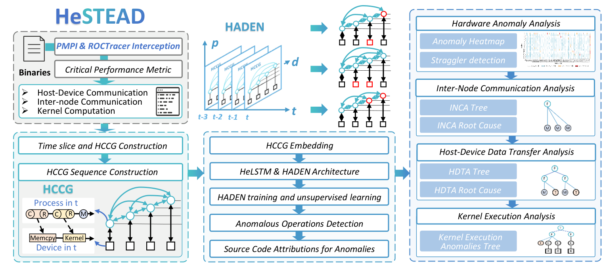

Figure 1 是理解整篇论文的入口。HeSTEAD 的工作流可以分成四个模块。

### 1. HLibrary

HLibrary 负责采集异构程序运行 trace。

它通过：

- PMPI 拦截 MPI 调用。
- ROCTracer 捕获 HIP API、host-device transfer、kernel launch 和 kernel execution。
- PAPI 采集主机硬件计数器。
- 后端可替换为 CUPTI，用于 NVIDIA GPU。

采集到的事件会被标准化成统一 Event record，供后续流程消费。

### 2. HCCG Construction

HeSTEAD 把 trace 按固定时间片切分。论文默认时间片是：

```text
100 ms
```

每个时间片构建一个 HCCG。整次执行得到的是一个 HCCG sequence。

### 3. HADEN

HADEN 对 HCCG sequence 做无监督学习。它不需要预先标注某个事件是否异常，而是学习当前执行的主导模式，再用重构误差衡量每个节点是否偏离正常模式。

### 4. Hierarchical Performance Analysis

HADEN 给出异常分数之后，HeSTEAD 生成：

- anomaly heatmap：用于观察硬件或全局异常模式。
- INCA tree：inter-node communication anomaly tree。
- HDTA tree：host-device data transfer anomaly tree。
- KEA tree：kernel execution anomaly tree。

这些结构把抽象异常分数转成具体操作、调用路径和源码位置。

### 部署方式

HeSTEAD 是 post-mortem offline workflow。

```text
程序运行时：HLibrary 轻量采集 trace
程序结束后：把每个 rank 的 trace 移到分析服务器
离线阶段：构建 HCCG、训练 HADEN、推理、生成 heatmap 和 anomaly trees
```

这种设计避免训练和推理开销干扰目标应用运行。

## 四、背景：异构程序追踪与异常检测

### 异构事件拦截

大规模 HPC 程序分析依赖 runtime trace。传统 MPI 程序可通过 PMPI 拦截 MPI 调用，例如函数名、参数、时间戳。TAU、Scalasca、Score-P 等工具都利用类似机制做 profiling。

异构程序还需要记录设备侧行为。AMD ROCTracer 和 NVIDIA CUPTI 都提供类似抽象：

| 抽象 | ROCTracer | CUPTI |
| --- | --- | --- |
| Runtime API callbacks | `hipApiCallback` | `cuptiSubscribe` runtime/driver API callbacks |
| Activity records | kernel dispatch 和 copy activity records | kernel 和 memcpy activity records |
| Correlation identifiers | `correlation_id` | `correlationId` |

这里最关键的是 correlation identifier。GPU API 是异步的，host 侧一次 API 调用可能对应 device 侧某个 kernel 或 memcpy activity。correlation id 把 host-side invocation 和 device-side activity 连接起来，后续才能正确构造 host-device 关系。

### 异常检测

异常检测用于识别偏离正常模式的行为。论文关注的是无监督异常检测：不依赖人工标签，直接从一次执行的 trace 中学习主导模式，再找出偏离主导模式的操作。

动态图神经网络和 VAE 在云系统异常检测中已经有应用，但大规模异构 HPC 有额外困难：

- trace 数据量巨大。
- 节点数可达数万。
- host/device 事件类型不同。
- 通信边随时间变化。
- 检测到异常后还要归因到源码和操作类型。

HeSTEAD 的方法是先用 HCCG 重组 trace，再用 HADEN 建模时间演化。

## 五、HLibrary：异构事件采集层

HLibrary 是 HeSTEAD 的数据入口。

### 采集对象

论文中的 HLibrary 采集以下事件：

- MPI events：通过 PMPI 捕获，包括阻塞和非阻塞 MPI 调用。
- host-device API events：通过 ROCTracer Callback API 捕获 host 侧 HIP API。
- device activity events：通过 ROCTracer Activity API 捕获 kernel execution 和 host-device transfer。
- hardware counters：通过 PAPI 在 MPI 事件进入和退出时采样。

主机硬件计数器包括：

- `PAPI_TOT_INS`：total instructions。
- `PAPI_L2_DCR`：data cache references。

设备端 kernel 的细粒度硬件 counter 难以低开销获取，因此论文选择 kernel execution time 作为轻量 proxy。

### Event record

HLibrary 把不同来源事件标准化成统一 Event record。

Host-side event 记录：

- enter timestamp。
- exit timestamp。
- rank 或 thread id。
- op type。
- op name。
- calling context。
- function parameters。
- selected hardware counters。
- HIP API 的 correlation id。

Device-side event 记录：

- enter timestamp。
- exit timestamp。
- event name。
- correlation id。

op type 包括：

- MPI event。
- host-device API。
- host-device activity。
- kernel launch。
- kernel execution。

### 双缓冲异步 I/O

HLibrary 的目标是低侵入。论文中每个 process 分配：

```text
2 个 host-side event buffers
2 个 device-side event buffers
每个 buffer 2 MB
```

事件先写入 active buffer。buffer 满后通过 POSIX asynchronous I/O 刷到每进程 binary trace 文件，同时 tracing thread 切换到另一个空 buffer。二进制格式比文本格式更小，序列化开销更低。

### GPU 后端可移植性

HLibrary 的可移植性来自事件抽象，不是绑定某个厂商库。ROCTracer 和 CUPTI 都能提供 API callback、activity record、correlation id。论文指出，厂商相关 wrapper 是一个薄适配层，替换 backend 后，下游 Event schema、I/O、HCCG、HADEN 和层次化分析都不需要变化。

## 六、HCCG：异构计算通信图

HCCG 是论文最重要的数据表示。

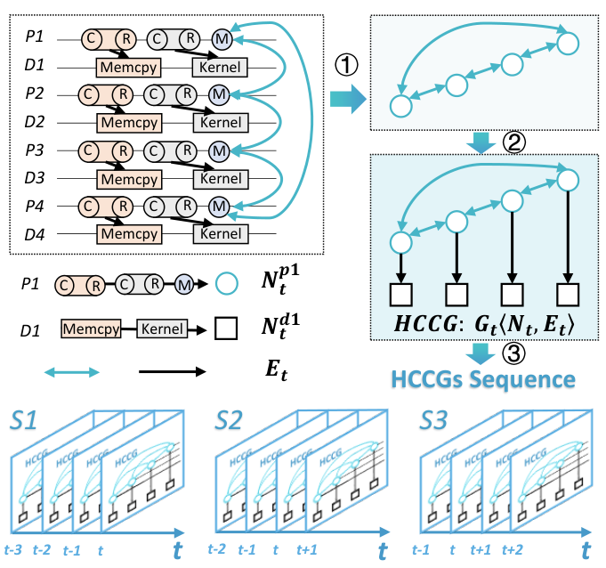

### HCCG 定义

对时间片 `t`，HCCG 定义为：

```text
HCCG_t = (N_t^H, N_t^D, E_t^C, E_t^T, A_t)
```

其中：

- `N_t^H`：host nodes。
- `N_t^D`：device nodes。
- `E_t^C`：host node 之间的 directed inter-node communication edges。
- `E_t^T`：host node 和 device node 之间的 host-device transfer edges。
- `A_t`：weighted adjacency matrix。

`A_t[i][j]` 表示在时间片 `t` 内，节点 `i` 到节点 `j` 的通信或传输事件次数。

Host node 携带：

- ordered event sequence。
- hardware counter vector。

Device node 携带：

- kernel execution events。
- duration。

### 节点如何构造

对每个时间片，HeSTEAD 聚合 rank/device 上的事件。

Host node 中包含：

- MPI 函数。
- host-device API。
- kernel launch event。
- event name 序列。
- duration。
- hardware counter。

Device node 中包含：

- kernel execution event。
- kernel duration。

每个节点的文本属性会被序列化，并和数值性能信息拼接。后面 HADEN 会对这些节点属性进行 embedding。

### 边如何构造

HCCG 中有两类主要边。

第一类是 host-host 边，表示 inter-node communication。HeSTEAD 解析 MPI 参数中的 source rank 和 destination rank，更新 adjacency matrix。

第二类是 host-device 边，表示 host-device data transfer 或 kernel launch 到 device execution 的关系。异步关系通过 correlation id 连接。

论文还提到，host trace 中外部库调用用 `C` 和 `R` 表示：

```text
C: call
R: return
```

`C -> R` 表示外部库 region 的执行。通过 call-return pairing 和 calling context，HeSTEAD 能构造层次化执行流，为 anomaly tree 归因做准备。

### 时间片和序列

HeSTEAD 会先把每个 rank 的 binary trace 文件按全局时间轴 merge，然后按同步边界切分：

```text
t_k = t_0 + k * Δt
```

默认：

```text
Δt = 100 ms
```

每个 slice 得到一个 HCCG。HADEN 的输入不是单个 HCCG，而是滑动窗口：

```text
N_s = 30
```

也就是每个输入样本包含 30 个连续 HCCG。窗口每次向前滑动一个 slice，相邻样本重叠 29 个 slice。

### HCCG 构造算法

论文 Algorithm 1 可以概括为：

```text
Input: merged event stream E, slice size Δt, global start time t0
Output: HCCG sequence

1. 按 t_k = t0 + kΔt 把 E 切成每个 slice 的事件流 E_t
2. 对每个 slice 并行：
   a. 初始化 host node set、device node set、communication edge set、transfer edge set、adjacency matrix
   b. 聚合每个 rank 的 host events，形成 host node
   c. 聚合每个 device 的 kernel events，形成 device node
   d. 遍历 MPI events，根据 sender/receiver 更新 A_t 和 E_t^C
   e. 遍历 host-device transfer / kernel-launch correlation，更新 E_t^T
3. 返回 HCCG_t 序列
```

这个算法有两个并行性：

- 不同 rank 的事件切分可以并行。
- 不同 slice 的 HCCG 构造可以并行。

## 七、HADEN：异构异常检测演化网络

HADEN 是 HeSTEAD 的异常检测模型。

### 输入表示

每个 HCCG 包含两部分信息：

1. 节点语义信息：事件名、调用名、性能指标等。
2. 结构信息：weighted adjacency matrix。

节点属性中有字符串，论文用 Word2Vec 把它们映射成 dense vector。终稿中 embedding 维度设为：

```text
32
```

同时，HCCG 的边用 weighted adjacency matrices 表示，边权 `F_e` 表示节点之间交互频率。

HADEN 输入的是：

```text
[N_s 个连续 HCCG 的节点特征 + 边结构]
```

### HeLSTM

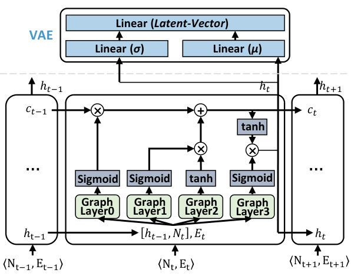

HeLSTM 是 HADEN 的核心单元。它是 GraphLSTM 的变体，用于大规模 performance trace。

普通 LSTM 的门控是：

```text
i = sigmoid(W_i [x_t, h_{t-1}])
f = sigmoid(W_f [x_t, h_{t-1}])
o = sigmoid(W_o [x_t, h_{t-1}])
g = tanh(W_g [x_t, h_{t-1}])
c_t = f * c_{t-1} + i * g
h_t = o * tanh(c_t)
```

HeLSTM 的变化是：`W [x_t, h_{t-1}]` 不只是线性层，而是图卷积层。图卷积使用 HCCG 的边结构和 edge weight，因此每个节点的状态更新会融合图邻域信息。

论文还加入 VAE 组件，用于概率化建模和异常检测。VAE 只在 encoder 最后一层和 decoder 每一层激活。这样做是为了兼顾异常检测效果和大规模训练开销。

### HADEN encoder-decoder

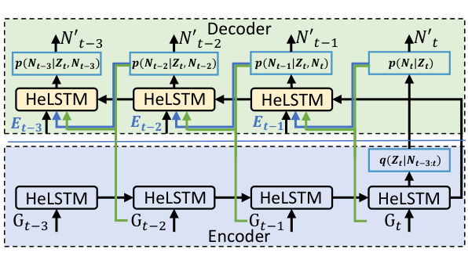

HADEN 是 encoder-decoder 结构。

Encoder：

- 输入 `N_{t-3:t}` 或一般的 HCCG window。
- 由多层 HeLSTM block 组成。
- 输出后验分布：

```text
q(Z_t | N_{t0:t}) = Normal(μ, σ)
```

Decoder：

- 比 encoder 少一层。
- 用 latent variable 和上一时刻重构结果逐步恢复输入序列。
- training 和 inference 数据流不同。

训练时，decoder 使用 teacher forcing：会用真实上一时刻输入帮助重构。推理时，decoder 使用前一步重构输出继续往前重构。

### ELBO 目标

HADEN 训练目标是最大化 ELBO：

```text
L(θ, φ, N_{t0:t})
= - KL(q_φ(Z_t | N_{t0:t}) || p_θ(Z_t))
  + E_{q_φ(z|N)} [log p_θ(N_{t0:t} | Z_t)]
```

先验设置为标准正态：

```text
p_θ(Z_t) = Normal(0, 1)
```

论文中 latent variable 采样数：

```text
L = 1
```

模型不需要训练到极低 loss。论文指出，实践中 5 个 epoch 就可以得到满意的异常检测效果。

## 八、结合源码理解模型实现

模型相关的核心文件包括：

```text
graphlstm.py
graphlstm_vae.py
graphlstm_vae_opt_lstm_opt.py
graphlstm_vae_ad_opt.py
algorithm_utils.py
```

训练入口和流程相关文件包括：

```text
preprocess.py
train.py
train_analysis.py
trace_analysis_flow.py
anomaly_score_bt.py
```

### GraphLSTM cell

`graphlstm.py` 中的 `GCNLSTMCell` 是 HeLSTM 源码实现的核心。

简化后逻辑如下：

```python
class GCNLSTMCell(nn.Module):
    def __init__(self, nodes_num, input_dim, hidden_dim):
        self.gconv = GCNConv(
            in_channels=input_dim + hidden_dim,
            out_channels=4 * hidden_dim,
            improved=True,
        )

    def forward(self, input_tensor, cur_state, edge_index, edge_weight):
        h_cur, c_cur = cur_state
        combined = torch.cat([input_tensor, h_cur], dim=2)

        batch = Batch.from_data_list([
            Data(x=combined[i], edge_index=edge_index, edge_weight=edge_weight)
            for i in range(combined.shape[0])
        ])

        gates = self.gconv(batch.x, batch.edge_index, batch.edge_weight)
        gates = gates.reshape(combined.shape[0], combined.shape[1], -1)

        cc_i, cc_f, cc_o, cc_g = torch.split(gates, hidden_dim, dim=2)
        i = torch.sigmoid(cc_i)
        f = torch.sigmoid(cc_f)
        o = torch.sigmoid(cc_o)
        g = torch.tanh(cc_g)

        c_next = f * c_cur + i * g
        h_next = o * torch.tanh(c_next)
        return h_next, c_next
```

这段实现对应论文中的 HeLSTM：将当前节点特征和上一隐藏状态拼接，通过图卷积产生 LSTM 四个门。

源码还提供了多个 cell 变体：

- `GCNLSTMCell`：使用 `GCNConv`。
- `GATLSTMCell`：使用 `GATConv`。
- `WL1LSTMCell`：使用 `GraphConv`。
- `LSTMCell`：退化为普通线性层，不使用图结构。

实际训练脚本默认使用：

```text
kind = 'GCN'
```

### GraphLSTM 序列处理

`GraphLSTM.forward` 输入形状是：

```text
(t, b, n, h)
```

含义：

- `t`：sequence length。
- `b`：batch size。
- `n`：HCCG node 数。
- `h`：每个 node 的 feature dimension。

源码逐层、逐时间步处理：

```python
for layer_idx in range(num_layers):
    h, c = hidden_state[layer_idx]
    output_inner = []

    for t in range(seq_len):
        h, c = self.cell_list[layer_idx](
            input_tensor=cur_layer_input[t],
            edge_index=edge_index[t],
            edge_weight=edge_weight[t],
            cur_state=[h, c],
        )
        output_inner.append(h)

    layer_output = torch.stack(output_inner, dim=0)
    cur_layer_input = layer_output
```

这里每个时间片都有自己的 `edge_index[t]` 和 `edge_weight[t]`，对应动态图随时间变化。

### VAE 版本

`graphlstm_vae_opt_lstm_opt.py` 是一个优化版实现。它和早期版本相比，把每个 node 单独一套线性层的实现改成统一线性层：

```python
self.hidden2output = nn.Linear(hidden_dim, input_dim)
self.mu = nn.Linear(hidden_dim, hidden_dim)
self.logvar = nn.Linear(hidden_dim, hidden_dim)
self.hidden2output_logvar = nn.Linear(hidden_dim, input_dim)
```

这对应论文中提到的：

```text
uniform linear transformation in VAE
```

原因是大规模集群有成千上万个节点，如果为每个节点维护独立线性层，参数和训练开销都很大。统一线性层降低复杂度，提升可扩展性。

### Reparameterization

源码中 VAE 采样：

```python
def reparametrize(self, mu, logvar):
    return mu + torch.randn_like(logvar) * torch.exp(logvar)
```

从标准 VAE 角度看，这里表达的是用均值和方差参数生成 latent representation。模型随后用 decoder 重构输入序列。

### Loss function

源码中的 loss：

```python
recon_loss = 0.5 * torch.mean(
    torch.sum(
        torch.div((preds - labels) ** 2, output_logvar.exp()) + output_logvar,
        (1, 2, 3),
    )
)

kl_loss = -0.5 * torch.mean(
    torch.sum(1 + logvar - mu**2 - logvar.exp(), (-1, -2))
)

total_loss = recon_loss + kl_loss
```

这正是 VAE 的两部分：

- reconstruction loss：输入与重构输出的负对数似然形式。
- KL loss：让 posterior 接近标准正态先验。

### 训练流程

`train.py` 和 `graphlstm_vae_ad_opt.py` 中训练流程为：

1. 读取 parquet 节点特征。
2. 读取 graph edge 和 edge weight。
3. 以 `sequence_length = 30` 构造滑动窗口。
4. 使用 DataLoader 按 batch 训练。
5. 优化器使用 Adam，默认学习率 `1e-3`。
6. 支持 AMP。
7. 训练过程中可保存 checkpoint 和 score。

源码中构造窗口：

```python
sequences = [
    data[i:i + sequence_length].reshape(sequence_length, nodes_num, -1)
    for i in range(data.shape[0] - sequence_length + 1)
]
```

edge 序列同步滑动：

```python
edge_sequences = [
    edge_index[i:i + sequence_length]
    for i in range(len(edge_index) - sequence_length + 1)
]
```

这和论文中的 HCCG sequence construction 完全一致。

## 九、异常分数与源码归因

### 异常分数

论文用节点重构负对数似然作为异常分数：

```text
S_t^i = - 1 / (L * D)
        * sum_{d=0}^{D-1} sum_{l=1}^{L}
          log p_θ(N_t^i | z_{t+d}^{(l)}, N_{t+1:t+d})
```

其中：

- `N_t^i` 是时间片 `t` 的第 `i` 个节点。
- `D` 是 scoring 的时间窗口，源码和论文中设置为 5。
- `L` 是 latent sample 数，设置为 1。
- 分数越高，表示该节点越难被模型重构，越可能异常。

源码中的预测过程对应这个思想：

```python
error_origin = ((output - ts_batch) ** 2) / output_logvar.exp() + output_logvar
sample_score = torch.sum(error_origin, 3)
```

然后对多次采样求平均，并通过 lattice 把重叠窗口的分数对齐回原始时间片：

```python
lattice = np.full((delay, len(sequences) + delay - 1, nodes_num), np.nan)
for i, score in enumerate(scores):
    for node in range(nodes_num):
        lattice[i % delay, i:i + delay, node] = score[-delay:, node]
scores = np.nanmean(lattice, axis=0)
```

这一步对应论文中考虑 temporal dependency 的 anomaly scoring。

### 源码归因

HeSTEAD 不止输出 node score，还会从原始 trace 中抽取 debug information。

归因信息包括：

- MPI operation full backtrace。
- host-device data transfer backtrace。
- source code attribution。
- 调用关系。

`anomaly_score_bt.py` 中做了一个实际归因处理：将 score 文件中的 `(ts_id, tid, score)` 和 backtrace 文件按 `ts_id/tid` merge，生成带分数的 backtrace CSV。

这一步为 anomaly tree 提供基础数据。

## 十、层次化性能分析

HeSTEAD 的层次化分析分四类：

```text
hardware analysis
inter-node communication analysis
host-device transfer analysis
kernel execution analysis
```

### Heatmap

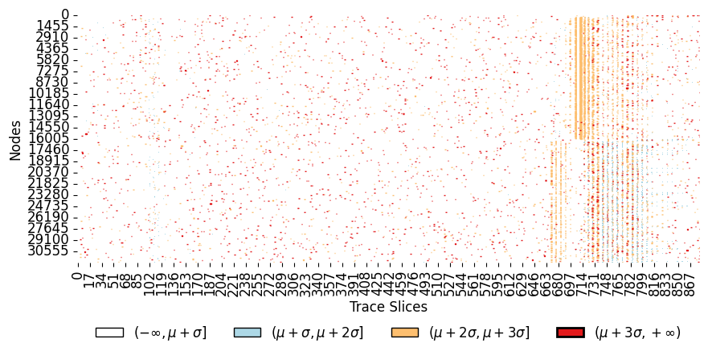

Heatmap 是层次化分析入口。

横轴：

```text
time slices
```

纵轴：

```text
HCCG node id
```

对绑定一个 accelerator 的进程，论文中节点分为两半：

- 前半部分是 CPU host nodes。
- 后半部分是 accelerator/device nodes。

异常阈值：

```text
μ + 3σ
```

超过阈值的点标为异常。

Heatmap 的模式解释：

- 少数节点横向持续异常：更像 hardware-level issue，例如 straggler、thermal throttling、degraded unit。
- 某些时间段大面积竖向异常：更像全局或近全局同步问题。
- 异常散布无明显空间结构：更像软件层 inefficiency，需要进一步查 INCA、HDTA、KEA tree。

### Anomaly tree

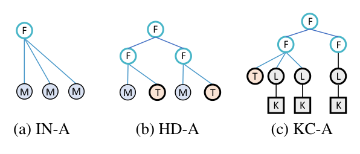

三类 anomaly tree 使用统一读取规则。

树节点含义：

- `M`：MPI function。
- `F`：source-code attributed function call。
- `T`：host-device transfer operation。
- `L`：kernel launch。
- `K`：kernel execution operation。

HeSTEAD 会把同一操作在所有时间片中的异常分数聚合，再做概率均值归一化。每一层 siblings 按聚合分数从左到右排序，最左边通常是最可疑操作。论文中红框标出的 AO 是 Anomalous Operation。

树从叶子向根阅读：

```text
leaf operation -> calling context -> root-level function
```

这样能从异常操作追溯到源码调用路径。

### 非阻塞 MPI receive 为什么会异常

论文特别解释了 `MPI_Irecv`。虽然 `MPI_Irecv` 本身非阻塞、返回很快，但它会和 `MPI_Wait` 或 `MPI_Test` 通过 request handle 配对。真正通信等待时间可能记录在 `MPI_Wait` 上。

HADEN 不是只看单个调用耗时，而是看 HCCG node attribute：

- `MPI_Irecv` 参数。
- source rank。
- tag。
- message length。
- request handle。
- invocation count。
- paired `MPI_Wait` completion timing。
- hardware counters。

因此，如果出现 request queue 饱和、sender 延迟、大消息、等待时间异常，包含 `MPI_Irecv/MPI_Wait` 的节点仍会有高重构误差。

## 十一、实验设置

论文在真实大规模集群和独立分析服务器上评估。

| 项目 | Cluster | Analysis |
| --- | --- | --- |
| CPU | AMD Zen-based processor @ 2.5GHz | Intel Xeon Gold 6330 @ 2.00GHz |
| GPU | 4 AMD Instinct MI60 GPUs | 1 Tesla A100 |
| Nodes | 4,000 | 1 |
| Cores | 32 | 56 |
| Memory | 128 GB | 256 GB |
| Software | GCC 9.3.1, OpenMPI 4.0.4 | GCC 9.3.1, OpenMPI 4.0.4 |

HADEN 实现：

```text
PyTorch 2.1.0
CUDA 11.8
learning rate = 0.001
training terminated within 30 epochs
```

应用包括：

1. MISA-MD：金属材料分子动力学程序。
2. ANT-MOC：3D neutron transport solver，MOC 是 Method of Characteristics。
3. LAMMPS-v1：开源 CPU 版本 LAMMPS，未优化 baseline。
4. LAMMPS-v2：异构优化版本，pair potential 计算 offload 到 GPU。
5. LAMMPS-v3：使用 EAM potential，与 v1/v2 的物理模型和计算 hotspot 不同。

论文强调应用选择不是只按科学领域，而是按性能问题类别覆盖：

- ANT-MOC：hardware stragglers / network congestion。
- LAMMPS-v1：point-to-point communication imbalance。
- LAMMPS-v2：host-device cross-binding。
- LAMMPS-v3：kernel inefficiency。
- MISA-MD：多维综合性能问题。

## 十二、四类层次化分析案例

### 1. Hardware Analysis：ANT-MOC

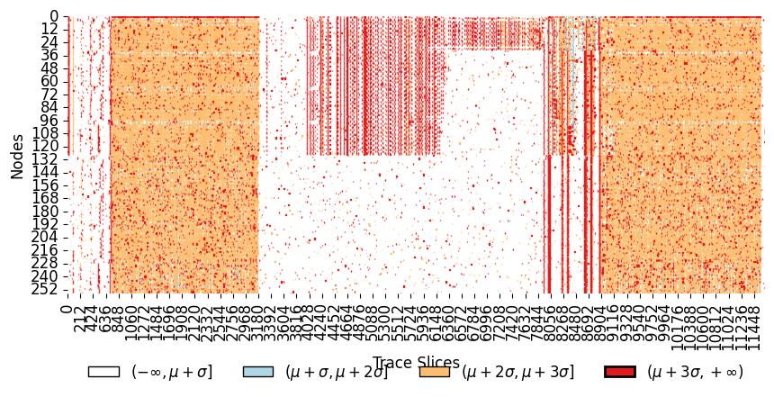

ANT-MOC 运行规模：

```text
128 processes
```

Heatmap 中：

- Node 0 到 Node 127 是 host nodes。
- Node 128 到 Node 255 是 device nodes。
- 红点表示 anomaly score 落入 `[μ + 3σ, +∞]`。

结果显示 host node 中部有明显异常簇，且异常随时间持续。论文判断性能下降更可能来自 host node 相关硬件问题，而不是普通软件 hotspot。进一步和系统管理员联合诊断后，确认是 bursty、short-period network congestion。

修复网络问题后：

```text
overall execution time improvement = 49.24%
```

### 2. Inter-Node Communication Analysis：LAMMPS-v1

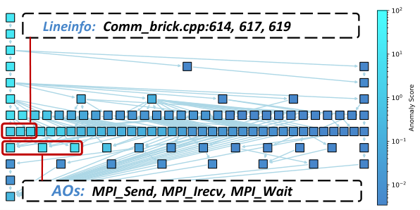

LAMMPS-v1 运行规模：

```text
1,024 processes
```

HeSTEAD 生成 INCA tree 后，定位到三个最异常操作：

```text
MPI_Send
MPI_Irecv
MPI_Wait
```

继续沿 anomaly tree 向上追溯，定位到三个源码位置：

```text
comm_brick.cpp:614
comm_brick.cpp:617
comm_brick.cpp:619
```

这些位置和 point-to-point communication load imbalance 相关。根据 HeSTEAD 给出的信息进行手动负载均衡优化后：

```text
overall performance improvement = 15.84%
```

### 3. Host-Device Transfer Analysis：LAMMPS-v2

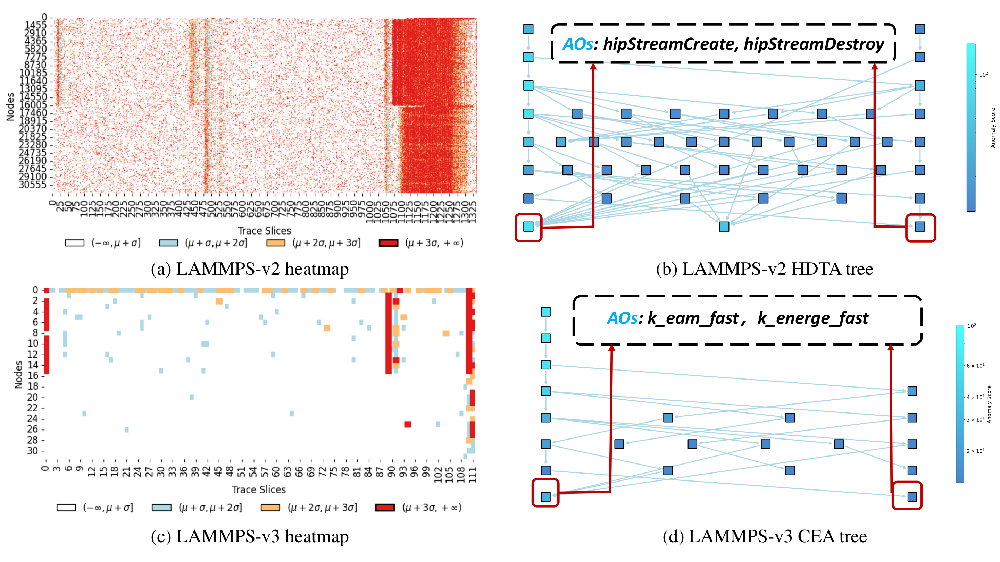

LAMMPS-v2 运行规模：

```text
16,000 processes
16,000 GPUs
```

Heatmap 显示严重异常：程序开始和结束阶段异常明显，整个执行期间也有分散异常，并且 CPU 与 GPU 侧出现同步异常行为。这提示问题可能来自 host-device data transfer 或 CPU-GPU coordination。

HDTA tree 中最异常操作是：

```text
hipEventSynchronize
hipEventElapsedTime
```

进一步诊断发现，每个节点内 4 张 GPU 和 4 个 CPU 进程发生错误 cross-binding，导致 CPU-GPU 配置错误。

这造成：

```text
overall program performance degradation = 35.90%
```

### 4. 与 GVARP 对比

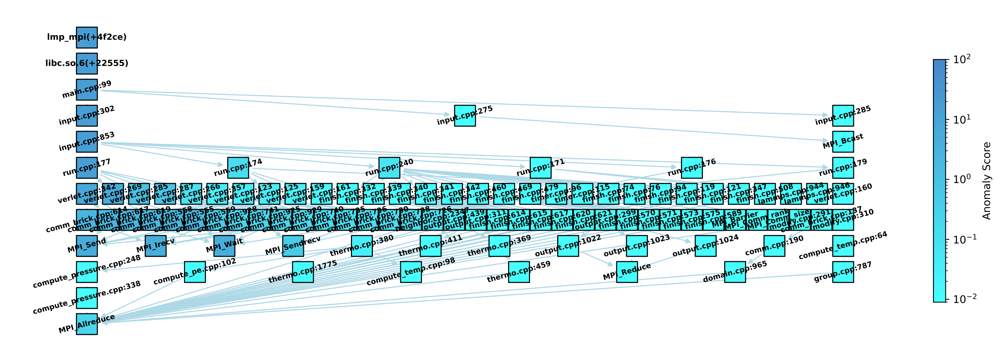

论文还用 GVARP 分析同一 LAMMPS-v2 执行。

GVARP 能发现 accelerator memory copy 阶段存在性能下降，但不能定位到具体 API，也不能解释 CPU-GPU cross-binding 根因。

HeSTEAD 则进一步定位到：

```text
hipEventSynchronize
hipEventElapsedTime
cross-bound CPU-GPU configuration
```

这个对比体现了 HeSTEAD 的层次化归因价值：不只是指出某个阶段慢，而是把异常映射到具体操作和系统配置问题。

### 5. Kernel Execution Analysis：LAMMPS-v3

LAMMPS-v3 运行规模：

```text
16 processes
16 GPUs
```

Figure 11 中，host 侧和 device 侧在同一时间片都有异常信号。HeSTEAD 并不只靠 heatmap 上肉眼最明显的点，而是通过 KEA tree 聚合 device-node reconstruction errors。

最终定位到两个 EAM potential kernels：

```text
k_eam_fast
k_energy_fast
```

它们是 LAMMPS-v3 的主要计算热点。结果说明，即使 host 侧也有异常，HeSTEAD 仍能通过层次化分析隔离 device-side kernel inefficiency。

## 十三、MISA-MD 大规模综合案例

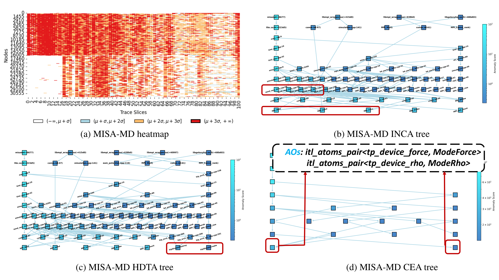

MISA-MD 案例用于验证 HeSTEAD 能否从单次 heterogeneous trace 中给出多维性能洞察。

运行规模：

```text
4,000 compute nodes
16,000 MPI processes
4 processes per node
```

Heatmap 中出现大量分散异常，说明存在多方面优化空间。

### 1. Inter-node communication

INCA tree 中最异常操作：

```text
MPI_Wait
MPI_Isend
MPI_Irecv
```

源码位置包括：

```text
send_recv_list.cpp:64
send_recv_list.cpp:56
eam_potential.cpp:123
```

根因是 neighboring MPI processes 之间的 ghost region 与 simulation region 同步，以及使用 Newton 第三定律时 ghost region 到 simulation region 的 force field data synchronization。

虽然这些操作是 point-to-point，而不是 collective，但在大规模邻域交换中，每个 rank 必须等待所有邻居交换完成后才能进入 force update。慢邻居会拖住整个迭代，形成隐式同步。

可缓解方向：

- data compression。
- overlap communication with computation。

### 2. Host-device inefficiency

HDTA tree 显示：

```text
hipStreamCreate
hipStreamDestroy
hipMemcpyAsync
```

问题包括：

- stream create/destroy 在仿真过程中频繁调用。
- host-device 双向传输量过大。
- 数据布局导致不必要字段被复制。

优化方式：

- 把 stream 创建和销毁移动到初始化阶段，只执行一次。
- 将 atomic data structure 从 AoS 改成 SoA。

AoS：

```cpp
struct Atom {
    float x, y, z;
    float vx, vy, vz;
    int type;
};
Atom atoms[N];
```

SoA：

```cpp
struct Atoms {
    float* x;
    float* y;
    float* z;
    float* vx;
    float* vy;
    float* vz;
    int* type;
};
```

SoA 能只传输 kernel 需要的字段，减少冗余数据移动，也更容易形成 coalesced memory access。

优化后：

```text
eliminate approximately 80% of total data transmission
```

### 3. Kernel inefficiency

KEA tree 报告的异常 kernel：

```text
itl_atoms_pair<tp_device_force, ModeForce>
itl_atoms_pair<tp_device_rho, ModeRho>
```

根因是 atom attribute data 的内存访问模式低效，存在大量 uncoalesced memory accesses。

同样通过 SoA memory layout 优化后：

```text
more than 60% performance improvement for both kernels
```

### 4. 总体收益

综合优化后，MISA-MD 执行时间从：

```text
155.70 s
```

降低到：

```text
56.24 s
```

总体性能提升：

```text
63.30%
```

这个案例说明 HeSTEAD 的关键价值不是单点检测，而是从一次 trace 中同时给出通信、传输和 kernel 三个层面的诊断。

## 十四、开销评估

论文把 HeSTEAD 开销分成：

- tracing。
- storage。
- HADEN training。
- inference。
- hierarchical analysis。

### HeSTEAD 自身开销

| Program | Scale (# proc.) | Storage (GB) | Training (min) | Inference (s) | Analysis (s) |
| --- | ---: | ---: | ---: | ---: | ---: |
| ANT-MOC | 128 | 0.8 | 13 | 51 | 71 |
| LAMMPS-v1 | 1,024 | 4.1 | 9 | 170 | 113 |
| LAMMPS-v2 | 16,000 | 70 | 19 | 273 | 195 |
| LAMMPS-v3 | 16 | 0.04 | 2 | 10 | 13 |
| MISA-MD | 16,000 | 16 | 7 | 297 | 199 |

结论：

- tracing 平均 overhead 小于 native execution time 的 10%。
- training/preprocessing 平均小于 20 分钟。
- 四类 hierarchical analyses 平均小于 5 分钟。
- 最大 trace storage 是 70 GB。

论文强调不同列和 process count 不简单线性对应：

- Storage 跟 HLibrary 生成的总 event count 线性相关。
- Training 跟所有时间片中总 node count 相关，即 `(|N^H| + |N^D|) * T`。
- Inference 跟每个 window 的 `N_s * (|N^H| + |N^D|)` 相关。
- Analysis 跟超过 `μ + 3σ` 阈值的异常节点数量相关。

### 与 HPCToolkit / Scalasca 对比

在 LAMMPS-v1 上，native execution time：

```text
53.072 s
```

| Tool | Collection Time (s) | Slowdown |
| --- | ---: | ---: |
| Native | 53.072 | 1.00x |
| HeSTEAD | 55.491 | 1.05x |
| HPCToolkit 2022.10.01 | 120.956 | 2.28x |
| Scalasca 2.6 | 62.991 | 1.19x |

HeSTEAD 采集开销为：

```text
4.56%
```

### 与 STAD 对比

同样在 LAMMPS-v1 上：

| Tool | Analysis Time (min) | Relative |
| --- | ---: | ---: |
| HeSTEAD | 13.72 | 1.00x |
| STAD | 356.35 | 25.97x |

HeSTEAD 比 STAD 快：

```text
25.97x
```

主要原因是 HeSTEAD 采用更轻量的 evolving network 和 hierarchical attribution 设计，避免 STAD 中更重的动态图神经网络开销。

### 诊断准确性讨论

论文没有用 per-candidate precision、recall、F1 作为核心指标，原因是没有公开 ground truth 数据集能同时覆盖大量带标注性能低效和优化后预期收益。

论文采用诊断质量和优化可复现性来评估。所有 evaluated real-world cases 中，HeSTEAD 给出的 7 个诊断异常都能被对应优化处理，没有产生浪费开发者时间的 bad data。

具体收益：

- hardware issue：49.24% improvement。
- inter-node communication：15.84% improvement。
- host-device transfer：mitigate 35.90% degradation。
- MISA-MD：63.30% end-to-end improvement。

## 十五、相关工作定位

论文把相关工作分成三类。

### 传统性能分析工具

代表：

- HPCToolkit。
- Scalasca。
- ScalaTrace。

这些工具能收集函数级 trace、communication event、hardware counter 等，对热点、通信瓶颈、负载不均有帮助。但在极大规模下，数据量和人工分析成本很高。

### 启发式分析工具

代表：

- GVARP。
- ScalaNA。
- PerFlow。
- VAPRO。
- VClinic。

这些工具依赖专家规则，能低成本检测特定类型问题。但适应新 workload、新硬件、新异构行为时受限。

### 机器学习分析方法

机器学习方法尝试通过深度学习、图表示、异常检测自动学习性能模式。

论文重点比较：

- ParaGraph：为单个 HPC kernel 构建 weighted graph，指导 per-kernel 优化。
- Ramadan 等工作：用图表示学习做 kernel region 级性能分析。
- STAD：用动态图神经网络检测 homogeneous MPI application 的 spatial communication anomaly。

HeSTEAD 和这些工作不同：

1. 面向完整 heterogeneous program execution，不是单个 kernel 或局部 region。
2. HCCG 是时间序列图，联合建模 inter-rank、host-device 和 temporal evolution。
3. 使用无监督 anomaly detection 加 hierarchical root-cause attribution。
4. 扩展到 16,000 processes / 16,000 accelerators，且开销控制在分钟级。

## 十六、结论与理解

HeSTEAD 的核心贡献是把异构 HPC 性能分析从“人工规则 + 多工具试错”转成一个统一的无监督异常检测和层次化归因流程。

它的关键抽象是：

```text
一次执行 trace
-> 时间片 HCCG 序列
-> HADEN 学习时空演化模式
-> reconstruction error 识别异常节点
-> heatmap / INCA / HDTA / KEA 定位根因
```

从方法上看，HCCG 解决异构执行行为的结构化表达问题；HADEN 解决时间演化异常检测问题；hierarchical analysis 解决异常到操作、调用链和源码的归因问题。

从系统上看，HLibrary 的统一 Event schema 和双缓冲异步 I/O 保证采集可扩展；离线训练避免影响目标程序；动态图模型和 VAE 让无监督检测可在单次执行 trace 上工作。

从实验上看，论文展示了四类典型性能问题：

- ANT-MOC：网络拥塞引起的 hardware-level 异常。
- LAMMPS-v1：MPI point-to-point communication imbalance。
- LAMMPS-v2：CPU-GPU cross-binding 导致 host-device 协调异常。
- LAMMPS-v3：EAM potential kernel inefficiency。
- MISA-MD：通信、传输、kernel 多层问题并存。

HeSTEAD 的实际价值在于：它不要求用户事先知道问题属于哪一类，而是先从异常模式中找到可疑操作，再沿层次化树把问题落到具体操作和源码位置。对于大规模异构程序，这种“时空图表示 + 无监督异常检测 + 层次化归因”的组合比单一 profiling 视图更接近真实调优流程。
