## 目录

1. [论文定位](#一论文定位)
2. [为什么深度学习稀疏算子难写](#二为什么深度学习稀疏算子难写)
3. [SparseTIR 的核心观点](#三sparsetir-的核心观点)
4. [系统总览：三阶段 IR](#四系统总览三阶段-ir)
5. [基础概念：coordinate space 与 position space](#五基础概念coordinate-space-与-position-space)
6. [语言构造：Axis、SparseBuffer、SparseIteration](#六语言构造axissparsebuffersparseiteration)
7. [Stage I：Coordinate Space Computation](#七stage-icoordinate-space-computation)
8. [格式分解：Format Decomposition](#八格式分解format-decomposition)
9. [Stage I Schedules：sparse_reorder 与 sparse_fuse](#九stage-i-schedulessparse_reorder-与-sparse_fuse)
10. [Stage II：Position Space Computation](#十stage-iiposition-space-computation)
11. [Sparse Iteration Lowering](#十一sparse-iteration-lowering)
12. [Stage II Schedules 与 TVM 调度复用](#十二stage-ii-schedules-与-tvm-调度复用)
13. [Stage III：Loop-Level IR 与 Sparse Buffer Lowering](#十三stage-iiiloop-level-ir-与-sparse-buffer-lowering)
14. [目标代码生成与 Horizontal Fusion](#十四目标代码生成与-horizontal-fusion)
15. [项目源码如何落地论文设计](#十五项目源码如何落地论文设计)
16. [GNN 实验：SpMM、SDDMM 与 GraphSAGE](#十六gnn-实验spmmsddmm-与-graphsage)
17. [Transformer 稀疏实验](#十七transformer-稀疏实验)
18. [RGMS、RGCN 与 Sparse Convolution](#十八rgmsrgcn-与-sparse-convolution)
19. [Related Work 与论文边界](#十九related-work-与论文边界)
20. [Future Work、Artifact 与复现实验](#二十future-workartifact-与复现实验)
21. [总结与面试表达](#二十一总结与面试表达)

## 一、论文定位

论文题目是 **SparseTIR: Composable Abstractions for Sparse Compilation in Deep Learning**，发表于 ASPLOS 2023。

作者是：

- Zihao Ye，University of Washington
- Ruihang Lai，Carnegie Mellon University
- Junru Shao，OctoML
- Tianqi Chen，Carnegie Mellon University / OctoML
- Luis Ceze，University of Washington

论文研究的问题是：

```text
深度学习中的稀疏算子越来越多，但手写高性能稀疏 kernel 很难；
传统稀疏库覆盖的算子有限；
传统稀疏编译器又难以适配深度学习里快速变化的稀疏模式和硬件后端。
```

SparseTIR 的核心回答是：

```text
用 composable formats 表达多种局部稀疏格式的组合；
用 composable transformations 把稀疏编译拆成可组合的程序变换；
再把这些格式和变换作为可调搜索空间，生成高性能稀疏算子。
```

论文摘要中的主要结果：

- GNN 单算子：相比 vendor libraries 有 `1.20-2.34x` 加速。
- Sparse attention 单算子：`1.05-2.98x` 加速。
- Sparse convolution 单算子：`0.56-7.45x` 加速。
- GraphSAGE 端到端训练：`1.08-1.52x` 加速。
- RGCN inference：`4.20-40.18x` 加速。

本地资料包含两部分：

```text
paper/SparseTir/arXiv-2207.04606v4/
  论文 LaTeX 源码、figures、appendix、代码片段

paper/SparseTir/SparseTIR-main/
  基于 TVM 的 SparseTIR 开源项目代码
```

从代码看，这不是只有论文概念的系统。SparseTIR 在 TVM 中扩展了：

- sparse IR node
- sparse schedule primitive
- sparse iteration lowering
- sparse buffer lowering
- sparse format decomposition
- horizontal fusion
- SpMM、SDDMM、RGMS、block sparse 等示例

## 二、为什么深度学习稀疏算子难写

论文开头指出，稀疏性在深度学习里越来越普遍，主要来自三类场景。

第一类是图神经网络。GNN 用稀疏矩阵表示图结构，例如社交网络、蛋白质、点云。图的邻接矩阵通常极稀疏，常见核心算子是 SpMM 和 SDDMM。

第二类是 sparse transformers。Longformer、Sparse Transformer、Butterfly Transformer 通过稀疏 attention mask 降低 attention 的时间和空间复杂度。

第三类是 network pruning。剪枝会把网络权重变成稀疏矩阵，以减少模型大小和计算量。不同剪枝方式会产生不同稀疏格式，例如 block sparsity、unstructured sparsity。

### Vendor library 的问题

cuSPARSE、dgSPARSE、Sputnik、Intel MKL 这类库通常只支持少数标准稀疏算子和固定格式。新模型出现新的稀疏模式或新算子时，库不一定覆盖。

比如论文提到的 heterogeneous graph 和 hypergraph，对应的算子可能不是单纯 SpMM，而是更复杂的 RGMS。直到论文写作时，没有通用稀疏库直接实现这个 kernel。

### 手写 sparse kernel 的问题

稀疏矩阵通常以压缩格式存储。写 kernel 时需要手工处理：

- 从 `indptr` 和 `indices` 中恢复坐标。
- 在压缩空间和逻辑坐标空间之间转换。
- 处理不同行长度导致的负载不均。
- 处理不同格式的访存模式。
- 为 GPU 做 thread/block 映射、vectorize、cache、tensorize。

同一个数学算子换一种稀疏格式，代码往往要重写。

### 传统 sparse compiler 的问题

TACO、MT1 等稀疏编译器能把格式说明和计算描述解耦，降低开发成本。但论文认为它们面对深度学习有两个核心挑战：

```text
1. 深度学习稀疏 workload 太多样，单一稀疏格式无法覆盖所有局部模式。
2. 硬件后端变化很快，single-shot sparse compiler 难以及时复用 Tensor Core、GPU mapping、tensorization 等底层优化。
```

这里的 single-shot compiler 指的是：从高层 tensor expression 和格式说明一次性 lowering 到目标代码。问题是中间缺少可逐步调度、可复用已有 dense tensor compiler 后端优化的 loop-level IR。

## 三、SparseTIR 的核心观点

SparseTIR 的核心是两个 composability。

### Format composability

格式可组合指的是：不要强迫整个稀疏矩阵只用一种格式，而是让不同局部稀疏模式使用不同格式。

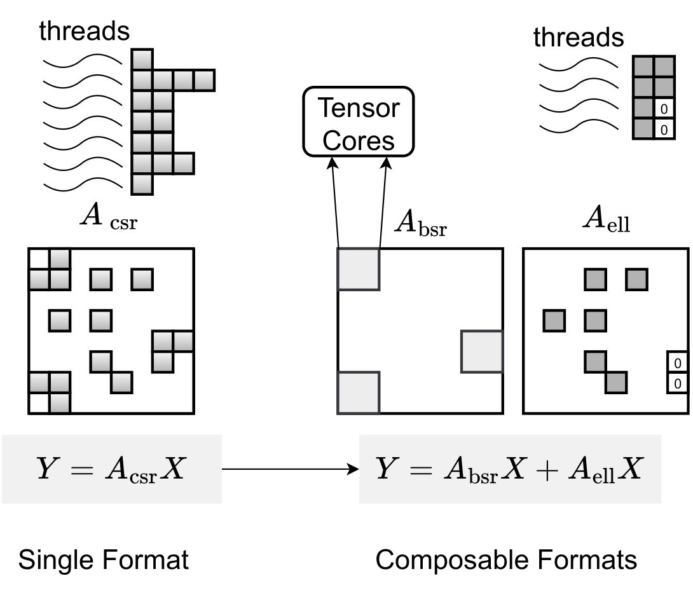

Figure 1 表达的思想是：同一个稀疏矩阵中，一部分可能适合 Tensor Core，一部分可能适合 ELL，一部分可能适合其他格式。单一格式会让某些区域很低效；组合格式可以把不同部分分别映射到合适的数据结构和调度策略。

对初学者来说，可以把它理解为：

```text
CSR 是通用格式，但不一定对 GPU 最友好；
ELL 行宽固定，适合行长度接近的区域；
BSR 适合块结构；
SR-BCRS 适合用 Tensor Core 处理不规则剪枝权重。

SparseTIR 允许把这些格式组合起来，而不是二选一。
```

### Transformation composability

变换可组合指的是：把编译过程拆成多个可以逐步应用的 program transformations。

传统 sparse compiler 更像把稀疏表达式一次性编译到底。SparseTIR 则把编译过程拆成 stage I、stage II、stage III，每个阶段都可以应用对应的变换。

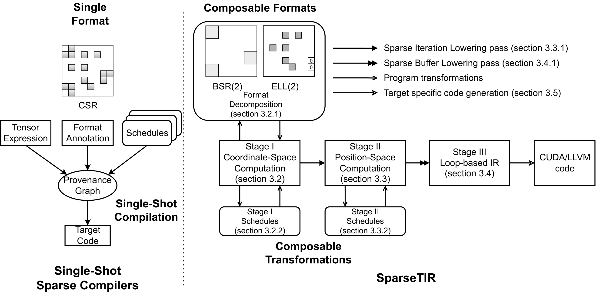

这个设计让 SparseTIR 可以：

- 在高层 sparse IR 上做 format decomposition。
- 在 sparse iteration 上做 sparse reorder/fuse。
- 在 lower 到 loop-level 之后复用 TVM 的 split、reorder、bind、cache、vectorize、tensorize。
- 把格式选择和 schedule 参数组合成搜索空间。

论文的贡献可以概括为三点：

1. 提出带 composable formats 和 composable transformations 的 sparse IR。
2. 构建性能调优系统，在组合格式和组合变换参数空间中搜索。
3. 在 GNN、Sparse Transformer、Pruned Transformer、RGCN、Sparse Convolution 上验证性能。

## 四、系统总览：三阶段 IR

SparseTIR 的系统由三阶段 IR 组成。

```text
Stage I: Coordinate Space Computation
Stage II: Position Space Computation
Stage III: Loop-Level IR
```

### Stage I：Coordinate Space

Stage I 用逻辑坐标描述稀疏计算。例如 SpMM：

```text
C[i, k] += A[i, j] * B[j, k]
```

这里的 `i, j, k` 是数学意义上的坐标。此时用户不用手动写 `indptr[i]` 到 `indptr[i+1]` 的循环，也不用手动计算非零元素位置。

Stage I 的作用是：

- 表达稀疏计算。
- 定义 Axis、SparseBuffer、SparseIteration。
- 做 format decomposition。
- 做 sparse_reorder、sparse_fuse 等高层稀疏变换。

### Stage II：Position Space

Stage II 引入显式 loop，并把 sparse iteration 转成 nested loops。此时访问稀疏数据时，不再直接用逻辑坐标，而是用压缩数据结构里的 position。

比如某一行非零列是：

```text
coordinates: [1, 3, 9, 10]
positions:   [0, 1, 2,  3]
```

坐标 `9` 的 position 是 `2`。如果 `A` 存在 CSR 的 `values` 里，实际访问的是 `values[indptr[row] + 2]`。

Stage II 的作用是：

- materialize `indptr` 和 `indices` 这类辅助 buffer。
- 生成 nested loops。
- 做 coordinate translation。
- 进行 read/write region analysis。
- 复用 TensorIR 的 loop schedule。

### Stage III：Loop-Level IR

Stage III 去掉 SparseTIR 的所有 sparse constructs，只保留普通 loop 和扁平 buffer 访问。这个阶段和 TVM TensorIR 兼容，可以进入后端 codegen。

Stage III 的作用是：

- sparse buffer lowering。
- 把多维 sparse buffer flatten 成一维 buffer。
- 把 `A[i, j]` 变成类似 `A[J_indptr[i] + j]` 的底层访问。
- 复用 TVM 后端生成 CUDA。

## 五、基础概念：coordinate space 与 position space

SparseTIR 论文反复出现 coordinate space 和 position space。理解这两个概念，是理解整篇论文的前提。

### Coordinate space

coordinate 是数学坐标。例如矩阵：

```text
A[3, 10] = 5
```

这里 `(3, 10)` 是坐标。用 coordinate space 写程序更接近数学公式，易读，也不绑定具体存储格式。

### Position space

position 是非零元素在压缩存储结构中的位置。

假设 CSR 中第 3 行的列号是：

```text
indices[indptr[3] : indptr[4]] = [2, 7, 10, 18]
```

那么坐标列 `10` 在这一行里的 position 是 `2`，真实 value 位置是：

```text
values[indptr[3] + 2]
```

### 为什么要分两层

如果只用 coordinate space，程序好写但不能直接执行，因为压缩格式里没有 dense 的 `A[3,10]` 数组。

如果只用 position space，程序性能可控但难写、难变换、绑定格式。

SparseTIR 的做法是：

```text
先在 coordinate space 表达语义；
再 lowering 到 position space 处理压缩格式；
最后 lowering 到普通 loop 和 buffer access。
```

这就是论文所说的多阶段 IR。

## 六、语言构造：Axis、SparseBuffer、SparseIteration

SparseTIR 语言有三个主要组件：

- `Axis`
- `SparseBuffer`
- `SparseIteration`

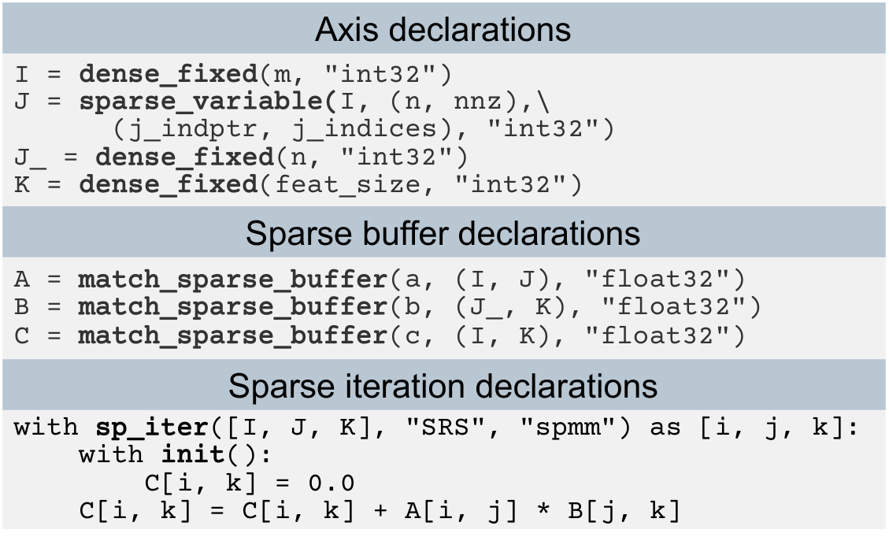

### Axis

Axis 是用来定义稀疏迭代空间的数据结构。论文说它 generalizes previous abstraction levels。

每个 axis 有两个正交属性：

```text
dense / sparse
fixed / variable
```

组合起来是四类：

| Axis 类型 | 含义 | 例子 |
| --- | --- | --- |
| dense fixed | 连续且长度固定 | dense matrix 的列维度 K |
| dense variable | 连续但每个 parent 下长度可变 | ragged tensor 中每行长度不同但内部连续 |
| sparse fixed | 非连续但每个 parent 下非零数固定 | ELL 每行固定 nnz_cols |
| sparse variable | 非连续且每个 parent 下非零数可变 | CSR 每行非零数不同 |

项目代码中对应 `python/tvm/tir/sparse.py`：

```python
class AxisKind(Enum):
    DenseFixed = 0
    DenseVariable = 1
    SparseFixed = 2
    SparseVariable = 3
```

并提供构造函数：

```python
dense_fixed_axis(...)
dense_variable_axis(...)
sparse_fixed_axis(...)
sparse_variable_axis(...)
```

Axis 中保存：

- `parent`：依赖的父 axis。
- `length`：当前 axis 的长度上界。
- `nnz`：从 root 到当前 axis 累积的非零数。
- `nnz_cols`：fixed axis 下每行固定非零数。
- `indptr`：variable axis 的 index pointer。
- `indices`：sparse axis 的 index array。
- `idtype`：索引类型。
- `sorted`：indices 是否有序。

这和论文里的描述完全对应。

### SparseBuffer

SparseBuffer 是 SparseTIR 中的稀疏矩阵/稀疏张量数据结构。

论文强调一点：SparseTIR 把 sparse structure auxiliary data 和 values 分开。

```text
Axis: 存 indptr、indices、metadata 等结构信息。
SparseBuffer: 存 values，并引用 axes 组合描述格式。
```

好处是：如果两个 sparse buffer 共享相同稀疏结构，它们可以复用 axis 的辅助数据。

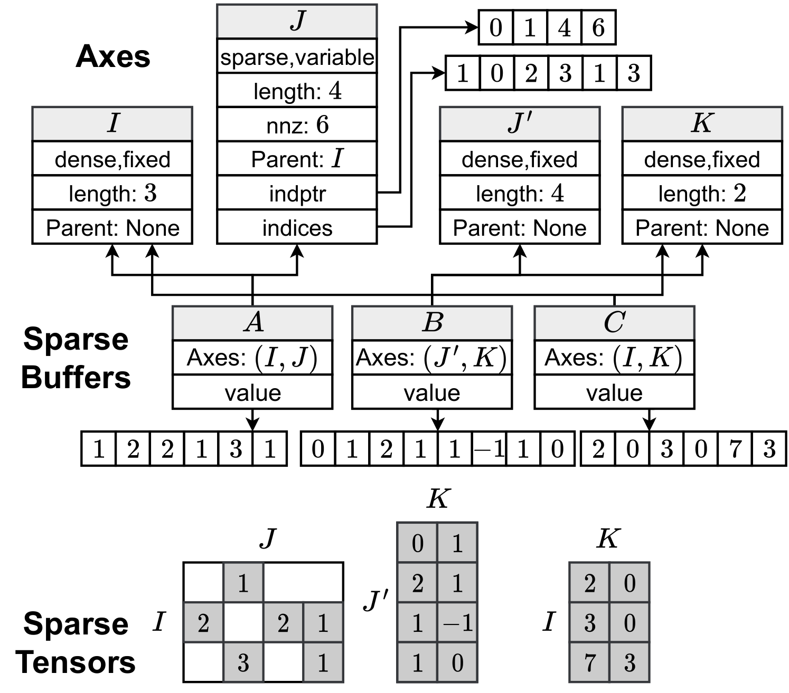

源码中 `SparseBuffer` 定义：

```python
class SparseBuffer(Buffer):
    data: Var
    axes: List[Axis]
    dtype: str
    name: str
    extra_storage: Optional[PrimExpr]
    default_value: Optional[PrimExpr]
```

C++ 侧 `src/tir/ir/sparse.cc` 会根据 axes 推导 flattened buffer 的 nnz：

```cpp
PrimExpr nnz = Integer(1);
...
node->flattened = Buffer(... shape={nnz} ...);
```

### SparseIteration

SparseIteration 描述对稀疏迭代空间的遍历，并包含计算 body。

论文指出 SparseTIR 比 TACO 更灵活：TACO 中 iterator 主要用于访问稀疏结构，例如 `A[i,j]`；SparseTIR 支持更复杂表达式：

- affine index：`A[i * m + j, k]`
- 从另一个 buffer 读取 index：`B[eid[i], j * n + k]`
- 多个 sparse iterations
- sparse iteration 嵌套
- branching 和 computation decomposition

这对 sparse convolution、RGMS 这类复杂算子很关键。

SpMM 在 SparseTIR 中可以写成：

```python
with T.sp_iter([I, J, K], "SRS", "csrmm") as [i, j, k]:
    with T.init():
        C[i, k] = 0.0
    C[i, k] = C[i, k] + A[i, j] * B[j, k]
```

其中 `"SRS"` 表示：

- `S`：spatial iterator。
- `R`：reduction iterator。
- `S`：spatial iterator。

对 SpMM 来说，`j` 是 reduction 维度，因为要沿着非零列累加。

## 七、Stage I：Coordinate Space Computation

Stage I 在 coordinate space 中定义稀疏计算。它的特点是：

```text
表达语义，不关心压缩位置。
```

以 SpMM 为例：

```text
Y[i,k] = sum_j A[i,j] * X[j,k]
```

在 Stage I 中，用户可以表达：

```python
C[i, k] = C[i, k] + A[i, j] * B[j, k]
```

而不用写：

```cpp
for (p = indptr[i]; p < indptr[i+1]; ++p) {
    j = indices[p];
    C[i,k] += values[p] * B[j,k];
}
```

Stage I 可以做两类重要变换：

- format decomposition
- sparse iteration schedules

这些变换还处在稀疏语义层，因此不会过早绑定到某个低层 loop layout。

## 八、格式分解：Format Decomposition

Format decomposition 是 SparseTIR 的关键变换。它把一个原始稀疏格式上的计算，分解成多个新格式上的子计算。

论文中的例子是把 CSR 上的 SpMM 分解成：

- BSR format，block size 为 2。
- ELL format，每行 2 个非零列。

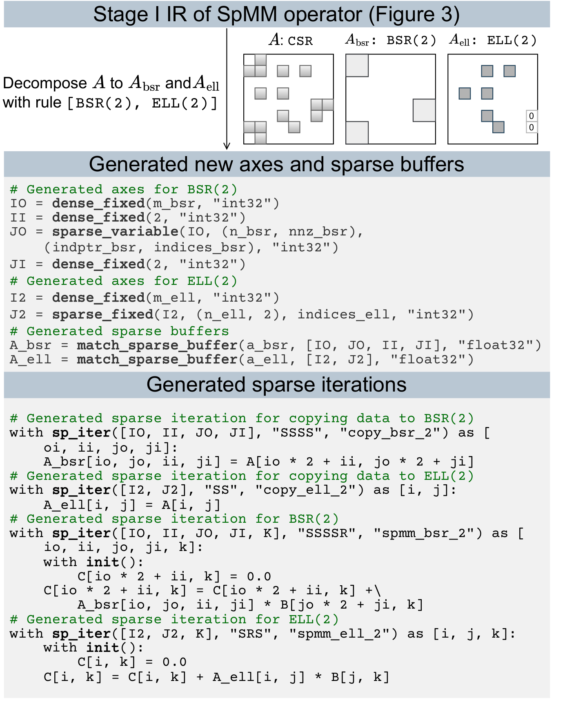

图中发生了三件事：

1. 创建新的 axes 和 sparse buffers。
2. 创建从原格式到新格式的数据复制 sparse iterations。
3. 创建在新格式上的计算 sparse iterations。

论文强调：如果 sparse matrix 是 stationary 的，也就是结构固定，可以在 preprocessing 阶段做格式转换，从而避免运行时转换开销。

### FormatRewriteRule

appendix 中给出编程接口。SparseTIR 提供两个 API：

- `FormatRewriteRule`
- `decompose_format`

`FormatRewriteRule` 描述一个格式重写规则，包含：

- rule 名字。
- 要重写的 sparse buffer。
- 新格式的 SparseTIR 描述。
- 原 axes 到新 axes 的映射。
- 原始坐标到新坐标的 index map `f`。
- 新坐标到原始坐标的 inverse map `f^{-1}`。

论文的符号是：

```text
A[I] = A'[f(I)]
A[f^{-1}(I')] = A'[I']
```

本地论文代码 `code/format_decompose.py` 里有示例：

```python
return FormatRewriteRule(
    "bsr_{}".format(str(block_size)),
    bsr_desc,
    ["A"], ["I", "J"], ["IO", "JO", "II", "JI"],
    {"I": ["IO", "II"], "J": ["JO", "JI"]},
    lambda i, j:
        return (i // block_size, j // block_size,
                i % block_size, j % block_size),
    lambda io, jo, ii, ji:
        return io * block_size + ii, jo * block_size + ji
)
```

这就是把原始 `(i,j)` 映射到 BSR 的 `(block_i, block_j, inner_i, inner_j)`。

源码中对应 `src/tir/transforms/sparse_format_decompose.cc`：

- `IndexRewriter` 保存 index map 和 inverse map。
- `SparseFormatDecomposer` 根据 rewrite rule 生成新 buffer、format rewrite block 和 compute block。
- `SparseFormatDecompose` pass 暴露到 Python。

Python API 在 `python/tvm/tir/transform/transform.py`：

```python
def SparseFormatDecompose(composable_formats, include_format_rewrite_blks=True):
    return _ffi_api.SparseFormatDecompose(composable_formats, include_format_rewrite_blks)
```

## 九、Stage I Schedules：sparse_reorder 与 sparse_fuse

Stage I 有两个稀疏调度原语：

- `sparse_reorder`
- `sparse_fuse`

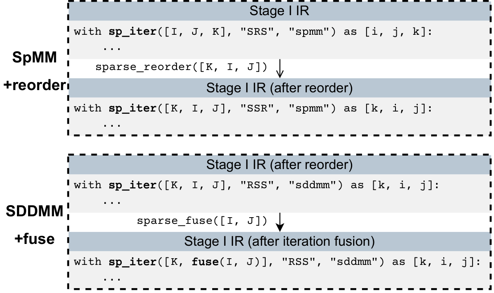

### sparse_reorder

`sparse_reorder` 改变 sparse axes 在 sparse iteration 中的顺序，从而影响 Stage II 生成 loop 的顺序。

源码中 `SparseReorder` 会检查：

1. 新 iterator 顺序是否是旧顺序的 permutation。
2. 新顺序是否破坏 axis dependency。

对应代码：

```cpp
CheckValidInputIterators(self, new_order, sp_iteration->sp_iter_vars);
CheckDependency(self, new_order);
```

dependency 检查很关键。例如 CSR 的列 axis 依赖行 axis，不能把列放到行之前。

### sparse_fuse

`sparse_fuse` 把多个 sparse iterators 融合成一个 iterator。

它适合 SDDMM 这类按非零元素独立计算的场景。SDDMM 原本可以写成：

```text
for i:
  for nonzero j in row i:
    compute A[i,j]
```

融合后可以变成：

```text
for each nonzero edge e:
  compute edge e
```

这更适合 GPU 并行，因为每个非零位置 workload 相近。

源码中 `SparseFuse` 会创建 `FusedAxis`：

```cpp
Axis new_axis = FusedAxis(axis_group, i);
new_sp_iters.push_back(SpIterVar(sp_iter_var->var, sp_iter_var->is_reduction, new_axis));
```

在 SDDMM 示例中：

```python
sp_iteration = sch.get_sparse_iteration("sddmm")
i, j, k = sch.get_sp_iters(sp_iteration)
sch.sparse_fuse(sp_iteration, [i, j])
```

## 十、Stage II：Position Space Computation

Stage II 引入 nested loops，并将 sparse buffer access 从 coordinate space 改写到 position space。

论文明确说 Stage II IR extends TensorIR，并把 sparse buffer 作为 first-class citizens。

为什么需要 Stage II？

```text
Stage I 太高层，适合表达语义和稀疏变换；
Stage III 太低层，已经没有稀疏结构信息；
Stage II 正好位于中间：有 loop，有 sparse buffer，有足够信息做 schedule 和 lowering。
```

Stage II 的核心 pass 是 Sparse Iteration Lowering。

## 十一、Sparse Iteration Lowering

Sparse Iteration Lowering 把 Stage I 转成 Stage II，包含四步。

### Step 1：Auxiliary buffer materialization

创建显式的辅助 buffer，例如 `indptr` 和 `indices`。

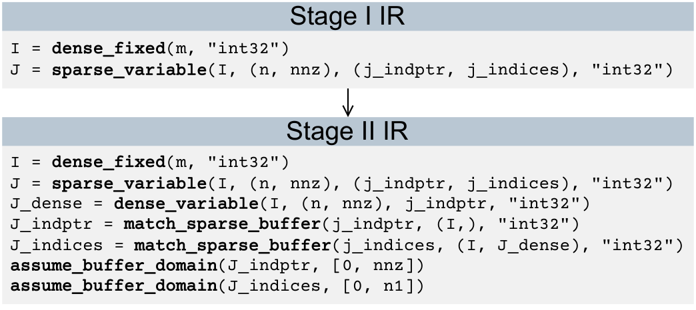

Stage I 中 axis 已经保存了指向 indptr/indices 的变量。到了 Stage II，需要显式声明这些 buffer，才能在 loop 里访问它们。

源码中 `lower_sparse_iter.cc` 的 `UpdateMetadata` 会遍历 `f->sp_axes`：

- variable axis 生成 `axis_indptr_map`。
- sparse axis 生成 `axis_indices_map`。
- 添加到 `buffer_map`。
- 添加 buffer domain。

### Step 2：Nested loop generation

把 sparse iteration 变成 nested loops。

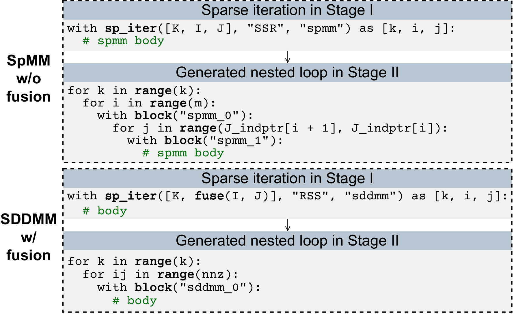

论文指出：

- 对 sparse iteration 中每个 axis 生成一个 loop。
- loop 从 0 开始。
- loop extent 由 fixed/variable 决定。
- 通过 TensorIR block 建立边界，防止错误的跨 block loop reorder。
- 在最内层 loop 内创建 block，放入原 sparse iteration body。

图中也展示了 sparse_fuse 的效果：未 fuse 时生成 `I`、`J` 两层 loop；fuse 后生成 `ij` 一个 fused loop。

### Step 3：Coordinate translation

把访问 sparse buffer 的坐标改成 position。

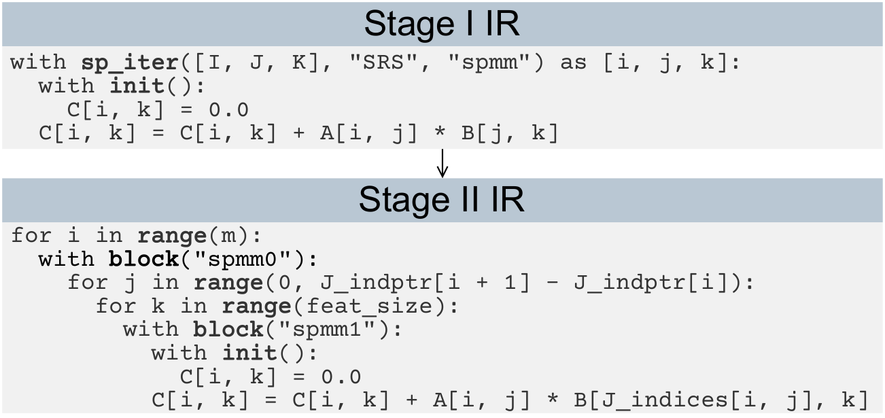

论文用 `f` 和 `f^{-1}` 表达 decompress 和 compress：

```text
f: position -> coordinate
f^{-1}: coordinate -> position
```

对 dense axis：

```text
f(A_i, x) = x
f^{-1}(A_j, x) = x
```

对 sparse axis：

```text
f(A_i, x) = A_i_indices[parent_position, x]
f^{-1}(A_j, x) = find(A_j_indices[parent_position, :], x)
```

这里的 `find` 是在 sorted indices 中查找目标 coordinate，SparseTIR 会生成 binary search block。

这也是为什么论文和代码中会出现 `binary_search_block`。在 SDDMM 示例中，lower 后会拆出 preprocess：

```python
mod_preprocess = tvm.tir.transform.ExtractPreprocess()(mod)
blk = sch.get_block("binary_search_block_0_0")
```

### Step 4：Read/Write Region Analysis

TensorIR 的 block 需要 read/write region 信息。SparseTIR 会分析每个 block 内的 buffer access，并标注读写区域。

这对后续 schedule、合法性检查和 lowering 都很重要。

## 十二、Stage II Schedules 与 TVM 调度复用

Stage II 已经有 loop 结构，因此可以复用 TVM TensorIR schedule primitives：

- `fuse`
- `reorder`
- `split`
- `cache_read`
- `cache_write`
- `bind`
- `vectorize`
- `tensorize`
- `rfactor`

这就是 SparseTIR 的设计价值之一：稀疏语义在 Stage I/II 保留，但底层硬件优化不用重做一套，可以复用 dense tensor compiler 的能力。

SDDMM 示例最清楚：

```python
ko, kio, kii = sch.split(k, [None, tx, vec_size])
rf_blk = sch.rfactor(kio, 2)
...
sch.bind(joo, "blockIdx.x")
sch.bind(joi, "threadIdx.y")
...
sch.vectorize(ax1)
```

这对应论文说的：PRedS 的两级 reduction 和 vectorized load/store 可以被 SparseTIR 表达成 composable transformations：

- `rfactor`
- `vectorize`
- `cache_read/write`
- thread binding

## 十三、Stage III：Loop-Level IR 与 Sparse Buffer Lowering

Stage III 去掉 SparseTIR 的所有 sparse constructs，只留下普通 loop 和扁平 buffer access。

论文选择 TVM TensorIR 作为 Stage III IR，因为 TensorIR 支持 tensorization，可以生成 Tensor Core 代码。

### Sparse Buffer Lowering

Sparse Buffer Lowering 做两件事：

1. 移除 axes。
2. 把多维 sparse buffer 访问 flatten 成一维访问。

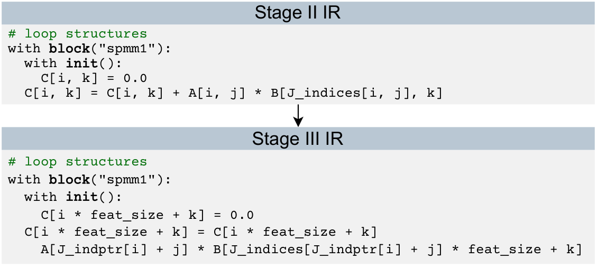

论文给出的例子是：

```text
A[i, j] -> A[J_indptr[i] + j]
```

源码中 `lower_sparse_buffer.cc` 的 `BufferTransformer::ComputeOffset` 实现了这个 offset 计算逻辑：

```cpp
if (axis->IsVariable()) {
  offset_map[axis] = index + BufferLoad(indptr, {offset_map[parent]});
} else {
  offset_map[axis] = index;
}
```

随后把 sparse buffer load/store 改成 flattened buffer：

```cpp
BufferLoad(sp_buf->flattened, {ComputeOffset(sp_buf->axes, indices)})
BufferStore(sp_buf->flattened, value, {ComputeOffset(sp_buf->axes, indices)})
```

这就是从 Stage II 到 Stage III 的关键转换。

## 十四、目标代码生成与 Horizontal Fusion

SparseTIR 复用 TVM 后端生成目标代码。

问题是：组合格式可能会把一个原始算子分解成多个子计算，每个子格式对应一个 kernel。如果直接生成多个 CUDA kernel，会引入额外 kernel launch overhead。

论文因此在 TVM 后端加入 horizontal fusion。

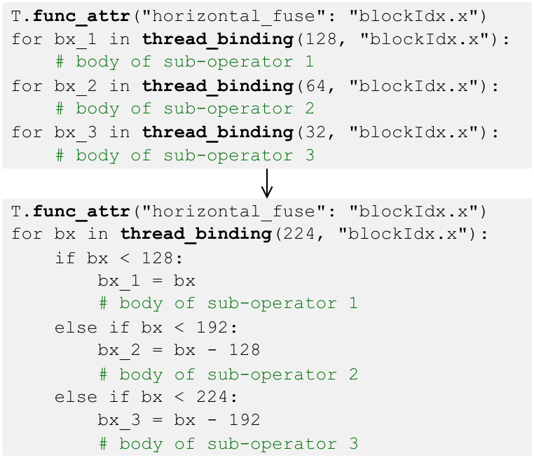

源码中 `horizontal_fusion.cc` 的逻辑是：

- 收集每个 thread binding 的 extent。
- 对 `blockIdx.x` 做累加融合。
- 对其他 thread axis 取最大 extent。
- 在 root block 外包一层统一 thread binding。
- 用 `IfThenElse` 控制不同 `blockIdx.x` 区间执行不同子算子。

核心代码：

```cpp
if (thread_tag == "blockIdx.x") {
  thread_tag_extent_map_.Set(thread_tag, prev_extent + extent);
} else {
  thread_tag_extent_map_.Set(thread_tag, max(prev_extent, extent));
}
```

以及：

```cpp
body = IfThenElse(
  thread_var < blockIdx_x_accum_offset_ + original_extent,
  VisitStmt(op->body)
);
```

这样多个子格式的 kernel 可以融合成一个 kernel，减少 launch 开销。

## 十五、项目源码如何落地论文设计

SparseTIR 的开源项目基于 TVM。核心代码分布如下：

```text
SparseTIR-main/
├── python/tvm/tir/sparse.py
├── src/tir/ir/sparse.cc
├── src/tir/schedule/primitive/sparse.cc
├── src/tir/transforms/lower_sparse_iter.cc
├── src/tir/transforms/lower_sparse_buffer.cc
├── src/tir/transforms/sparse_format_decompose.cc
├── src/tir/transforms/horizontal_fusion.cc
├── src/sparse/format.cc
└── examples/
    ├── spmm/
    ├── sddmm/
    ├── blocksparse/
    └── rgms/
```

### Python sparse API

`python/tvm/tir/sparse.py` 定义：

- `Axis`
- `FusedAxis`
- `FlattenedAxis`
- `AttachedAxis`
- `SparseBuffer`
- `SpIterVar`

这些是论文语言构造的 Python 入口。

### C++ sparse IR

`src/tir/ir/sparse.cc` 注册 C++ IR node：

- `AxisNode`
- `FusedAxisNode`
- `FlattenedAxisNode`
- `AttachedAxisNode`
- `SparseBufferNode`

并注册全局 FFI：

```cpp
TVM_REGISTER_GLOBAL("tir.sparse.Axis")
TVM_REGISTER_GLOBAL("tir.sparse.FusedAxis")
TVM_REGISTER_GLOBAL("tir.sparse.FlattenedAxis")
```

### Sparse schedule primitive

`src/tir/schedule/primitive/sparse.cc` 实现：

- `SparseReorder`
- `SparseFuse`

它会做合法性检查，避免 iterator 顺序破坏 dependency。

### Format conversion routines

`src/sparse/format.cc` 实现论文实验用到的格式转换，例如：

- `ColumnPartHyb`
- `CSFToELL3D`

`ColumnPartHyb` 对应 GNN SpMM 中的 `hyb(c,k)` 组合格式：按列分区，再按行内非零数 bucket 成 ELL 子矩阵。

核心逻辑：

```cpp
int part_id = col_id / partition_size;
int degree = degree_counter[part_id].count(row_id);
int bucket_id = upper_bound(buckets, degree - 1);
```

然后生成：

- `row_indices`
- `col_indices`
- `mask`

`mask` 用来标识 padding 位置是真非零还是补零。

### SpMM 示例流水

`examples/spmm/bench_spmm.py` 展示了完整流程。

1. 用 SparseTIR 写 CSR SpMM。

```python
I = T.dense_fixed(m)
J = T.sparse_variable(I, (n, nnz), (indptr, indices), "int32")
A = T.match_sparse_buffer(a, (I, J), "float32")
...
with T.sp_iter([I, J, K1, K2, K3], "SRSSS", "csrmm") as [i, j, k1, k2, k3]:
    C[i, k1, k2, k3] += A[i, j] * B[j, k1, k2, k3]
```

2. 调用 `column_part_hyb` 做格式转换。

```python
cached_bucketing_format = column_part_hyb(
    m, n, indptr_nd, indices_nd, num_col_parts, bucket_sizes
)
```

3. 创建多个 `FormatRewriteRule`。

```python
FormatRewriteRule(
    str(part_id) + "_" + str(bucket_id),
    ell.specialize({nnz_cols_symbol: bucket_size}),
    ["A"],
    ["I", "J"],
    ["O", "I", "J"],
    {"I": ["O", "I"], "J": ["J"]},
    csr2ell_index_map,
    csr2ell_inv_index_map,
)
```

4. 执行格式分解。

```python
mod = format_decompose(mod, rewrites)
mod = tvm.tir.transform.RemovePreprocess()(mod)
```

5. 做 sparse_fuse。

```python
sp_iteration = sch.get_sparse_iteration(sp_iter_name)
o, i, j, k1, k2, k3 = sch.get_sp_iters(sp_iteration)
sch.sparse_fuse(sp_iteration, [o, i])
```

6. lower 到普通 loop。

```python
mod = tvm.sparse.lower_sparse_iter(mod)
```

7. 用 TVM schedule 做 thread mapping、unroll、cache write、atomic。

8. lower sparse buffer 并 build。

```python
mod = tvm.sparse.lower_sparse_buffer(sch.mod)
f = tvm.build(mod, target="cuda")
```

这条流水基本就是论文设计的可执行版本。

### SDDMM 示例流水

`examples/sddmm/bench_sddmm.py` 展示了 SparseTIR 如何表达 PRedS 风格优化。

SDDMM 定义：

```python
with T.sp_iter([I, J, K], "SSR", "sddmm") as [i, j, k]:
    with T.init():
        C[i, j] = 0.0
    C[i, j] = C[i, j] + A[i, k] * B[j, k]
```

调度部分：

```python
sch.sparse_fuse(sp_iteration, [i, j])
...
rf_blk = sch.rfactor(kio, 2)
...
sch.vectorize(ax1)
sch.bind(joo, "blockIdx.x")
sch.bind(joi, "threadIdx.y")
```

这正对应论文中的 composable transformations。

## 十六、GNN 实验：SpMM、SDDMM 与 GraphSAGE

论文首先评估 GNN workload，因为 SpMM 和 SDDMM 是 GNN 中最通用的两个稀疏算子。

### 实验环境与 baseline

硬件：

- NVIDIA RTX 3070
- NVIDIA Tesla V100

baseline：

- cuSPARSE 11.7
- dgSPARSE 0.1
- Sputnik
- TACO
- DGL 0.9.1
- PyG 2.2.0
- Graphiler
- Triton
- TorchSparse

论文说明，dgSPARSE 和 Sputnik 不使用 Tensor Cores。所有 SparseTIR kernel 都与已有框架/库比较过数值正确性。

GNN 数据集：

| Graph | #nodes | #edges | %padding |
| --- | ---: | ---: | ---: |
| cora | 2,708 | 10,556 | 15.9 |
| citeseer | 3,327 | 9,228 | 13.0 |
| pubmed | 19,717 | 88,651 | 23.1 |
| ppi | 44,906 | 1,271,274 | 22.9 |
| ogbn-arxiv | 169,343 | 1,166,243 | 17.5 |
| ogbn-proteins | 132,534 | 39,561,252 | 21.6 |
| reddit | 232,965 | 114,615,892 | 28.6 |

这里 `%padding` 是原始矩阵转成组合格式后补零元素比例。

### SpMM

SpMM 公式：

```text
Y[i,k] = sum_j A[i,j] * X[j,k]
```

SparseTIR 为 SpMM 设计 `hyb(c,k)` 组合格式：

1. 按列分区，分区数为 `c`。
2. 对每个列分区，把行按行内非零数分 bucket。
3. bucket `i` 收集满足 `2^{i-1} < l <= 2^i` 的行。
4. 每个 bucket 形成一个 ELL 子矩阵。
5. 每个 thread block 处理约 `2^k` 个非零元素，实现 compile-time load balancing。

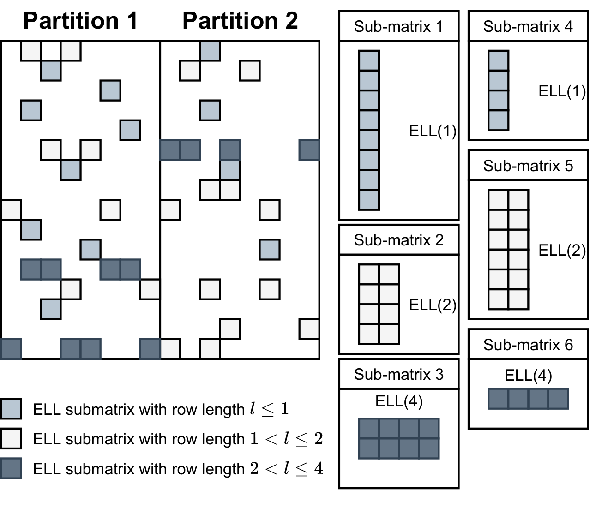

列分区的目的不是改变数学结果，而是提高 cache locality。处理第 `j` 个列分区时，只访问 `B[jw:(j+1)w]`。

论文搜索：

```text
c in {1, 2, 4, 8, 16}
k = ceil(log2(nnz / n))
```

Figure 中展示 column partition 对 cache hit rate 和 kernel duration 的影响：

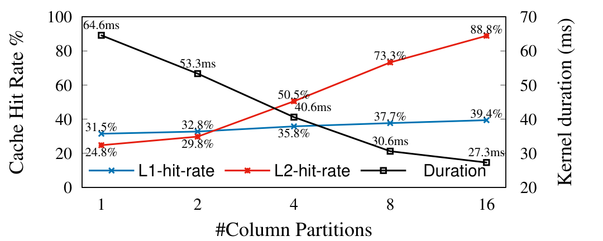

结论是：列分区越多，L1/L2 cache hit rate 越高；但分区过多会增加对结果矩阵的更新次数，因为 `c` 个分区需要更新 `C` `c` 次，所以收益会饱和。

SpMM 实验结果：

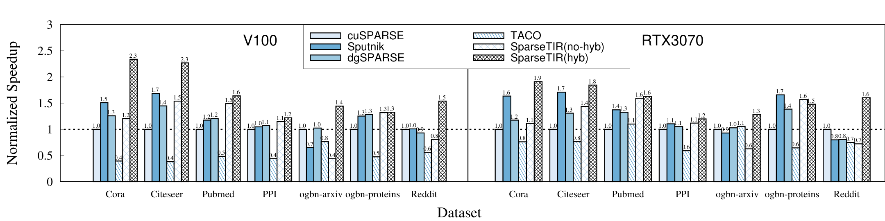

论文报告：

- V100 上，SparseTIR `hyb` 相比 cuSPARSE 有 `1.22-2.34x` 加速。
- RTX 3070 上，有 `1.20-1.91x` 加速。
- SparseTIR 也 consistently 优于 dgSPARSE、Sputnik 和带 auto-scheduling 的 TACO。

论文特别比较了 `SparseTIR(no-hyb)` 和 `SparseTIR(hyb)`，证明 composable formats 重要。比如 ogbn-arxiv 的 degree 符合 power-law，组合格式的 load balancing 帮助明显。虽然 padding 会增加 FLOPs，但更好的调度仍能让总时间更短。

### SDDMM

SDDMM 公式：

```text
B[i,j] = sum_{k=1}^{d} A[i,j] * X[i,k] * Y[k,j]
```

`A` 和 `B` 是共享稀疏结构的 sparse matrix，`X` 和 `Y` 是 dense matrix。

SDDMM 中每个非零 `(i,j)` 的计算相互独立，workload 相对均匀，因此不需要像 SpMM 那样重点处理行长度负载不均。关键优化是：

- `sparse_fuse` 直接按非零 `(i,j)` 遍历。
- `vectorize` 做向量化 load/store。
- `rfactor` 做两级 reduction。
- 搜索 group size、vector length、每个 CTA 的 workload 数。

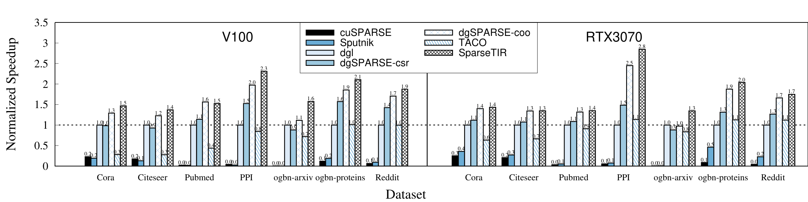

论文结论：

- 不使用 composable formats。
- baseline 是 DGL 的 SDDMM，使用 Featgraph 优化。
- cuSPARSE 和 Sputnik 的 SDDMM 对图这种 highly sparse matrix 不够优化，性能较低。
- SparseTIR 优于 dgSPARSE/PRedS，原因是调度参数空间可搜索。
- TACO 因 provenance graph 不支持 multiple branches，无法在该层做 `rfactor` 这类 schedule。

### GraphSAGE 端到端训练

论文把 SparseTIR 生成的 SpMM 集成到 PyTorch 的 GraphSAGE 模型中，与 DGL 对比。

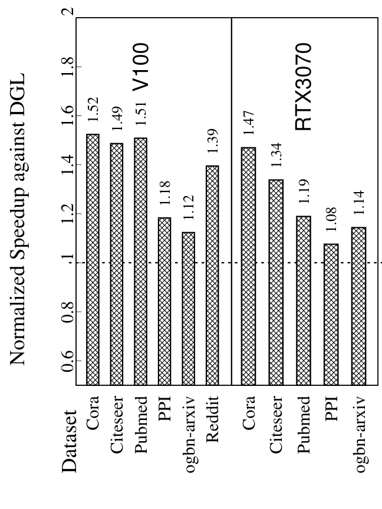

结果：

- V100：`1.18-1.52x`
- RTX 3070：`1.08-1.47x`
- Reddit 在 RTX 3070 上因为 OOM 未报告。

这说明单算子的收益可以传导到端到端训练，但端到端加速通常小于 kernel 级加速，因为模型还有其他操作。

## 十七、Transformer 稀疏实验

论文把 Transformer 稀疏分成两类：

1. Sparse attention。
2. Network pruning 后的 sparse weight。

该部分使用 half precision，以利用 Tensor Cores。

### Sparse Attention

Sparse attention 把 attention matrix 变稀疏，降低复杂度。论文选择两个例子：

- Longformer：band matrix。
- Pixelated Butterfly Transformer：butterfly matrix。

它们的 sparse structures 是人工设计的 block-sparse pattern，适合 Tensor Core。

实验实现：

- batched-SpMM
- batched-SDDMM
- CSR 和 BSR 格式
- 对 BSR operators 使用 Stage II 的 `tensorize`

固定参数：

```text
matrix size: 4096 x 4096
batch/head size: 12
band size: 256
feature size per head: 64
```

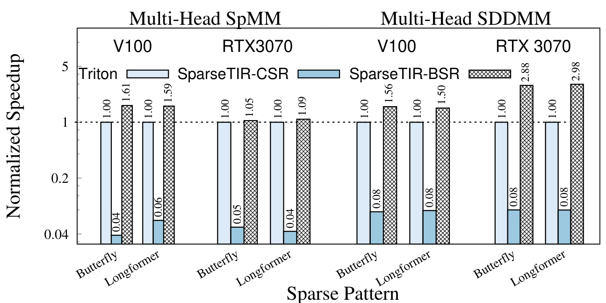

结果：

- multi-head SpMM：`1.05-1.59x`
- multi-head SDDMM：`1.50-2.98x`

### Structured Pruning

structured pruning 按 channel 或 block 组剪枝。论文使用 PruneBERT 中 block-pruned model：

- block size 32。
- 平均 weight sparsity 93%。
- batch size 1。
- sequence length 512。

block-pruned weight 中有很多全零行，因此论文提出 doubly-compressed BSR，也就是 DBSR，用来跳过 zero rows。

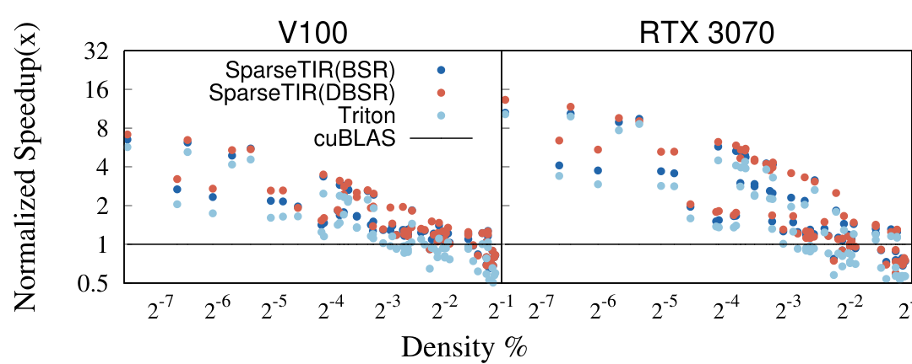

结论：

- SparseTIR 的 DBSR 格式 consistently 优于 SparseTIR 的 BSR。
- DBSR 也优于 Triton 的 BSRMM。

### Unstructured Pruning

unstructured pruning 不约束剪枝形状，通常存 CSR。它难优化，因为稀疏模式极不规则；直接转 BSR 会造成严重 block 内碎片。

论文使用 Magicube 的 SR-BCRS `(t,g)` 格式：

1. 把矩阵切成 `t x 1` tile。
2. 全零 tile 省略。
3. 同一行内非零 tile 按 `g` 分组。
4. 尾部 group 用 zero tile padding。
5. 加载 A 的 tile group 和 X 的对应行到寄存器/SRAM。
6. 用 Tensor Core 做局部矩阵乘。

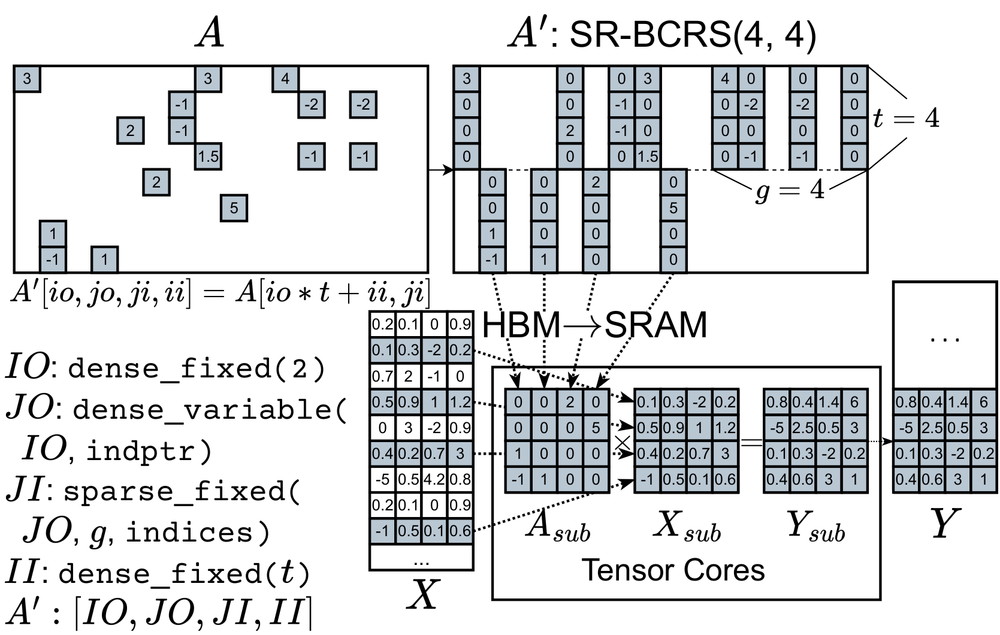

相比 BSR：

```text
SR-BCRS(t,g) 的块内非零比例下界是 1/t；
BSR block size b 的下界是 1/b^2。
```

因此 SR-BCRS 对 unstructured pruning 更不容易被块内碎片拖垮。

实验使用 movement-pruned PruneBERT：

- 平均 weight sparsity 94%。
- SR-BCRS(8,32)，用于 GPU 的 m8n32k16 MMA。
- 对比 BSR、cuBLAS、cuSPARSE CSRMM。

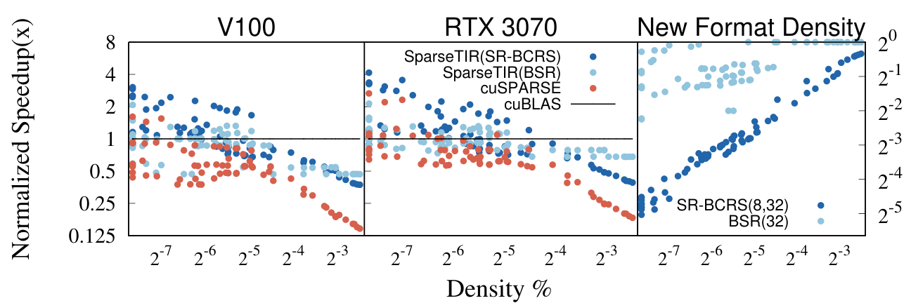

结论：

- SparseTIR on SR-BCRS 在多数设置下优于 BSR。
- 当 density >= `2^-3` 时，转换后稀疏矩阵密度接近 1，SR-BCRS 和 BSR 差异变小。
- cuSPARSE CSRMM 只有在 weight density 极低时，例如 `<= 2^-6`，才可能优于 cuBLAS GEMM。

## 十八、RGMS、RGCN 与 Sparse Convolution

### RGMS 算子

RGMS 是 Relational Gather-Matmul-Scatter。公式：

```text
Y[i,l] = sum_r sum_j sum_k A[r,i,j] * X[j,k] * W[r,k,l]
```

其中：

- `A` 是 3D sparse matrix。
- `r` 是 relation / edge type。
- 每个 `A[r,:,:]` 是一个关系对应的 2D sparse matrix。
- `X` 是节点 feature。
- `W[r,:,:]` 是 relation `r` 对应的 dense weight matrix。

RGMS 难点：

- 要考虑 load balancing。
- 要利用 Tensor Cores。
- 传统库没有直接实现该 kernel。

### RGCN

RGCN 是 GCN 对 heterogeneous graph 的扩展。异构图中有多种 edge type / relation。

论文使用的数据集：

| Graph | #nodes | #edges | #etypes | %padding |
| --- | ---: | ---: | ---: | ---: |
| AIFB | 7,262 | 48,810 | 45 | 17.9 |
| MUTAG | 27,163 | 148,100 | 46 | 8.0 |
| BGS | 94,806 | 672,884 | 96 | 4.3 |
| ogbl-biokg | 93,773 | 4,762,678 | 51 | 4.2 |
| AM | 1,885,136 | 5,668,682 | 96 | 10.8 |

传统 GNN 库把 RGMS 拆成两阶段：

```text
T[r,j,l] = sum_k X[j,k] * W[r,k,l]
Y[i,l] = sum_r sum_j A[r,i,j] * T[r,j,l]
```

问题是中间结果 `T` 要 materialize 到 HBM，显存开销大，访存也重。

SparseTIR 把两阶段融合成一个 operator。它把 `hyb` 格式扩展到 3D，对每个 relation 的 2D sparse matrix 分解成 `hyb(1,5)`。

RGMS 调度：

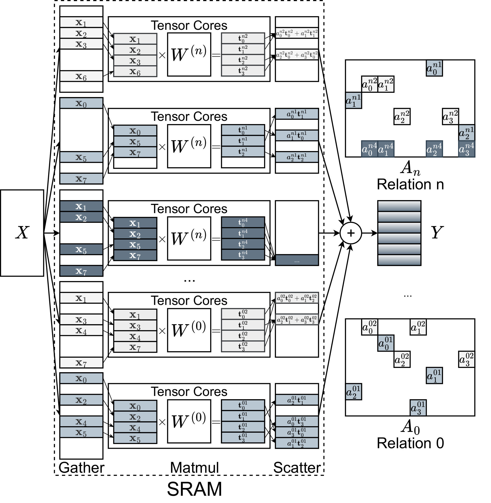

核心思路：

- 对每个 ELL matrix `A^{rk}`，把对应 `W^r` pin 在 SRAM。
- 从 HBM gather 相关 `X` 行到 SRAM。
- 用 Tensor Core 做 partial matmul。
- 在 SRAM 内 scatter 到 `Y`。
- 不显式把中间 `T` 存到 HBM。

实验结果：

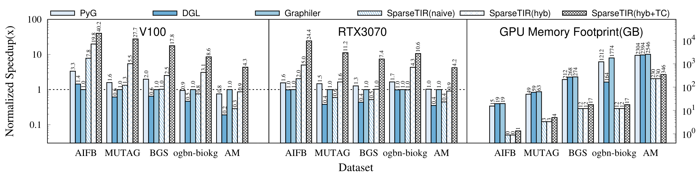

论文结论：

- `SparseTIR(hyb+TC)` 相比 Graphiler 有 `4.2-40.2x` 加速。
- 对比 `SparseTIR(naive)`、`SparseTIR(hyb)` 和 `SparseTIR(hyb+TC)` 可以看到，组合格式和 Tensor Core 变换都重要。
- 虽然 `hyb` 引入 padding 增加 FLOPs，但更好 load balancing 仍让 kernel 快 `2-4.4x`。
- fused kernel 显著降低 GPU memory footprint，因为不把 `T` 写入 HBM。
- `hyb+TC` 比 naive/hyb 显存略高，原因是 half/single precision 类型转换。

### Sparse Convolution

Sparse convolution 常用于 3D point cloud。

论文观察到：Sparse Convolution 是 RGMS 的特殊形式。

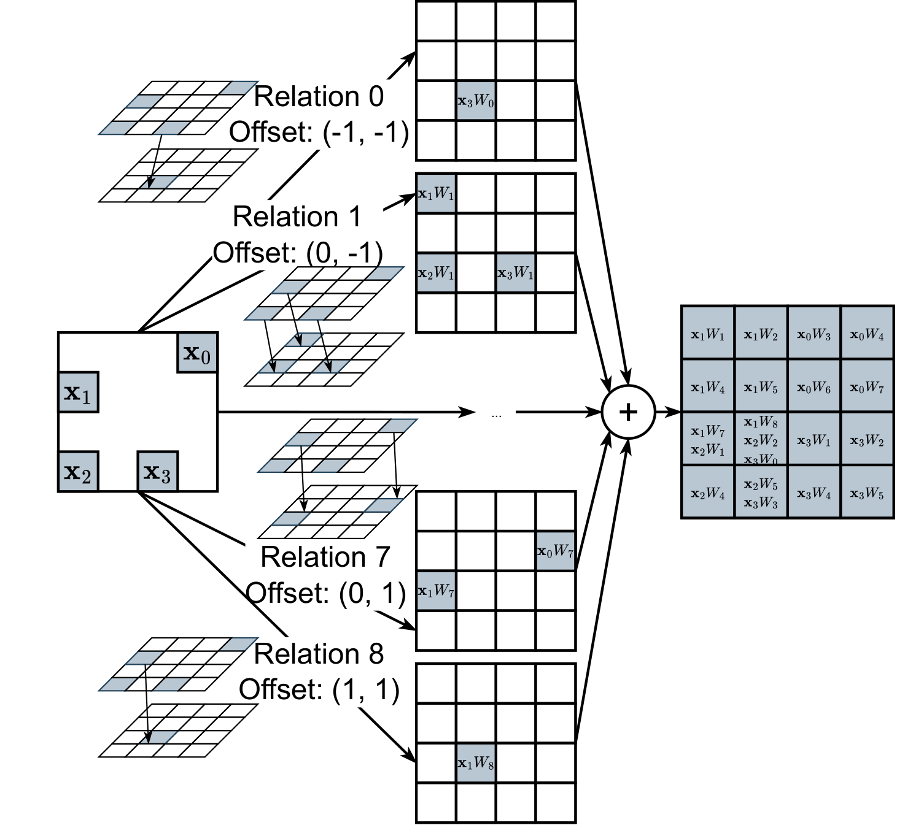

卷积核里的每个 relative offset 可以看成 RGMS 的一个 relation。对每个 relation，上一层 feature map 的非零点到下一层非零点的映射形成一个 bipartite graph，也就是一个 2D sparse matrix；每行非零数不超过 1。

论文从 MinkowskiNet on SemanticKITTI 中提取 Sparse Convolution operators，用 SparseTIR 的 RGMS kernel 评估。

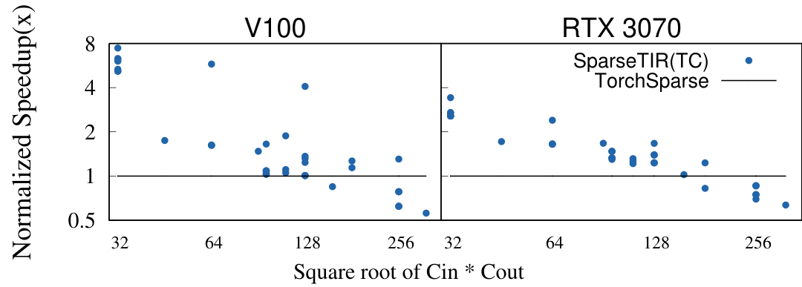

结论：

- 对大多数算子，SparseTIR RGMS 优于 TorchSparse，因为减少了 HBM/SRAM 数据交换。
- 当 channel size > 128 时，SparseTIR 不能超过 TorchSparse。原因是 matmul 开销变成主导，FLOPs 随 channel size 二次增长，而 gather/scatter 是线性增长；大矩阵乘法上 cuBLAS 优化更强。

## 十九、Related Work 与论文边界

论文 related work 分六类。

### Tensor and deep learning compilers

Halide、TVM 把 kernel description 和 schedule 解耦，主要服务 dense computation。XLA、Relay 是计算图层抽象，适合 kernel fusion 和 graph substitution，但稀疏算子支持有限。

TensorIR 是 TVM 的 tensor-level programming abstraction，支持自动 tensorization。Triton 提供 tile-level programming。FreeTensor 支持 irregular tensor programs。论文认为这些 IR 可以作为 SparseTIR 的 Stage III IR。

### Sparse compilers

MT1、SIPR、Ironman、TACO、Sparse Iteration Space Transformation、TACO conversion、Sympiler、Parsy、SPF、MLIR Sparse Dialect、COMET、CoRA 等都与 SparseTIR 相关。

SparseTIR 和它们的差异主要是：

- 支持 decomposable / composable formats。
- 支持多阶段 composable transformations。
- 能复用 TensorIR 的低层 schedule 和 tensorization。

### GNN systems and compilers

PyG、DGL 提供 message passing 编程接口，但主要依赖 vendor library 和 handwritten operator。

FeatGraph 用 TVM 优化 GNN operator，但 TVM 本身缺乏稀疏支持。

Graphiler、Seastar 可以编译 message passing function，但模板化后端表达能力有限。

论文认为 SparseTIR 可以作为这些 GNN compiler 的后端。

### Sparse kernel optimizations

Merge-SpMM、ASpT、GE-SpMM、Sputnik、DA-SpMM 等探索了 GPU SpMM 的 schedule space。SparseTIR 试图用可组合抽象统一这些优化。

### Sparse format optimizations

行列重排序、block granularity 提升、cache locality 改善等方法可以作为 SparseTIR 的 preprocessing step，用于发现更好的组合格式。

### Hardware-efficient algorithms

块稀疏、bank sparsity、N:M sparsity、ES-SpMM 等硬件友好算法都可以通过 SparseTIR 的 composable abstractions 进一步探索。

## 二十、Future Work、Artifact 与复现实验

论文 future work 有四点。

### Automatic scheduling

SparseTIR 仍需要用户提供 schedule templates，类似早期 Halide/TVM。

未来可以引入：

- Halide auto-scheduler
- FlexTensor
- Ansor
- Meta-scheduler
- sparse tensor algebra cost model

目标是自动生成或缩小 schedule 搜索空间。

### Automatic format decomposition

本文只探索人工设计的 format decomposition rules。未来方向是自动格式选择和自动格式分解。

### Dynamic sparsity

MoE、Switch Transformer、sparse training 等模型存在 dynamic sparsity，非零位置会随时间变化。每个矩阵都重新搜索 schedule 不现实。

论文提到 DietCode 的 shape-generic search space、micro-kernel cost model、runtime dispatcher 思想也可用于 sparse tensor programs。

### Integration with graph-level IR

SparseTIR 当前建模 tensor-level sparsity。未来计划把 sparse attributes 扩展到 XLA、Relay 这类 graph-level IR。

### Artifact 信息

appendix 中 artifact 说明：

- 数据集：OGB、SemanticKITTI、DGL built-in datasets。
- 运行环境：NVIDIA Container Toolkit。
- 硬件：NVIDIA Turing/Ampere/Hopper 架构 GPU。
- 指标：execution time、GPU memory footprint。
- 实验：SpMM、SDDMM、GraphSAGE、Sparse Transformer、3D Sparse Convolution、RGCN。
- 磁盘：约 55GB。
- 准备时间：约 2 小时构建 Docker。
- 完整实验：约 10 小时。
- SparseTIR artifact MIT license，compiler Apache License v2.0。
- Zenodo DOI：`10.5281/zenodo.7643745`。

复现实验时，每个目录都有 `run.sh`：

- `spmm`
- `sddmm`
- `e2e`
- `sparse-attention`
- `pruned-bert`
- `rgcn`
- `sparse-conv`

论文还特别说明 profiling 使用 CUDAEvent，前 10 次 warm-up 丢弃，重复 100 cycles。

一个重要细节：artifact 提供 `FLUSH_L2` 开关。论文认为很多工作不 flush L2 cache，可能导致小算子测试不准确，因为前一次运行的数据还留在 L2。论文结果使用：

```text
FLUSH_L2=ON
```

这点在性能评估中很严谨。

## 二十一、总结与面试表达

SparseTIR 的本质不是某个单点稀疏 kernel 优化，而是一个稀疏编译抽象：

```text
用可组合格式表达复杂稀疏模式；
用可组合变换组织从稀疏语义到低层循环的编译流程；
把格式和 schedule 共同放入可调搜索空间；
最后复用 TVM TensorIR 的 GPU mapping、vectorize、tensorize、codegen 能力。
```

这篇论文最重要的技术主线：

1. 深度学习稀疏 workload 多样，单一格式不够。
2. 传统 sparse compiler 的 single-shot compilation 不容易复用现代 tensor compiler 的 loop-level 优化。
3. SparseTIR 分三阶段 IR：coordinate space、position space、loop-level IR。
4. Stage I 负责语义和格式分解。
5. Stage II 负责 position lowering 和 loop schedule。
6. Stage III 移除 sparse constructs，进入普通 TensorIR。
7. 实验覆盖 GNN、Sparse Attention、Pruned Transformer、RGCN、Sparse Convolution。

面试中可以这样表达：

```text
SparseTIR 的关键贡献是把稀疏编译拆成可组合格式和可组合变换。
它先在 coordinate space 中表达稀疏计算，再 lowering 到 position space 处理压缩格式，最后 lowering 到 TVM TensorIR 复用硬件相关 schedule。
相比 TACO 这类 single-shot sparse compiler，SparseTIR 更适合深度学习中多样的稀疏模式，也更容易复用 Tensor Core、vectorization、thread binding 等后端优化。
```

如果进一步解释性能来源，可以说：

```text
SparseTIR 的性能不是来自一个固定 kernel，而是来自格式和 schedule 的联合搜索。
例如 SpMM 中 hyb(c,k) 通过列分区提高 cache locality，通过 bucketed ELL 做 compile-time load balancing；
SDDMM 中 sparse_fuse 让计算按非零元素并行，再用 rfactor 和 vectorize 表达 PRedS 风格优化；
RGCN/RGMS 中通过 3D hyb 和 Tensor Core schedule 避免把中间 T 显式写到 HBM。
```

这也是 SparseTIR 和手写库、传统 sparse compiler 最大的区别：它试图把“稀疏格式选择”和“硬件调度优化”放到同一个可组合系统里。
